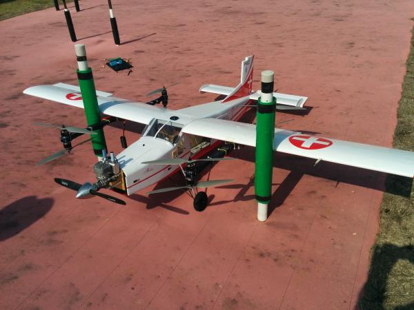

.. _quadplane-building:

Building a QuadPlane
====================

Putting together a QuadPlane involves careful planning. This page will
give you some general guidance on design principles for QuadPlanes
that may help you with your build.

General Rules
-------------

A wide range of fixed wing aircraft can be converted to have VTOL
capabilities. While ArduPilot uses the name QuadPlane for these
aircraft, you are not restricted to just QuadCopter motor
layouts. Almost any multicopter motor arrangement can be used with a
QuadPlane, including quad, hexa, tricoper, octa and octaquad.

Some of the key factors to success are:

- a fixed wing frame that can carry the weight of the multicopter
  lifting motors and power system, along with any payload needed

- sufficient power in the lifting motors not just for the total
  airframe weight, but also for the additional load that may be
  induced by downforce on the wings

- complete clearance above and below the whole disk area of the
  lifting motors, to ensure they achieve full aerodynamic thrust

- minimum wing twist and flex so the motors provide thrust vertically
  at all times

- a sufficiently robust mounting system for the lifting motors

- minimising aerodynamic drag from the lifting motors and frame

  .. image:: ../images/quadplane-quadstar.jpg
    :target: ../_images/quadplane-quadstar.jpg

When you are designing a QuadPlane it is highly recommended that you
make use of `eCalc <http://ecalc.ch/>`__ to help choose the motors,
ESCs, batteries, propellers and other components of your
design. Brushless motors vary a lot in their power to weight ratio,
and ensuring you choose motors that keep the weight down while
supplying sufficient lifting power is important.

QuadPlane Range
---------------

Perhaps surprisingly, it is sometimes possible to increase the
potential range of an aircraft using a QuadPlane conversion. This may
seem counter intuitive as a QuadPlane conversion will both add weight
and increase aerodynamic drag to an airframe.

The reason why range can be increased is the extra carrying capacity
of a QuadPlane. Many fixed wing aircraft are limited in the amount of
battery they can carry due to the requirements for reliable
launch. During launch, and especially when using a flying launch such
as a catapult or bungee, the aircraft needs to rapidly accelerate to
an airspeed above its stall speed. If it fails to reach that speed
suffiently quickly then it will crash. A QuadPlane avoids this problem
by taking off vertically, and can spend longer on the acceleration
needed to sufficient speed for forward flight.

This means it is often possible to pack a lot more battery into a
QuadPlane than is possible in the same airframe without VTOL
motors. The extra battery capacity can more than make up for the
increased weight and drag of the VTOL motors.

To make the most of this advantage you need to do very rapid VTOL
takeoffs and landings to minimise the battery consumption in VTOL
flight. The video below demonstrates just how rapid a takeoff can be
achieved with a properly setup quadplane.

..  youtube:: 4oVlSQaplZc

A second factor that can help with QuadPlane range is the flexibility
available in choosing the propeller and power train for the forward
motor. As conventional takeoff is not needed the forward motor does
not need to be optimised for the high level of thrust needed for
takeoff. This can allow larger propellers and geared motors to be used
that are highly efficient for forward cruise flight.

Finally, for really long range with a QuadPlane you can use an
internal combustion engine for the forward motor. A gas engine can
run for a lot longer than an electric motor with the same weight of
fuel.

Build Logs
----------

Here are some build logs of a few QuadPlanes that may help you with
ideas for your own build.

-  Porter OctaQuadPlane build:
   http://diydrones.com/profiles/blogs/building-flying-and-not-crashing-a-large-octaquadplane
-  Porter QuadPlane build:
   http://diydrones.com/profiles/blogs/building-flying-and-crashing-a-large-quadplane
-  QuadRanger build: http://px4.io/docs/quadranger-vtol/

if you would like to add your own build to this list then please
contact the ArduPilot dev team.
