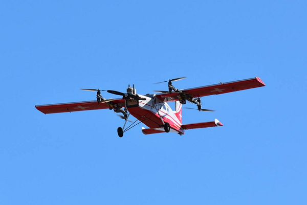

.. _quadplane-overview:

==================
QuadPlane Overview
==================

A QuadPlane is a combined fixed wing and MultiCopter aircraft. This sort
of aircraft brings the benefit of vertical takeoff and landing,
significantly greater speed and range of travel, and the ability to
hover and perform copter-like tasks at the destination.

QuadPlane is built upon Plane, but adds copter like stability control for one or more motors. In some configurations 4 or more additional motors are added . Additional modes and commands allow a QuadPlane to take off, land and fly like a copter, and to smoothly transition
between the Plane and Copter-like (VTOL) modes in both automatic and
autopilot-assisted modes. The additional rotors can also provide lift
and stability in normal Plane modes.

Types and Configurations
========================

The image below illustrates the wide variety of configurations that are possible. Motors can be under tilt control or not, the number of motors can vary from one to 8 or more, and the VTOL stance of the QuadPlane can either be horizontal, like a plane in normal fixed wing flight, or vertical (called Tailsitters). 

Installing the Firmware
=======================

The normal instructions for installing the Plane firmware apply since QuadPlane functions are an option within the Plane firmware.

When you install the plane firmware and look in the parameter list you
will see a :ref:`Q_ENABLE<Q_ENABLE>` parameter. That defaults to zero, which disables
QuadPlane support. Setting :ref:`Q_ENABLE<Q_ENABLE>` to 1 will enable QuadPlane
support. You then need to refresh your parameter list to see all the
other QuadPlane options. All QuadPlane specific parameters start with
\Q_.
