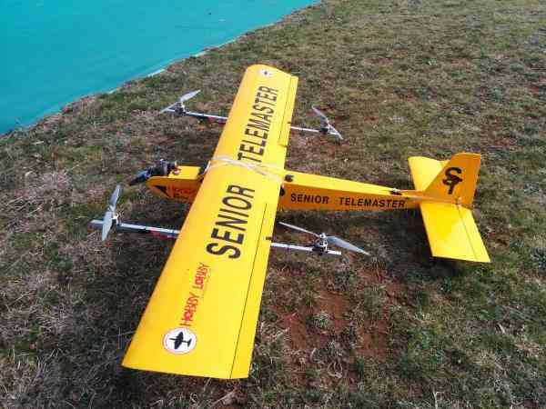

.. _quadplane-landing-page:

=================
QuadPlane Support
=================

This article explains how to set up and use a combined fixed wing and
multicopter aircraft, also known as a "QuadPlane".

.. toctree::
    :maxdepth: 1

    Overview <quadplane-overview>
    Building a QuadPlane <quadplane-building>
    Frame Setup <quadplane-frame-setup>
    Parameter Setup <quadplane-parameters>
    Flight Modes <quadplane-flight-modes>
    Flying a QuadPlane <quadplane-flying>
    AUTO Missions <quadplane-auto-mode>
    Simulation <quadplane-simulation>
    
