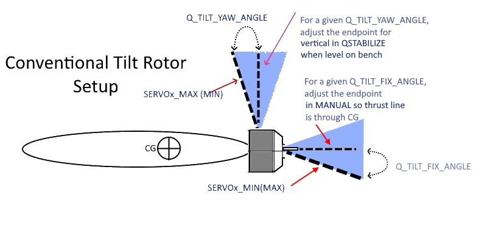
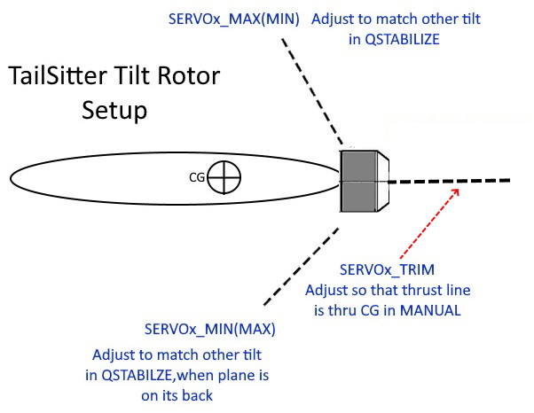
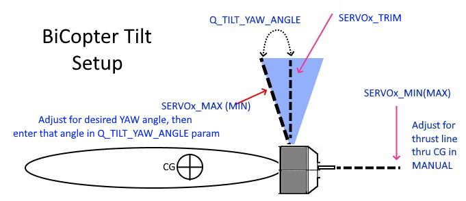

.. _quadplane-tips:

==============       
QuadPlane Tips
==============

A few helpful hints and tips for first time QuadPlane users.

Motor Alignment
===============

Motor alignment is always critical for any Plane's performance, but it is especially so for QuadPlanes. 
Miss-aligned VTOL motors can greatly affect basic VTOL performance, especially yaw trim and effectiveness, as well as fixed wing flight performance.

Checking motor alignment on the bench can be done by blocking the vehicle in a level position and measuring prop to table distances for all motors with props in fore-aft and side-to side positions. Measurement differences easily reveal miss-alignments. The arc-sine of the prop tip end differences divided by the prop diameter will give the tilt angles. A degree or two miss-alignment, while not disastrous for pitch or roll, can be significant in non-vectored yaw configurations with regards to extreme yaw miss-trim. 

Miss-alignment can be also seen in the dataflash log RCOUT values in a hover for the VTOL motors. Yaw problems appear as large separation between diagonal motor pairs.

For vectored thrust frames, fixed wing mode alignment is also critical. Very small differences between motor thrust angles in forward flight will generate undesirable, and sometimes un-controllable, roll trim tendencies. Careful bench checking and adjustment of forward fixed-wing mode positions with respect to airframe and one another is required.

X vs H Quad Mixing
==================

In theory, it doesn't matter which is used. With perfectly rigid mounting, no performance or flight difference will be noted as far as motor control dynamics. However, the actual implementation of the mounting can result in differences in drag and efficiency.

- X frame mounting or horizontal H frame type mounting creates the most drag.
- H frame mounting fore-aft (ie on the wings in line with wing chord) is the least drag, but also can result in a lot of flexing, depending on wing construction

In addition, if the mount method allows ANY twist to occur, serious performance impacts can occur. For example, a conventional style plane airframe can have the motors mounted on cross members in the nose and rear fuselage. If the fuselage allows a minor twist to occur (like during yaw with one diagonal supporting most of the plane's weight), which most foam style planes will, then if X mixing is used, the twist induced during yaw actually acts to decrease the yaw. In some cases, it can completely disable yaw effectiveness. However, the same configuration using H mixing, the twist will actually aid the desired yaw.

In general, in a Quad configuration, use H mixing and not X mixing, independent of the actual physical mounting arrangement.

Increasing YAW Authority
========================

In non-vectored yaw configurations, where torque deltas between motors is the only means of inducing/maintaining yaw, you may find that the yaw authority is too weak. In some cases, it may be so weak as to be inadequate even to maintain yaw directional stability in a hover due to imperfections in motor alignment or frame twist, even after careful trimming of motor alignment.

However, by intentionally inducing the appropriate motor tilt into each mount, YAW authority can be greatly increased at very small cost to total vertical lifting capability of the VTOL motors.

For H mixing, simply tilt all the motors inward toward the plane by 2-3 degrees, either by shimming or intentional design of the motor mounts. This provides a rotational thrust boost in addition to the torque differential, as the diagonal motor pairs are sped up/slowed down. With additional YAW authority, small motor angle imperfections can be automatically overcome by the autopilot, as well as giving the pilot additional YAW authority.

.. note:: be aware that Quadplanes rarely have the same yaw authority as multicopters due to the greater mass and surface area to wind that a plane presents. Expect to be only able to face into the wind if it's not relatively calm.

AHRS "LEVEL" Trim
=================

When you setup a Plane, the "level" calibration should be done with the plane in its normal cruising attitude (ie angle of attack of the wings). If the vertical position of the VTOL motors is not 90 degrees to this attitude, then the QuadPlane will tend to move forward or backward when hovering, requiring stick input to modify pitch. 

Fortunately, there is a parameter which allows the independent adjustment of the VTOL AHRS "level" attitude. This is :ref:`Q_TRIM_PITCH<Q_TRIM_PITCH>` . 

.. note:: this parameter is set in radians. 1 degree = 0.0174533 radians.

However, there is a better way. If mechanically possible, trim each motor to be vertical when the QuadPlane is in fixed wing "level" mode, so that using :ref:`Q_TRIM_PITCH<Q_TRIM_PITCH>` is not required. Usually this requires 3-5 degrees of forward tilt. This has the advantage of having the wings generate lift while hovering in the wind, reducing the load on the VTOL motors and preventing sudden pitch changes during transitions back to VTOL mode from fixed wing flight.

.. note:: those fabricating their mounts via a 3D printer, this is very easy to do, as well as tilt for yaw enhancement discussed above.

Copter Motors vs Servos
=======================

If you are using a configuration where there are copter motors involved (almost all QuadPlanes do except single/dual motor tailsitters), the motor outputs are assigned as PWM unless changed (see :ref:`common-dshot` ). But the PWM is at a 400Hz update rate, not 50Hz. If a servo is used in an  output group sharing the same timer as one of the motor outputs, then it too will be operating at 400HZ and must be able to tolerate that. Most analog servos will overheat or burn up. Most digital servos can tolerate that rate. Check your autopilot's :ref:`hardware description <common-autopilots>` page for the DShot output groups, which indicates which outputs share the same timer.

.. _tilt-rotor-setup:

Tilt Rotor Servo Setup
======================

Adjustment of the tilt servo's max,min,trim output values for conventional and tailsitter tilt-rotors are show below. Whether an endpoint is adjusted by SERVOx_MAX or MIN, depends on if it has been reversed to get proper directional operation.

--------------------------------------------------------------

--------------------------------------------------------------

Battery Sag
===========

Many QuadPlanes are targeted for duration and therefore may utilize high capacity to weight ratio, but low "C" , batteries. Battery sag in the initial phase of VTOL to fixed-wing transitions can be a real issue. Be sure to read the warning in :ref:`quadplane-flying` and to set :ref:`BATT_WATT_MAX<BATT_WATT_MAX>`, :ref:`Q_M_BAT_CURR_MAX<Q_M_BAT_CURR_MAX>`, and the :ref:`Q_M_BAT_VOLT_MIN<Q_M_BAT_VOLT_MIN>` parameters appropriately.

Optional Features Sometimes Overlooked
======================================

In case you missed them:

- Various QuadPlane Options: :ref:`Q_OPTIONS<Q_OPTIONS>` , bits 0,and 3-5 being especially interesting
- RTL Behaviour; :ref:`Q_RTL_MODE<Q_RTL_MODE>`
- :ref:`Assisted Flight<assisted_fixed_wing_flight>`
- :ref:`Weathervaning<quadplane-weathervaning>`
