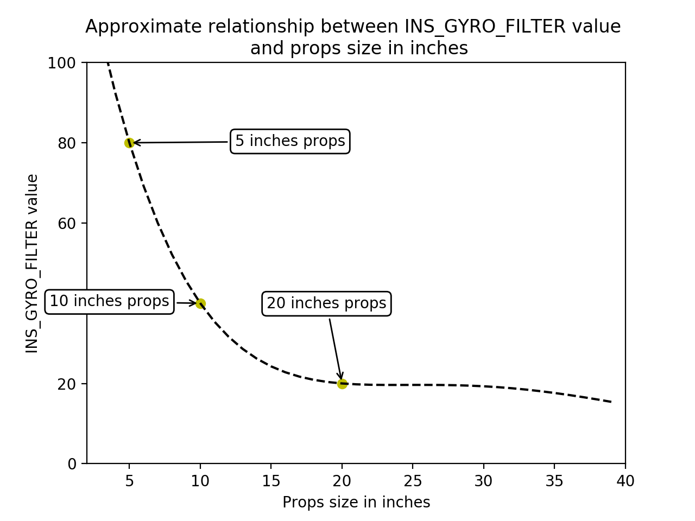
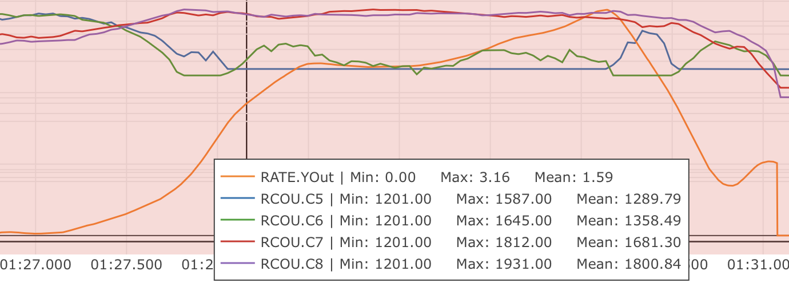

.. _quadplane-vtol-tuning-process:

===========================
Tuning Process Instructions
===========================

Setting the aircraft up to be ready for tuning
==============================================

The following parameters should be set correctly based on the specifications of your aircraft.

Step 1: Battery and expo settings
---------------------------------

It is very important to ensure that the thrust curve of your VTOL
motors is as linear as possible. A linear thrust curve means that
changes in the actual thrust produced by a motor is directly
proportional to the thrust being demanded by ArduPilot. If your thrust
curve is badly non-linear then you will never produce a good tune, and
in some cases may end up with such a bad tune that your vehicle can
become completely unstable and crash.

There are 3 common causes of a non-linear thrust curve.

 - voltage sag as throttle is increased or the forward motor is engaged. This is very common in QuadPlanes
 - incorrect end-point setup in the PWM range you use to your ESCs (see "Motors setup" below)
 - non-linearity in the thrust produced by your propeller, ESC and motor combination

Start with setting up the voltage range to cope with voltage sag.

- :ref:`Q_M_BAT_IDX <Q_M_BAT_IDX>`: index of the battery to use for voltage measurements on VTOL power system. Zero is the first battery, one for 2nd battery etc
- :ref:`Q_M_BAT_VOLT_MAX <Q_M_BAT_VOLT_MAX>`: 4.2v x No. Cells for LiPo
- :ref:`Q_M_BAT_VOLT_MIN <Q_M_BAT_VOLT_MIN>`: 3.3v x No. Cells for LiPo
- :ref:`Q_M_OPTIONS<Q_M_OPTIONS>` = 0 (default). The default is to use sag compensated voltage for the above and during tuning computations. It can be set to 1 to use raw voltage instead of sag compensated voltage, which may improve tuning results for light vehicles.

Note that :ref:`Q_M_BAT_IDX <Q_M_BAT_IDX>` needs to be for the correct
battery for your VTOL motors. If you have a separate battery for
forward motors and VTOL motors then make sure you use the right one.

Next setup the thrust expo. If you are setting up a professional
aircraft then you should invest in a thrust stand so you can
accurately measure the true thrust for your motor/ESC/propeller
combination as you vary the throttle. Then you will adjust the expo
value along with the endpoints (given by motors setup below) so that the thrust between the endpoints is as linear as possible. Do not trust manufacturer data for the thrust curve as they 
are frequently inaccurate. See :ref:`motor-thrust-scaling` for
details on thrust scaling.

If you are setting up a hobby grade vehicle then you can use the
graph below to estimate the correct :ref:`Q_M_THST_EXPO <Q_M_THST_EXPO>` value for your aircraft.

- :ref:`Q_M_THST_EXPO <Q_M_THST_EXPO>`: 0.55 for 5 inch props, 0.65 for 10 inch props, 0.75 for 20 inch props.

Step 2: Motors setup
--------------------

The motor parameters define the PWM output range sent to the
ESCs. This is critical to ensure that the entire range of throttle
values used in flight is within the linear range of your propulsion
system.

For standard PWM based ESCs you should adjust :ref:`Q_M_PWM_MIN
<Q_M_PWM_MIN>` until it is approximately 20 microseconds below the
minimum value that causes the motors to just start spinning. If you
are using digital motor outputs (such as DShot) then this is not
necessary and the default of 1000 should be used.

You should then adjust :ref:`Q_M_PWM_MAX <Q_M_PWM_MAX>` to the value
where the ESCs stop producing more thrust. Note that this is commonly
a bit below the default maximum of 2000. To find the value you should
test with propellers removed, and use the motor test facility of your
GCS to find the lowest PWM value which produces the motors maximum
RPM. You should be able to tell at what PWM the motors stop producing
more thrust by listening to the sound made at different PWM values, or
you can use a tachometer.

The :ref:`Q_M_SPIN_MIN <Q_M_SPIN_MIN>` and :ref:`Q_M_SPIN_MAX<Q_M_SPIN_MAX>` values are used to select a sub-range of the outputs
to your motors which is linear. For hobby users the defaults are
usually good, but for professional vehicles you should use the thrust
stand data to determine the right range to produce linear thrust after
the expo is applied.

- :ref:`Q_M_PWM_MAX <Q_M_PWM_MAX>`: Check ESC manual for fixed range or 2000us
- :ref:`Q_M_PWM_MIN <Q_M_PWM_MIN>`: Check ESC manual for fixed range or 1000us
- :ref:`Q_M_SPIN_ARM <Q_M_SPIN_ARM>`: use the :ref:`motor test feature <connect-escs-and-motors_testing_motor_spin_directions>`
- :ref:`Q_M_SPIN_MAX <Q_M_SPIN_MAX>`: 0.95
- :ref:`Q_M_SPIN_MIN <Q_M_SPIN_MIN>`: use the :ref:`motor test feature <connect-escs-and-motors_testing_motor_spin_directions>`
- :ref:`Q_M_THST_HOVER <Q_M_THST_HOVER>`: 0.25, or below the expected hover thrust percentage (low is safe)

Step 3: PID Controller Initial Setup
------------------------------------

The settings below are meant to get your PID controller acceleration
and filter settings into the right approximate range for your
vehicle. These parameters are critical to the tuning process.

- :ref:`INS_ACCEL_FILTER <INS_ACCEL_FILTER>`:  10Hz to 20Hz
- :ref:`INS_GYRO_FILTER <INS_GYRO_FILTER>`: 80Hz for 5 inch props, 40Hz for 10 inch props, 20Hz for 20 inch props
- :ref:`Q_A_ACCEL_P_MAX <Q_A_ACCEL_P_MAX>`: 110000 for 10 inch props, 50000 for 20 inch props, 20000 for 30 inch props
- :ref:`Q_A_ACCEL_R_MAX <Q_A_ACCEL_R_MAX>`: 110000 for 10 inch props, 50000 for 20 inch props, 20000 for 30 inch props
- :ref:`Q_A_ACCEL_Y_MAX <Q_A_ACCEL_Y_MAX>`: 7500 for 6 inch props,6750 for 10 inch props, 4500 for 20 inch props, 2250 for 30 inch props
- :ref:`Q_A_RAT_YAW_P <Q_A_RAT_YAW_P>`: 0.5 x :ref:`Q_A_ACCEL_Y_MAX <Q_A_ACCEL_Y_MAX>` / 4500

- :ref:`Q_A_RAT_PIT_FLTD <Q_A_RAT_PIT_FLTD>`: :ref:`INS_GYRO_FILTER <INS_GYRO_FILTER>` / 2
- :ref:`Q_A_RAT_PIT_FLTT <Q_A_RAT_PIT_FLTT>`: :ref:`INS_GYRO_FILTER <INS_GYRO_FILTER>` / 2
- :ref:`Q_A_RAT_RLL_FLTD <Q_A_RAT_RLL_FLTD>`: :ref:`INS_GYRO_FILTER <INS_GYRO_FILTER>` / 2
- :ref:`Q_A_RAT_RLL_FLTT <Q_A_RAT_RLL_FLTT>`: :ref:`INS_GYRO_FILTER <INS_GYRO_FILTER>` / 2
- :ref:`Q_A_RAT_YAW_FLTE <Q_A_RAT_YAW_FLTE>`: 0 for vectored yaw; 2.5 for other types of QuadPlanes
- :ref:`Q_A_RAT_YAW_FLTT <Q_A_RAT_YAW_FLTT>`: :ref:`INS_GYRO_FILTER <INS_GYRO_FILTER>` / 2

The initial tune of the aircraft should be done **in the aircraft's most agile configuration**. This generally means that the aircraft will be at its minimum take off weight with fully charged batteries.

Step 4: Pilot's preparation for first flight
--------------------------------------------

The first takeoff of an untuned VTOL vehicle is the most dangerous seconds of the aircraft’s life. This is where the aircraft could be very unstable causing a sudden increase in power when then results in the aircraft jumping into the air, or it may be so poorly tuned that you have insufficient control over the aircraft once it is airborne. The pilot should be extremely diligent during the tuning flights to avoid a situation that could result in injury or damage.

There are several things that the pilot can do to minimize the risk during the early tuning process:

1. The pilot should conduct a motor number and orientation check (see :ref:`Checking the motor numbering with the Mission Planner Motor test <connect-escs-and-motors_testing_motor_spin_directions>`). Care should be taken to ensure that the correct frame type is selected. Incorrect frame type can result in a very fast yaw rotation or complete loss of control. Take note of the output percentage required to spin the propellers and ensure that:

- :ref:`Q_M_SPIN_ARM <Q_M_SPIN_ARM>` is set high enough to spin the motors cleanly.
- :ref:`Q_M_SPIN_MIN <Q_M_SPIN_MIN>` is set high enough to spin the motors win a minimal level of thrust.

2. All flights after a significant tuning change should be done in QSTABILIZE. QSTABIILIZE provides the pilot with significantly more control over the aircraft in the event that the attitude controllers are unstable.
3. The pilot should not take off in QHOVER until the altitude controller has been tested in flight. This should be done by taking off in QSTABILIZE and switching to QHOVER. Although QHOVER is rarely a problem unless the aircraft has a very low hover throttle.
4. For the initial flights the pilot should ensure that these parameters are set:

- :ref:`Q_A_THR_MIX_MAN <Q_A_THR_MIX_MAN>` to 0.1
- :ref:`Q_M_THST_HOVER <Q_M_THST_HOVER>` to 0.25 (or lower than the expected hover throttle)

5. Use a radio and calibrate the radio correctly (see :ref:`common-radio-control-calibration`).
6. Configure an ARM/DISARM switch and test it (see :ref:`Auxiliary Functions <common-auxiliary-functions>`).
7. Do tuning flights in low-wind condition and normal weather (no rain and between 15°C/59°F and 25°C/77°F).
8. Practice QSTABILIZE flight in simulator or on a low-end drone first. You should be confident to be able to takeoff and land with your untuned aircraft.

Tuning Process
===============

Step 5: First Flight
--------------------

The first take off is the most dangerous time for any QuadPlane. Care must be taken to ensure the aircraft is not destroyed in the first seconds of flight and nobody is injured.

- **Ensure that all spectators are at a safe distance**.
- **Ensure the pilot is at a safe distance and position**.
- The pilot should refresh themselves on the method used to disarm the aircraft (using :ref:`Auxiliary Functions <common-auxiliary-functions>` for Motor Interlock or Arm/Disarm may be beneficial).

This flight will allow to setup your aircraft in a "flyable for tuning" state.

1. Ensure the aircraft is in QSTABILIZE mode
2. Arm the aircraft
3. Immediately disarm the aircraft to ensure your disarm procedure is correct
4. Arm the aircraft
5. Slowly increase the throttle looking for signs of oscillation. (long or flexible landing gear may cause some landing gear oscillation that will only go away after the aircraft leaves the ground)
6. As soon as the aircraft lifts off the ground immediately put the aircraft back down as gently as possible
7. Disarm the aircraft
8. Evaluate what you observed to decide if you need to make adjustments to the tuning parameters or if it is safe to take off again
9. Arm and increase the throttle to initiate a takeoff
10. Hover at approximately 1m altitude and apply small (5 degrees) control inputs into roll and pitch
11. Immediately land if any oscillation is observed

Next section will explain how to remove the oscillations.

Step 6: Initial aircraft tune
-----------------------------

The first priority when tuning a QuadPlane is to establish a stable tune, free of oscillations, that can be used to do further tests.

1. Arm the aircraft in QSTABILIZE
2. Increase the throttle slowly until the aircraft leaves the ground
3. If the aircraft starts to oscillate immediately abort the takeoff and/or land the aircraft, and:
4. Reduce all the following parameters by 50%

a. :ref:`Q_A_RAT_PIT_P <Q_A_RAT_PIT_P>`
b. :ref:`Q_A_RAT_PIT_I <Q_A_RAT_PIT_I>`
c. :ref:`Q_A_RAT_PIT_D <Q_A_RAT_PIT_D>`
d. :ref:`Q_A_RAT_RLL_P <Q_A_RAT_RLL_P>`
e. :ref:`Q_A_RAT_RLL_I <Q_A_RAT_RLL_I>`
f. :ref:`Q_A_RAT_RLL_D <Q_A_RAT_RLL_D>`

This process is repeated until the aircraft can hover without oscillations being detectable visually or audibly.

If the aircraft has very long or flexible landing gear then you may need to leave the ground before ground resonance stops.

Be aware that in this state the aircraft may be very slow to respond to large control inputs and disturbances. The pilot should be extremely careful to put minimal stick inputs into the aircraft to avoid the possibility of a crash.

Step 7: Test QHOVER
-------------------

This test will allow to test the altitude controller and ensure the stability of your aircraft.

1. Check :ref:`Q_M_HOVER_LEARN <Q_M_HOVER_LEARN>` is set to 2. This will allow the controller to learn by itself the correct hover value when flying.

.. note:: the Hover throttle value is only "learned" when the attitude is not being commanded by the pilot, or autopilot (ie QLOITER,etc.), to exceed 5 degrees from neutral for two seconds.

2. Take off in QSTABILIZE and increase altitude to 5m. Switch to QHOVER and be ready to switch back to QSTABILIZE. If the aircraft is hovering at a very low hover throttle value you may hear a reasonably fast oscillation in the motors. Ensure the aircraft has spent at least 30 seconds in hover to let the hover throttle parameter converge to the correct value. Land and disarm the aircraft.

3. Set these parameters on ground and preferably disarm  (A confident pilot could set them in flight with GCS):

  - :ref:`Q_P_ACCZ_I <Q_P_ACCZ_I>` to 2 x :ref:`Q_M_THST_HOVER <Q_M_THST_HOVER>`
  - :ref:`Q_P_ACCZ_P <Q_P_ACCZ_P>` to :ref:`Q_M_THST_HOVER <Q_M_THST_HOVER>`

 If the QuadPlane in QHOVER starts to move up and down, the vertical position and velocity controllers may need to be reduced by 50%. These values are: :ref:`Q_P_POSZ_P <Q_P_POSZ_P>` and :ref:`Q_P_VELZ_P <Q_P_POSZ_P>`.

.. note:: If the :ref:`Q_M_THST_HOVER<Q_M_THST_HOVER>` learned should be ~0.3-0.6. Higher values indicate that insufficient thrust is available, either due to motor system design, obstructed prop air flow by the fuselage or wings, or excessive yaw bias (see next section)

Step 8: Yaw Bias
----------------

A common problem in QuadPlanes is excessive amount of VTOL power being
used to maintain yaw hold instead of providing lift. This can be caused by:

- small misalignment of the VTOL motors
- frame twist (often caused by wing twist) as thrust is applied
- obstructed prop air flow by wings in :ref:`TVBS type tailsitters<tvbs>` making vectored yaw by motor tilt less effective. This can also cause enough reduction in normal thrust to make hovering and VTOL climb difficult.

If too much power is needed to maintain yaw then the aircraft could
lose yaw control during transitions, or could lose roll and pitch
stability. The most common symptom is a high hover throttle point, or even the inability to rise into a hover at high throttle stick position. For larger QuadPlanes it is common to need to deliberately
tilt the motors by a couple of degrees to increase yaw authority.

.. note:: for an X frame type (:ref:`Q_FRAME_TYPE<Q_FRAME_TYPE>` = 1), 
    the motors should be tilted outwards. 
    For an H frame (:ref:`Q_FRAME_TYPE<Q_FRAME_TYPE>` = 3) they should be tilted inwards.

You should check the amount of thrust being used to maintain yaw by
looking at the RATE YOut value in your hover logs. If it is over 10%
(a value of 0.1) when hovering in no wind with no pilot input,then you have a problem with
yaw asymmetry that should be fixed. Just hovering in place may look fine 
and you may not see the problem until you examine the log.

The log below shows RATE.YOut (orange) increasing dramatically while motor 1 (RCOUT.C5) 
is idling and motor 2 (RCOUT.C6) is barely working,
but at the same time motor 3 (RCOUT.C7) and motor 4 (RCOUT.C8) are are running > 50% output. This limits how much higher the firmware could raise the overall thrust due to these motors maxing out.

Fixing yaw asymmetry can involve mechanical improvements such as stiffening the
airframe to resist twisting, making sure prop flow is unobstructed by the wings on TVBS frames,or correcting/adjusting motor tilt angles

Some QuadPlanes will benefit from being setup as H frames
instead of X frames. Which works best depends on the way the motor
mounts twist when under thrust. If you have a persistent problem with
yaw control then consider trying to change the frame type between X
and H, however a quadplane with motors mounted on booms secured
to the wings would normally be setup as an X frame.

Step 9: Notch Filtering
-----------------------

After your have QHOVER flying without oscillations the next step is to
get get a good notch filter setup to reduce noise to the VTOL PID
controllers. A good set of notch filtering parameters is critical to a
good tune.

To get a notch filter setup you need to hover your QuadPlane for 2
minutes with no pilot input and with :ref:`INS_LOG_BAT_MASK
<INS_LOG_BAT_MASK>` set to 1. This will enable FFT logging which will
guide the correct setup of the notch filters. You should then
carefully read the :ref:`common-imu-notch-filtering` documentation and
setup a harmonic notch to remove the noise from your gyros.

When setting up your filtering you should consider the cause of any
oscillation you find. On most aircraft the vibrations you find will be
directly caused by a multiple of the RPM, but on some aircraft a frame
resonance or resonance in the autopilot mount may be the
cause. Understanding the cause of any resonances is critical to
reducing noise enough to get a good tune.

Step 10: Manual tuning of Roll and Pitch
----------------------------------------

While you may be tempted to jump straight to autotuning, this is
not recommended. Most QuadPlanes need some manual tuning of roll and
pitch before they can handle an autotune. If you jump straight to an
autotune then your aircraft may become unstable enough to crash. A
good manual tune will also reduce the amount of time an autotune will
take, which can be critical given the small VTOL hover times of many
QuadPlanes.

Before starting the manual tune you should go back and check you have
fully completed the steps above, and ensure you have a good notch
filter setup to remove noise from the gyros.

Hover the aircraft in QSTABILIZE or QHOVER modes, in low wind, with
good sky view and good GPS lock. You should adjust the rate gains as
described below, using small "twitches" on the sticks after each
change to try to trigger oscillation.

If oscillations start do not make large or sudden stick inputs. Reduce
the throttle smoothly to land the aircraft while using very slow and
small roll and pitch inputs to control the aircraft position.

The parameters you will be adjusting are:

- :ref:`Q_A_RAT_RLL_D <Q_A_RAT_RLL_D>`
- :ref:`Q_A_RAT_RLL_P <Q_A_RAT_RLL_P>` and :ref:`Q_A_RAT_RLL_I <Q_A_RAT_RLL_I>`
- :ref:`Q_A_RAT_PIT_D <Q_A_RAT_PIT_D>`
- :ref:`Q_A_RAT_PIT_P <Q_A_RAT_PIT_P>` and :ref:`Q_A_RAT_PIT_I <Q_A_RAT_PIT_I>`

.. note::  If the VTOL motors do not tilt, then the ``Q_A_RAT_PIT_FF`` and  ``Q_A_RAT_YAW_FF`` will be zero and corrections are dominated by P/I/D. But if pitch or yaw control is primarily by tilting the motors, then the FF terms dominate and P/D are primarily for disturbance correction. For tuning a tilted motor controlled axis, see :ref:`pitch-yaw-tuning`.

Start with the roll parameters, then move onto the pitch.

1. Increase the D term in steps of 50% until oscillation is observed
2. Reduce the D term in steps of 10% until the oscillation disappears
3. Reduce the D term by a further 25%
4. Increase the P term in steps of 50% until oscillation is observed
5. Reduce the P term in steps of 10% until the oscillation disappears
6. Reduce the P term by a further 25%

Each time the P term is changed in the above steps you should set the
corresponding I term equal to the P term. Those parameters can be
changed on ground and preferably disarmed. Alternatively, a confident
pilot could set them in flight with a GCS, or use the transmitter
tuning option. See :ref:`common-transmitter-tuning`

Note that it is common that once you have properly setup notch
filtering that you will be able to increase the D value a lot from the
default value. Increases of 10x over the default are not
uncommon. Being able to use a larger D gain is one of the main
advantages of good notch filtering, and can produce a much better
tune.

After you have gone through the above steps you should carefully look
at your logs to ensure you don't have a hidden oscillation. The
structure of QuadPlanes sometimes means that oscillations may not be
externally visible. You should use the RATE, PIQR and PIQP messages to
look for oscillations.

Step 11: Evaluating the aircraft tune
-------------------------------------

You need to evaluate the aircraft's tune to see if the previous steps
have resulted in a tune which is good enough for a transition flight
or for autotuning.

1. Take off in QHOVER or QSTABILIZE
2. Apply small roll and pitch inputs. Start with 5 degree inputs and releasing the stick to centre, pitch, left, right, roll forward back, then all 4 points on the diagonal
3. Increase inputs gradually to full stick deflection
4. Go to full stick deflection, quickly momentarily, and let the sticks spring back to centre

If the aircraft begins to overshoot significantly or oscillate after
the stick input, halt the tests before the situation begins to
endanger the aircraft. The aircraft may require more manual tuning before autotuning can be run.

To test the stabilization loops independent of the input shaping, set the parameter: :ref:`Q_A_RATE_FF_ENAB <Q_A_RATE_FF_ENAB>` to 0.

1. Take off in QHOVER or QSTABILIZE
2. Hold a roll or pitch input
3. Release the stick and observe the overshoot as the aircraft levels itself
4. Gradually increase the stick deflection to 100%

Halt the tests if the aircraft overshoots level significantly or if
the aircraft oscillates and go back to manual tuning.

Set :ref:`Q_A_RATE_FF_ENAB <Q_A_RATE_FF_ENAB>` to 1 after the tests are complete.

Step 12: Autotuning
-------------------
Often, a good manual tune will be sufficient. However, autotuning can sometimes improve the tune.

If the aircraft appears stable enough to attempt autotuning and you
have sufficient battery to last through an autotuning session then you can autotune using one of two methods:

- Quick Tune LUA Applet (the preferred method if your autopilot is capable of running LUA scripts)
- QAUTOTUNE Mode (no longer the recommended method, but can be used if using LUA scripts is not possible)

Using the Quick VTOL Tune LUA Applet to Automate Tuning
~~~~~~~~~~~~~~~~~~~~~~~~~~~~~~~~~~~~~~~~~~~~~~~~~~~~~~~

For systems using an autopilot with sufficient memory to run :ref:`LUA scripts <common-lua-scripts>`, such as F7 and H7 based controllers, this process has been automated via a LUA Applet.

Be sure that scripting has been setup and sufficient memory has been allocated, as explained in :ref:`LUA scripts <common-lua-scripts>`.

See the `Quick VTOL Tune LUA script <https://github.com/ArduPilot/ardupilot/blob/master/libraries/AP_Scripting/applets/VTOL-quicktune.md>`__.

Using the QAUTOTUNE mode to Automate Tuning
~~~~~~~~~~~~~~~~~~~~~~~~~~~~~~~~~~~~~~~~~~~

Follow the instructions in the :ref:`QAUTOTUNE<qautotune-mode>` page.

You should use QAUTOTUNE on one axis at a time (setting
:ref:`Q_AUTOTUNE_AXES <Q_AUTOTUNE_AXES>` for the axis you want to
tune). An autotune of a single axis will typically take 5 to 8
minutes, but will take longer if your manual tune is not good
enough. If you do not have enough battery for at least 8 minutes of
vertical flight then QAUTOTUNE is not recommended.

There a number of problems that can prevent QAUTOTUNE from providing a good tune. Some of the reason QAUTOTUNE can fail are:

- High levels of gyro noise.
- Incorrect value of :ref:`Q_M_THST_EXPO <Q_M_THST_EXPO>`.
- Flexible frame or payload mount.
- Overly flexible vibration isolation mount.
- Non-linear ESC response.
- Very low setting for :ref:`Q_M_SPIN_MIN <Q_M_SPIN_MIN>`.
- Overloaded propellers or motors.
- Autotuning a Tailsitter's pitch or yaw axis, or vectored yaw axis on TiltRotor, since they require feed-forward.

If QAUTOTUNE has failed you will need to re-do a manual tune.

Some signs that QAUTOTUNE has been successful are:

- An increase in the values of :ref:`Q_A_ANG_PIT_P <Q_A_ANG_PIT_P>` and :ref:`Q_A_ANG_RLL_P <Q_A_ANG_RLL_P>`.
- :ref:`Q_A_RAT_PIT_D <Q_A_RAT_PIT_D>` and :ref:`Q_A_RAT_RLL_D <Q_A_RAT_RLL_D>` are larger than :ref:`Q_AUTOTUNE_MIN_D <Q_AUTOTUNE_MIN_D>`.

QAUTOTUNE will attempt to tune each axis as tight as the aircraft can tolerate. In some aircraft this can be unnecessarily responsive. A guide for most aircraft:

- :ref:`Q_A_ANG_PIT_P <Q_A_ANG_PIT_P>` should be reduced from 10 to 6
- :ref:`Q_A_ANG_RLL_P <Q_A_ANG_RLL_P>` should be reduced from 10 to 6
- :ref:`Q_A_ANG_YAW_P <Q_A_ANG_YAW_P>` should be reduced from 10 to 6
- :ref:`Q_A_RAT_YAW_P <Q_A_RAT_YAW_P>` should be reduced from 1 to 0.5
- :ref:`Q_A_RAT_YAW_I <Q_A_RAT_YAW_I>`: :ref:`Q_A_RAT_YAW_P <Q_A_RAT_YAW_P>` x 0.1

These values should only be changed if QAUTOTUNE produces higher values. Small aerobatic aircraft may prefer to keep these values as high as possible.

Step 13: Setting the input shaping parameters
---------------------------------------------

QuadPlane has a set of parameters that define the way the aircraft feels to fly. This allows the aircraft to be set up with a very aggressive tune but still feel like a very docile and friendly aircraft to fly.

The most important of these parameters is:

- :ref:`Q_A_RAT_YAW_P <Q_A_RAT_YAW_P>`: yaw rate x 45 degrees/s
- :ref:`Q_ANGLE_MAX <Q_ANGLE_MAX>`:  maximum lean angle
- :ref:`Q_A_ACCEL_P_MAX <Q_A_ACCEL_P_MAX>`: Pitch rate acceleration
- :ref:`Q_A_ACCEL_R_MAX <Q_A_ACCEL_R_MAX>`: Roll rate acceleration
- :ref:`Q_A_ACCEL_Y_MAX <Q_A_ACCEL_Y_MAX>`: Yaw rate acceleration
- :ref:`Q_A_ANG_LIM_TC <Q_A_ANG_LIM_TC>`: Aircraft smoothing time

QAUTOTUNE mode tuning will set the :ref:`Q_A_ACCEL_P_MAX <Q_A_ACCEL_P_MAX>`, :ref:`Q_A_ACCEL_R_MAX <Q_A_ACCEL_R_MAX>` and :ref:`Q_A_ACCEL_Y_MAX <Q_A_ACCEL_Y_MAX>` parameters to their maximum based on measurements done during the QAUTOTUNE tests. These values should not be increased beyond what QAUTOTUNE suggests without careful testing. In most cases pilots will want to reduce these values significantly.

The Quick VTOL Tune LUA Applet will not adjust these from defaults and you may adjust them to get the feel you desire.

For aircraft designed to carry large directly mounted payloads, the maximum values of :ref:`Q_A_ACCEL_P_MAX <Q_A_ACCEL_P_MAX>`, :ref:`Q_A_ACCEL_R_MAX <Q_A_ACCEL_R_MAX>` and :ref:`Q_A_ACCEL_Y_MAX <Q_A_ACCEL_Y_MAX>` should be reduced based on the minimum and maximum takeoff weight (TOW):

- :ref:`Q_A_ACCEL_P_MAX <Q_A_ACCEL_P_MAX>`  x (min_TOW / max_TOW)
- :ref:`Q_A_ACCEL_R_MAX <Q_A_ACCEL_R_MAX>`  x (min_TOW / max_TOW)
- :ref:`Q_A_ACCEL_Y_MAX <Q_A_ACCEL_Y_MAX>`  x (min_TOW / max_TOW)

:ref:`Q_A_RAT_YAW_P <Q_A_RAT_YAW_P>` should be set to be approximately 0.5 x :ref:`Q_A_ACCEL_Y_MAX <Q_A_ACCEL_Y_MAX>` / 4500 to ensure that the aircraft can achieve full yaw rate in approximately half a second.

:ref:`Q_A_ANG_LIM_TC <Q_A_ANG_LIM_TC>` may be increased to provide a very smooth feeling on the sticks at the expense of a slower reaction time.

Aerobatic aircraft should keep the :ref:`Q_A_ACCEL_P_MAX <Q_A_ACCEL_P_MAX>`, :ref:`Q_A_ACCEL_R_MAX <Q_A_ACCEL_R_MAX>` and :ref:`Q_A_ACCEL_Y_MAX <Q_A_ACCEL_Y_MAX>` provided by QAUTOTUNE and reduce :ref:`Q_A_ANG_LIM_TC <Q_A_ANG_LIM_TC>` to achieve the stick feel desired by the pilot. 

The full list of input shaping parameters are:

- :ref:`Q_A_RAT_YAW_P <Q_A_RAT_YAW_P>`
- :ref:`Q_ANGLE_MAX <Q_ANGLE_MAX>`
- :ref:`Q_A_ACCEL_P_MAX <Q_A_ACCEL_P_MAX>`
- :ref:`Q_A_ACCEL_R_MAX <Q_A_ACCEL_R_MAX>`
- :ref:`Q_A_ACCEL_Y_MAX <Q_A_ACCEL_Y_MAX>`
- :ref:`Q_A_ANG_LIM_TC <Q_A_ANG_LIM_TC>`
- :ref:`Q_A_RATE_P_MAX <Q_A_RATE_P_MAX>`
- :ref:`Q_A_RATE_R_MAX <Q_A_RATE_R_MAX>`
- :ref:`Q_A_RATE_Y_MAX <Q_A_RATE_Y_MAX>`
- :ref:`Q_A_SLEW_YAW <Q_A_SLEW_YAW>`
- :ref:`Q_P_JERK_XY<Q_P_JERK_XY>`
- :ref:`Q_P_JERK_Z<Q_P_JERK_Z>`
- :ref:`Q_LOIT_ACC_MAX <Q_LOIT_ACC_MAX>`
- :ref:`Q_LOIT_ANG_MAX <Q_LOIT_ANG_MAX>`
- :ref:`Q_LOIT_BRK_ACCEL <Q_LOIT_BRK_ACCEL>`
- :ref:`Q_LOIT_BRK_DELAY <Q_LOIT_BRK_DELAY>`
- :ref:`Q_LOIT_BRK_JERK <Q_LOIT_BRK_JERK>`
- :ref:`Q_LOIT_SPEED <Q_LOIT_SPEED>`

