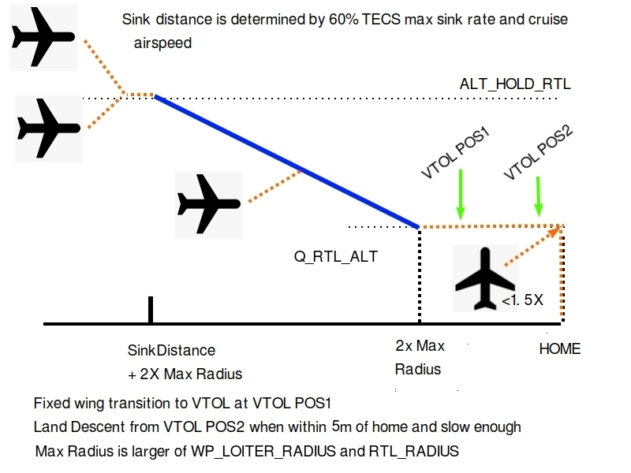

.. _quadplane_rtl:

================
Return to Launch
================

Returning to Launch (either HOME or a Rally point) can be executed by either switching to RTL mode or QRTL mode. In each case a key concept is the return point. This is defined as the
closest rally point, or if a rally point is not defined, then the HOME
location. See the :ref:`Rally Points <common-rally-points>` page for
more information on rally points.

RTL mode has four different options for its behavior but basically uses fixed wing flight for at least the majority of the return. Behavior also depends on how close to the return point the vehicle is when entered and from what mode, fixed wing or VTOL/QAssist. RTL mode behavior is determined by the :ref:`Q_RTL_MODE<Q_RTL_MODE>` parameter and explained in the sections below.

QRTL mode, by default, will return either in fixed wing mode and land in VTOL mode the same way as the RTL mode selected by :ref:`Q_RTL_MODE<Q_RTL_MODE>` = 3, or by using :ref:`Q_OPTIONS<Q_OPTIONS>` bit (16), as a pure VTOL return and land.

.. note:: RC failsafe when in a VTOL mode will only result in either a switch to QLAND, RTL, or QRTL, depending on the :ref:`Q_OPTIONS<Q_OPTIONS>` bit 5 (QRTL) and bit 20 (RTL) settings (bit 20 overrides bit 5), independent of what the :ref:`FS_SHORT_ACTN<FS_SHORT_ACTN>` or :ref:`FS_LONG_ACTN<FS_LONG_ACTN>` setting is.

RTL Modes
=========
Fixed Wing RTL
--------------

:ref:`Q_RTL_MODE <Q_RTL_MODE>` = 0
~~~~~~~~~~~~~~~~~~~~~~~~~~~~~~~~~~
**RETURN FIXED WING AND LOITER**

The default behaviour (:ref:`Q_RTL_MODE<Q_RTL_MODE>` = 0)of the RTL mode is the same as for fixed
wing. It will fly to the nearest rally point (or HOME if no rally
point is defined) and circle as a fixed wing aircraft about that
point. The VTOL motors will not be used unless the aircraft drops below
the airspeed defined in :ref:`Q_ASSIST_SPEED <Q_ASSIST_SPEED>`. The altitude the aircraft
will circle at will be the altitude in the rally point, or the
:ref:`RTL_ALTITUDE<RTL_ALTITUDE>` altitude if a rally point is not being used.

If in a VTOL mode when RTL is selected (either by a failsafe action or the pilot), the Quadplane will immediately transition to fixed wing and fly back as if in normal fixed wing RTL mode.

.. _hybrid_rtl:

Hybrid RTL
----------

The another options for RTL in a QuadPlane are to fly as a fixed wing
aircraft until it is close to the return point at which time it
switches to VTOL QRTL mode and land vertically at the return point. To enable this type of
hybrid RTL behavior you need to set the :ref:`Q_RTL_MODE <Q_RTL_MODE>` parameter to 1, 2, or 3.

:ref:`Q_RTL_MODE <Q_RTL_MODE>` = 1
~~~~~~~~~~~~~~~~~~~~~~~~~~~~~~~~~~
**RETURN FIXED WING, SWITCH TO QRTL, and LAND**

If in fixed wing mode when RTL is entered, the initial altitude that will be aimed for in the fixed wing portion
of the hybrid RTL is the same as for a fixed wing RTL. You should set
your rally point altitude and :ref:`RTL_ALTITUDE<RTL_ALTITUDE>` parameters appropriately to
ensure that the aircraft travels at a safe altitude.

The distance from the return point at which the aircraft switches from
fixed wing to VTOL flight is set using the :ref:`RTL_RADIUS<RTL_RADIUS>` parameter, or
if that is not set then the :ref:`WP_LOITER_RAD<WP_LOITER_RAD>` parameter is used. The
aircraft will then slow down as it approaches the return point, aiming
for an altitude set by :ref:`Q_RTL_ALT <Q_RTL_ALT>`.

Once the return point is reached the aircraft begins to descend and land.

If in a VTOL mode when RTL is selected (either by a failsafe action or the pilot), the Quadplane will immediately transition to fixed wing and fly back as if it had been entered while in a fixed wing mode.

:ref:`Q_RTL_MODE <Q_RTL_MODE>` = 2
~~~~~~~~~~~~~~~~~~~~~~~~~~~~~~~~~~
**RETURN FIXED WING, LOITER TO ALT, SWITCH TO QRTL, LAND**

Setting :ref:`Q_RTL_MODE<Q_RTL_MODE>` to 2 results in behavior similar to above, but with the vehicle returning like normal fixed wing RTL until it reaches :ref:`Q_FW_LND_APR_RAD<Q_FW_LND_APR_RAD>`, then loitering in fixed wing mode down to :ref:`Q_RTL_ALT<Q_RTL_ALT>` altitude, and then exiting facing the wind and executing a :ref:`QRTL<qrtl-mode>` to the home position. Be sure the loiter portion is set up to clear any obstacles.

If RTL is triggered within the larger of :ref:`RTL_RADIUS<RTL_RADIUS>` and :ref:`WP_LOITER_RAD<WP_LOITER_RAD>`, and below :ref:`Q_RTL_ALT<Q_RTL_ALT>`, in a VTOL mode or assisted fixed wing flight, the vehicle will proceed immediately toward :ref:`Q_RTL_ALT<Q_RTL_ALT>` and the landing position and then land (ie :ref:`QRTL<qrtl-mode>` mode).

If in a VTOL mode or assisted fixed wing flight when RTL is selected (either by a failsafe action or the pilot) beyond those radii, the Quadplane will immediately transition to fixed wing and fly back as if it had been entered while in a fixed wing mode.

:ref:`Q_RTL_MODE <Q_RTL_MODE>` = 3
~~~~~~~~~~~~~~~~~~~~~~~~~~~~~~~~~~
**RETURN FIXED WING,APPROACH TO VTOL TRANSITION POINT, AIRBRAKE, SWITCH TO QRTL, LAND**

Setting :ref:`Q_RTL_MODE<Q_RTL_MODE>` to 3 results in behavior similar to a normal :ref:`QRTL <qrtl-mode>`. The vehicle will enter an "APPROACH" phase, and will return at :ref:`RTL_ALTITUDE<RTL_ALTITUDE>` and at a calculated distance, start a descent towards :ref:`Q_RTL_ALT<Q_RTL_ALT>`. As it approaches the landing position, ArduPilot starts an "airbraking" phase in non-tailistters to slow the vehicle and once slowed enters full VTOL mode and proceeds to execute a VTOL landing. This behavior is also used by default for the :ref:`QRTL<qrtl-mode>` mode unless :ref:`Q_OPTIONS<Q_OPTIONS>` bit 16 is set to prevent the Hybrid operation above.

In effect, this enables the QRTL mode for any RTL actuation: failsafe actions, mode change to QRTL, or completion of a mission (unless the last mission item prevents RTL).

.. note:: This mode is also used by default in all mission VTOL_LANDINGs unless the :ref:`Q_OPTIONS<Q_OPTIONS>` bit 16 is set to disable it.

This fixed wing "approach" allows VTOL landings to be used without needing to setting up approach waypoints to reduce altitude and get close enough to proceed in VTOL mode toward the landing point. If disabled by bit 16, the vehicle will instantly transition to VTOL mode upon that mission items execution, or upons mode changes to :ref:`QRTL <qrtl-mode>`, and navigate to its landing point in VTOL before doing a QLAND. This means that you should be very close to the landing site if the FW approach mode is disabled in a mission since it will proceed in VTOL flight to the land point.

The image below details the phases of the approach and landing with the default setting of bit 16 (ie, not enabled):

The phases of the approach are:

- if in a VTOL mode when entered, vehicle will climb to :ref:`Q_RTL_ALT<Q_RTL_ALT>`, if below, then transition to fixed wing and start a normal fixed wing RTL
- in a fixeed wing mode when further than 2 times the greater of either :ref:`RTL_RADIUS<RTL_RADIUS>` or :ref:`WP_LOITER_RADS<WP_LOITER_RAD>` (MAXRAD) plus a calculated distance needed to descend from :ref:`RTL_ALTITUDE<RTL_ALTITUDE>` to :ref:`Q_RTL_ALT<Q_RTL_ALT>`, the plane will attempt to climb or descend to :ref:`RTL_ALTITUDE<RTL_ALTITUDE>`. If within that range, it will attempt to climb/descend to a linear descent slope, meet it, and continue to descend, as shown above.
- if started further than 2X "MAXRAD" but closer than above, at 2x MAXRAD it will continue in fixed wing mode at :ref:`Q_RTL_ALT<Q_RTL_ALT>`.
- when it reaches a point that is within the VTOL stopping distance of the landing point (at the VTOL deceleration parameter limits and current speed), it will transition to VTOL mode and send a message that it is in "VTOL Position1" and continue moving to the land point. If the vehicle is NOT a tailsitter, an "AIRBRAKING" phase may occur before the VTOL transition, spinning up the VTOL motors to create additional braking.
- once the QuadPlane is within 5m of the land point and moving less than 2 m/s, it will send a GCS message declaring that it is in "VTOL Position2, and final position itself over the land point and begin its landing descent, which will also be indicated by GCS messages
- if the approach is entered less than 1.5X MAXRAD, it will immediately move to VTOL Position1 state, whether entered from fixed wing or vtol modes, and move toward the landing site attempting to obtain :ref:`Q_RTL_ALT<Q_RTL_ALT>` as it does so.
- if in VTOL mode at greater than 1.5X MAXRAD, the plane will transition to fixed wing, and attempt to navigate to home, executing the approach. The climb and turn toward the landing point will occur at even low altitudes, just like normal non-QuadPlane RTLs, so the :ref:`FLIGHT_OPTIONS<FLIGHT_OPTIONS>` bit 4 for "Climb before turn in RTL" and/or :ref:`Q_OPTIONS<Q_OPTIONS>` bit 0 for "Level Transitions" might be worth considering.

QRTL Mode
=========

By default, switching to :ref:`QRTL<qrtl-mode>` mode will act exactly as :ref:`Q_RTL_MODE<Q_RTL_MODE>` = 3, above. However, if you prefer to do return to launch as a pure VTOL aircraft (like a multirotor would do) then you can use the :ref:`QRTL<qrtl-mode>` flight mode, but with :ref:`Q_OPTIONS<Q_OPTIONS>` bit 16 set in order to disable QRTL's default behavior (which is like the hybrid RTL described above with :ref:`Q_RTL_MODE<Q_RTL_MODE>` = 3). The vehicle will transition to VTOL flight, if not already in VTOL, and then fly at the
:ref:`Q_WP_SPEED <Q_WP_SPEED>` speed towards the return point, at an altitude of
:ref:`Q_RTL_ALT <Q_RTL_ALT>`.

Once the return point is reached the aircraft will start a vertical
descent towards the ground for landing. The initial descent rate is
set by :ref:`Q_WP_SPEED_DN <Q_WP_SPEED_DN>`. Once the aircraft reaches an altitude of
:ref:`Q_LAND_FINAL_ALT <Q_LAND_FINAL_ALT>` the descent rate will
change to :ref:`Q_LAND_FINAL_SPD <Q_LAND_FINAL_SPD>` for
the final landing phase.

In the final landing phase the aircraft will detect landing by looking
for when the VTOL motor throttle drops below a minimum threshold for 5
seconds. When that happens the aircraft will disarm and the VTOL
motors will stop.
