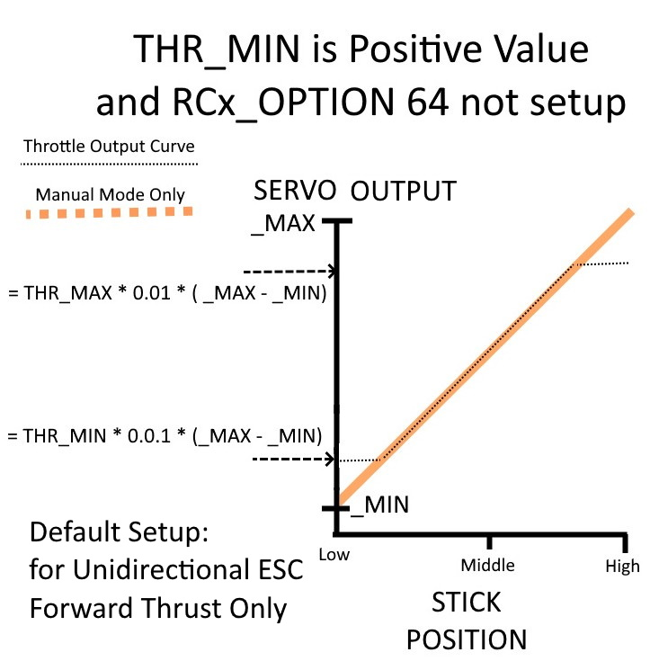

.. _reverse-thrust-setup:

====================
Reverse Thrust Setup
====================

Reverse thrust can be used in Plane for any auto-throttle mode and in automatic landings, and/or under pilot control to provide steeper descents without gaining airspeed.

In order to use reverse thrust, the ESC must be capable of it. If so, usually the ESC input to output will be symmetric with equal forward and reverse output. For example, the center point 1500us would be idle/stopped, instead of half throttle as on a non-reversing ESC.

For the rest of this document, the typical setup of having RC channel 3 control the throttle, and the motor esc being on output 3, for the examples. For multiple motors, the parameters would be used for those output numbers also.

Setup
=====

.. warning:: never arm and work on motor settings with propellers attached!

First, the :ref:`SERVO3_MAX<SERVO3_MAX>`, :ref:`SERVO3_MIN<SERVO3_MIN>`, and :ref:`SERVO3_TRIM<SERVO3_TRIM>` must be set appropriately for the output attached to the ESC. Usually, the :ref:`SERVO3_TRIM<SERVO3_TRIM>` value will set the zero output point (usually 1500uS), while the :ref:`SERVO3_MAX<SERVO3_MAX>` sets the maximum forward point, and :ref:`SERVO3_MIN<SERVO3_MIN>` sets the maximum reverse thrust point.

In order for reverse thrust to be active (outputting values to the ESC between trim and min values), the value for :ref:`THR_MIN<THR_MIN>` must be negative, as shown below.

Next, how it will be controlled must be decided. The options are:

1. Pilot control with the throttle stick. Above the zero thrust (idle) stick position will control forward thrust, while below will be reverse thrust. Within the deadzone (:ref:`RC3_DZ<RC3_DZ>`), is the zero thrust position. This allows pilot control on approaches or descents in non-auto-throttle modes (MANUAL, FBWA, etc.)

2. Automatic control by ArduPilot in auto-throttle modes (AUTO,CRUISE,FBWB,etc.) for increased descents without airspeed increases, especially during automatic landings to control flare and pre-flare airspeeds more accurately with steeper glide-slopes.

3. Both of the above.

Reverse Thrust: Pilot Controlled
--------------------------------

First, its important to understand how non-reverse throttle's input to throttle servo output functions, when :ref:`THR_MIN<THR_MIN>` is zero or a positive value and the RC option for a reversing switch (RCx_OPTION = 64) is not setup (the usual case for most planes).

    Normal Throttle Setup

The throttle stick positions of low and high correspond to the calibrated values for :ref:`RC3_MIN<RC3_MIN>` and :ref:`RC3_MAX<RC3_MAX>`, respectively. When armed, these positions produce the minimum and maximum output values setup for SERVO3 and correspond to zero output and full thrust output when the ESC has been calibrated. Note that the :ref:`RC3_TRIM<RC3_TRIM>` value is not used in this case. 

The :ref:`THR_MAX<THR_MAX>` and :ref:`THR_MIN<THR_MIN>` values constrain the output values in non-Manual modes. A non-zero, positive value for :ref:`THR_MIN<THR_MIN>` might be used to keep an internal combustion engine running at low stick, but allow its cutoff in MANUAL mode. Note that these parameters are percentages of the output range.

In order to obtain reverse thrust using the pilot's throttle stick, the servo output will be setup for a reversing ESC with the maximum, trim, and minimum output values of SERVO3 setup as shown below. :ref:`THR_MIN<THR_MIN>` must be set to a negative value and will constrain the maximum reverse thrust at low stick in modes other than MANUAL to a percentage of the reverse output range. Likewise, :ref:`THR_MAX<THR_MAX>` will set the maximum positive thrust percentage in modes other than MANUAL.

The :ref:`RC3_TRIM<RC3_TRIM>` and its deadzone, :ref:`RC3_DZ<RC3_DZ>`, will determine the stick position range where no thrust is produced , ie :ref:`SERVO3_TRIM<SERVO3_TRIM>`.

    Throttle Stick controls forward and reverse thrust

This can be a bit awkward to use, since placement of the throttle stick in the trim deadzone to stop the motor producing thrust can be difficult. Therefore, using an RC switch option to use reverse thrust control can make this much easier, as shown below. In this case the RC channel's ``RCxOPTION`` has been set to 64. When high, this changes the throttle stick to control reverse thrust instead of forward thrust. Note, that the low stick position (and its deadzone above it) produce zero thrust in both cases and that :ref:`RC3_TRIM<RC3_TRIM>`, again is irrelevant.

    Using the RC Option for changing throttle stick to control either forward or reverse thrust

Reverse Thrust: AutoPilot Controlled
------------------------------------

Reverse thrust can also be used by the autopilot to steepen descents without overspeeding automatically, in automatic throttle controlled modes, including during automatic landings, by setting the :ref:`USE_REV_THRUST<USE_REV_THRUST>` parameter, as shown in the above diagrams.

In order to actually use this,an airspeed sensor must be in use, and the :ref:`TECS_SINK_MAX<TECS_SINK_MAX>` must be set such that :ref:`TECS_PITCH_MIN<TECS_PITCH_MIN>` and :ref:`ARSPD_FBW_MAX<ARSPD_FBW_MAX>` would be exceeded otherwise. The autopilot will use reverse thrust up to :ref:`THR_MIN<THR_MIN>` in order to obtain that maximum sink rate when required by the autopilot. Typical configurations also have :ref:`TECS_APPR_SMAX<TECS_APPR_SMAX>` set higher than :ref:`TECS_SINK_MAX<TECS_SINK_MAX>` for smoother cruising, while allowing steeper and more aggressive slopes for landing.

Use with pilot controlled forward thrust only
+++++++++++++++++++++++++++++++++++++++++++++

The autopilot controlled reverse thrust discussed above can be used without needing to have the throttle stick evoke any reverse thrust at all. Simply set :ref:`THR_MIN<THR_MIN>` for the maximum reverse thrust and :ref:`USE_REV_THRUST<USE_REV_THRUST>` as desired, and then set ::ref:`RC3_TRIM<RC3_TRIM>` =  :ref:`RC3_MIN<RC3_MIN>`. Low throttle stick will be zero thrust and above that, will only be forward thrust, however the autopilot can still command reverse thrust as needed.

