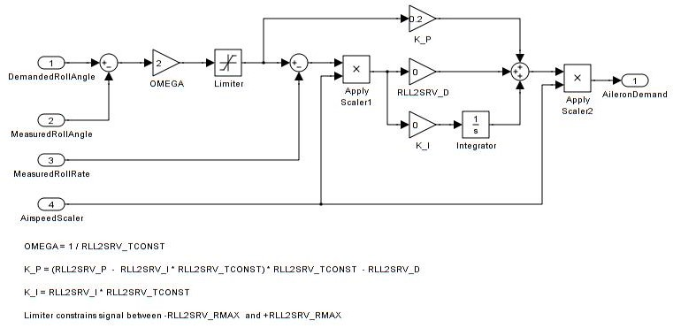
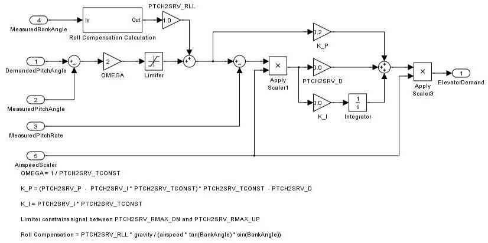
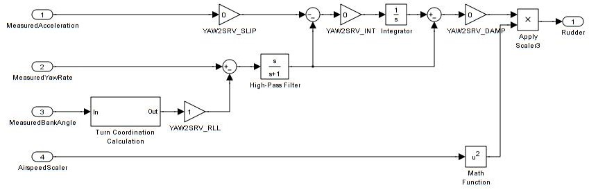

.. _roll-pitch-controller-tuning:

=====================================
Roll, Pitch and Yaw Controller Tuning
=====================================

These instructions will teach you how to tune the roll, pitch and yaw
response of your aircraft. This is the first tuning you should do with a
new aircraft, as everything else relies on getting this right.

.. tip::

    We **strongly** recommend that 
    :ref:`you use AUTOTUNE to perform roll/pitch/yaw tuning <automatic-tuning-with-autotune>`. 
    The instructions in this article should be used if you are unable to fly.

.. note::

   The default values for the
   roll and pitch controllers in Plane are quite deliberately too small for
   most aircraft. This is because small values will cause APM to not
   navigate well and be sluggish, but are less likely to cause the aircraft
   to crash. The defaults also have a zero 'I' gain, as you should not
   introduce any 'I' (integrator) until you have correctly tuned the 'P'
   gain.

Preconditions
=============

The following instruction assume that:

-  Your model is trimmed
-  You have done your radio calibration
-  You have calibrated your airspeed sensor
-  You have leveled the autopilot
-  You have set your APM and transmitter to be able to select :ref:`FBW-A mode <fbwa-mode>`
-  You have checked your pitch roll and yaw angle on the HUD
   and verified that they match the rotation of the model

Ground Checks
=============

#. On the ground select FBW-A mode
#. Rotate your model nose up - you should see the elevators/elevons
   deflect down
#. Rotate your model nose down - you should see the elevators/elevons
   deflect up
#. Roll the model to the right - you should see the LH aileron/elevon go
   up and the RH aileron/elevon go down.
#. Roll the model to the left - you should see the LH aileron/elevon go
   down and the RH aileron/elevon go up.
#. Level the model - the control surfaces should be close to neutral.
   There will be a little bit of offset, but any more than 10% of your
   maximum throw indicates that the APM has not been leveled or the
   radio calibration needs to be repeated.
#. With the model level apply LH and RH roll stick inputs on
   your transmitter - the controls should deflect in the same direction
   that they would in manual mode.
#. With the model level apply up and down pitch stick inputs on
   your transmitter the controls should deflect in the same direction
   that they would in manual mode.
#. If you have an airspeed sensor enabled then blow air towards
   the front of the pitot tube and watch the HUD. You should see
   the airspeed reading increase

Flight testing
==============

Ideally you will need a second person to do this - one person to fly the
plane and one person to adjust the parameters. To follow the manual
parts of this procedure you need to be a proficient RC pilot or have
someone who is available to help you. Otherwise you will need to start
at step 2 on the Initial Assessment and be more cautious with control
gain adjustment, increasing them in small steps.

Initial Assessment
==================

#. Take-off in manual and adjust the trims and throttle to a
   cruise position so that the plane flies straight and level at a speed
   that you are comfortable with. This will normally be somewhere
   between 30 and 60% throttle depending on how overpowered your model
   is.
#. With the plane flying away from you switch to FBW-A. It
   should continue to fly wings level and at a fairly constant height
   (it may climb or descend slowly). If it wants to roll or pitch
   more than a small amount then there is a problem with the model's
   trim, autopilot level or radio calibration and you need to solve that
   first before proceeding further.
#. If the model starts to wag its wings, then the
   default ``RLL2SRV_P`` value is too high for your model (this is
   unlikely but could happen) and you need to switch back to manual
   immediately and ask your assistant to halve the
   ``RLL2SRV_P`` parameter before switching back into FBW-A
#. If the model starts to porpoise, the default ``PTCH2SRV_P`` value is
   too high (this is unlikely but could happen) and you need to
   switch back to manual immediately and ask your assistant to halve
   the ``PTCH2SRV_P`` parameter before switching back into FBW-A

Roll Control Tuning
===================

Method 1
--------

This method is the simplest, but won't give the best result. For those
users familiar with tuning the old PID controllers, the
``RLL2SRV_P``, ``RLL2SRV_I`` and ``RLL2SRV_D`` gains have the same
effect, but there are some additional values that can be set by more
advanced users.

#. With the model in FBW-A mode, put in a rapid bank angle demand by
   pushing the aileron stick all the way over, hold it for a couple of
   seconds and then release. Do the same in the other direction. You
   want the model to roll quickly and smoothly to the new bank angle
   and back again without overshoot or any wing 'rocking'. If the
   roll response is too slow, then progressively increase :ref:`RLL2SRV_P<RLL2SRV_P>` in
   increments of 0.1 until you are happy with the response.
#. If you get bank angle oscillation or overshoot, then you need to
   reduce :ref:`RLL2SRV_P<RLL2SRV_P>`. If at this point you still don't have sufficient
   response then you need to follow Method 2.
#. Once you are happy with the roll response you should now slowly
   increase the :ref:`RLL2SRV_I<RLL2SRV_I>` to give the controller some "I gain" to allow
   it to cope better with wind. A value of 0.05 will work for most
   models. If you see overshoot or oscillation when raising the I value
   then halve it.

Method 2
--------

This method will give a better result, but requires more caution because
step 2 can produce a high frequency instability that can overheat the
aileron servo(s) if allowed to continue.

#. With the model in FBW-A mode, put in a rapid bank angle demand, hold
   it and release. Do the same in the other direction. You want the
   model to roll quickly and smoothly to the new bank angle and back
   again without overshoot or any wing 'waggle'. If the roll response is
   too slow, then progressively increase the :ref:`RLL2SRV_P<RLL2SRV_P>` gain in
   increments of 0.1 until you are happy with the response or you start
   to get oscillation in bank angle or overshoot
#. Increase :ref:`RLL2SRV_D<RLL2SRV_D>` in increments of 0.01 until it it starts
   to oscillate, then halve it. Do not go above 0.1 for
   :ref:`RLL2SRV_D<RLL2SRV_D>` without checking the temperature of your servos when you
   land as in extreme cases turning up this gain can cause rapid servo
   movement and overheat the servos leading to premature failure.
#. Now start to increase the integrator gain :ref:`RLL2SRV_I<RLL2SRV_I>` in steps of 0.05
   from its default value of zero until the bank angle starts to
   overshoot or oscillate, then halve it.

Tuning tips
-----------

-  Select the tuning box on the bottom of the Mission Planners
   Flight Data page. You should get a scrolling black window above
   the map. Double click in the black window and you should get a list
   of parameters to plot. Change the selection until you have the
   roll and nav_roll plotted. Nav_roll is the demand and roll is
   the response. You can use this to look for overshoot and other
   behaviour that isn't so obvious from the ground looking at the model.
-  Check for any steady offset between nav_roll and roll. If you have
   followed the basic method you may see an offset which can be removed
   by setting ``RLL2SRV_I`` to a small value (say 0.01) which will
   allow the control loop to slowly trim the aileron demand to remove
   the steady error.
-  Although the autopilot will prevent the integrator from increasing if
   the maximum aileron is exceeded, there is additional protection
   provided by the ``RLL2SRV_IMAX`` parameter. This parameter sets the
   maximum amount of aileron (in centi-degrees) that the integrator can
   control. The default value of 1500 allows the integrator to trim up
   to 1/3 of the total aileron travel. This parameter should not need to
   be changed unless you are trying to tune the controller to be able to
   compensate for large roll offsets due to system failures.
-  The maximum roll rate can be constrained to make the model bank
   more smoothly by setting the roll rate limit :ref:`RLL2SRV_RMAX<RLL2SRV_RMAX>` parameter
   to a non-zero value. The default value of 60 deg/sec works well for
   most models. Setting this parameter to 0 turns the rate limiter off
   and can make the effect of tuning changes easier to see. If this
   value is reduced too far, then the roll controller is unable to keep
   up with demands from the navigation controller which leads to
   overshoot and weaving in the aircraft's trajectory.
-  The time constant parameter ``RLL2SRV_TCONST`` can also be used to
   adjust how rapidly the bank angle reaches the demanded value. The
   effect of this parameter will be seen mostly in the response to small
   step changes in demanded roll. For larger roll demands, the roll rate
   limit ``RLL2SRV_I`` tends to mask its effect. Making this parameter
   smaller will cause the aircraft to reach its demanded roll angle in
   less time, but only if the aircraft is capable. A very slow
   responding airframe may require a slightly larger setting for this
   parameter.
-  Plot the roll_speed in the tuning window. This shows the rate of
   roll in radians/second. A value of 1 radian/second is approximately
   equal to 60 degrees/second (57 to be more precise), so if you
   have :ref:`RLL2SRV_RMAX<RLL2SRV_RMAX>` set to 60, the maximum roll_speed when responding
   to a large bank angle demand (eg full bank one way to full bank the
   other) should be just above 1.0. A value of greater than 1.1
   indicates that ``RLL2SRV_P`` is too high and should be reduced,
   whereas a value of less than 1 indicates that ``RLL2SRV_P`` should
   be increased.

Pitch Control Tuning
====================

Method 1
--------

This method is the simplest and but won't give the best result. For
those users familiar with tuning the old PID controller gains, the K_P,
K_I and K_D gains in this controller have the same effect, but there
are some additional values that can be set by more advanced users.

#. With the model in FBW-A mode, put in a rapid pitch angle demand, hold
   it and release. Do the same in the other direction. You want the
   model to pitch quickly and smoothly to the new pitch angle and back
   again without overshoot or any porpoising. If the pitch response is
   too slow, then progressively increase :ref:`PTCH2SRV_P<PTCH2SRV_P>` in increments of
   0.1 until you are happy with the response.
#. If you get pitch angle oscillation or overshoot, then you need to
   reduce :ref:`PTCH2SRV_P<PTCH2SRV_P>`. If at this point you still don't have sufficient
   response then you need to check your radio calibration, the minimum
   and maximum pitch angles and potentially follow Method 2.
#. Now roll the model to maximum bank in each direction. The nose should
   stay fairly level during the turns without significant gain or loss
   of altitude. Some loss of altitude during sustained turns at constant
   throttle is expected, because the extra drag of turning slows the
   model down which will cause a mild descent. If the model gains height
   during the turns then you need to reduce the :ref:`PTCH2SRV_RLL<PTCH2SRV_RLL>` by small
   increments of 0.05 from the default value of 1.0. If the model
   descends immediately when the model banks (a mild descent later in
   the turn when the model slows down is normal as explained earlier)
   then increase the :ref:`PTCH2SRV_RLL<PTCH2SRV_RLL>` by small increments of 0.01 from the
   default value of 1.0. If you need to change the
   :ref:`PTCH2SRV_RLL<PTCH2SRV_RLL>` parameter outside the range from 0.7 to 1.4 then
   something is likely wrong with either the earlier tuning of your
   pitch loop, your airspeed calibration or you APM's bank angle
   estimate.

Method 2
--------

This method can give a better result, but requires more caution
because step 2) can produce a high frequency instability that unless
reversion back to manual is done quickly, could overstress the plane.

#. Perform the tuning steps from Method 1
#. Increase :ref:`PTCH2SRV_D<PTCH2SRV_D>` in increments of 0.01 until it it starts
   to oscillate, then halve it. Do not go above 0.1 for
   :ref:`PTCH2SRV_D<PTCH2SRV_D>` without checking the temperature of your servos when you
   land as in extreme cases turning up this gain can cause rapid servo
   movement and overheat the servos leading to premature failure.
#. Now start to increase the integrator gain :ref:`PTCH2SRV_I<PTCH2SRV_I>` in steps of
   0.05 from its default value of zero until the pitch angle starts to
   overshoot or oscillate, then halve it.

Tuning tips
-----------

-  Select the tuning box on the bottom of the Mission Planners
   Flight Data page. You should get a scrolling black window above
   the map. Double click in the black window and you should get a list
   of parameters to plot. Change the selection until you have the pitch
   and nav_pitch plotted. Nav_pitch is the demand and pitch is
   the response. You can use this to look for overshoot and other
   behaviour that isn't so obvious from the ground looking at the model.
-  Check for any steady offset between nav_pitch-roll and pitch. If you
   have followed the basic method you may see an offset which can be
   removed by setting \ ``PTCH2SRV_I`` to a small value (say 0.05)
   which will allow the control loop to slowly trim the elevator demand
   to remove the steady error. The value of ``PTCH2SRV_I`` can be
   increased in small increments of 0.05 until you are satisfied with
   the speed at which the control loop 're-trims'.
-  Although the autopilot will prevent the integrator from increasing if
   the maximum elevator is exceeded, there is additional protection
   provided by the :ref:`PTCH2SRV_IMAX<PTCH2SRV_IMAX>` parameter. This parameter sets the
   maximum amount of elevator(in centi-degrees) that the integrator can
   control. The default value of 1500 allows the integrator to trim up
   to 1/3 of the total elevator travel. This should be enough to allow
   for the trim offset and variation in trim with speed for most models.
-  WARNING : If ``PTCH2SRV_IMAX`` is set too high, then there is a
   danger that in FBW-A, if the model has been levelled so that zero
   pitch is too nose-up to glide at a safe speed, that the integrator
   will continue to keep increasing the elevator to maintain the
   demanded pitch angle until the model stalls. :ref:`PTCH2SRV_IMAX<PTCH2SRV_IMAX>` should be
   set to a value that is big enough to allow from trim changes, but
   small enough so that it cannot stall the plane.
-  The rate of pitch (and therefore the reduce the number of g's) used
   to correct pitch angle errors can be limited setting the pitch rate
   limit ``PTCH2SRV_RMAX_DN`` and ``PTCH2SRV_RMAX_UP`` parameters to
   non-zero values. Setting these values to 560 divided by the airspeed
   (in metres/second) gives a limit equivalent to approximately +- 1g.
-  The time constant parameter ``PTCH2SRV_TCONST`` can also be used to
   adjust how rapidly the pitch angle reaches the demanded value. The
   effect of this parameter will be seen mostly in the response to small
   step changes in demanded pitch. For larger pitch demands, the
   pitch rate limits ``PTCH2SRV_RMAX_DN`` and \ ``PTCH2SRV_RMAX_UP``
   tend to mask its effect. Making this parameter smaller will cause the
   aircraft to reach its demanded pitch angle in less time, but only if
   the aircraft is capable. A very slow responding airframe may require
   a slightly larger setting for this parameter.
-  Plot the pitch_speed in the tuning window. This shows the rate of
   pitch in radians/second. A value of 1 radian/second is approximately
   equal to 60 degrees/second (57 to be more precise), so if for example
   you had \ ``PTCH2SRV_RMAX_DN``/UP set to 30, the maximum pitch_speed
   when responding to a large pitch angle demand (eg full pitch one way
   to full pitch the other way) should be just above 0.5. A value of
   greater than 0.6 would indicate that ``PTCH2SRV_P`` is too high and
   should be reduced, whereas a value of less than 0.5 would indicate
   that :ref:`RLL2SRV_P<RLL2SRV_P>` should be increased.

Yaw Controller Tuning
=====================

The yaw control loop can be configured either as a simple yaw damper
(good for models with inadequate fin area) or as a combined yaw damper
and side-slip controller. Because control of side-slip uses measured
lateral acceleration, it will only work for those models that have
enough fuselage side area to produce a measurable lateral acceleration
when they side-slip (an extreme example of this is an aerobatic model
flying a knife-edge manoeuver where all of the lift is produced by the
fuselage). Gliders with slender fuselages and flying wings cannot use
this feature, but can still benefit from the yaw damper provided they
have a yaw control (rudder, differential airbrakes, etc)

Tuning the yaw damper
=====================

#. Verify that the ``YAW2SRV_SLIP`` and ``YAW2SRV_INT`` gain terms are
   set to zero, the ``YAW2SRV_RLL`` gain term is set to 1.0 and the
   ``YAW2SRV_DAMP`` gain term is set to zero
#. Now rapidly roll the model from maximum bank angle in one direction
   to maximum bank angle in the opposite direction. Do this several
   times going in each direction and observe the yawing motion of the
   model. If as the wings pass through level the nose is yawed in the
   opposite direction to the roll (for example when rolling from left to
   right bank, the nose points left) then increase the value of
   ``KFF_RDDRMIX`` gain until the yaw goes away. Do not use a value
   larger than 1.
#. Increase :ref:`YAW2SRV_DAMP<YAW2SRV_DAMP>` in small increments of 0.05 until the yaw
   angle starts to oscillate. When this happens, the tail will appear to
   'wag'. Halve the gain from the value that caused the oscillation.
#. Now roll the model into and out of turns in both directions. If the
   model has a tendency to yaw the nose to the outside of the turn, then
   increase the :ref:`YAW2SRV_RLL<YAW2SRV_RLL>` gain term in increments of 0.05 from its
   default value of 1.0. Conversely if the model has a tendency to yaw
   the nose to the inside of the turn on turn entry, then reduce the
   :ref:`YAW2SRV_RLL<YAW2SRV_RLL>` gain term in increments of 0.01 from its default value
   of 1.0. If you have to go outside the range from 0.7 to 1.4, then
   there is something else that needs to be sorted and you should check
   that you have performed step 2) correctly and check your airspeed
   calibration if airspeed is being used.

Tuning the sideslip controller
==============================

#. Tune the yaw damper first
#. Bring up the tuning graph window in the mission planner and plot the
   lateral acceleration ay.
#. Roll the model rapidly from full bank in each direction and observe
   the lateral acceleration ay. If the lateral acceleration sits around
   zero and doesn't change when you roll into or out of turns then no
   side-slip control is necessary. You can finish at this point.
#. Set the ``YAW2SRV_INT`` gain term to 1.0. If this causes the yaw
   angle to oscillate then halve the gain from the smallest value that
   causes oscillation.
#. If you see that the y acceleration is offset or spikes up during
   turns, then progressively increase the ``YAW2SRV_SLIP`` gain in steps
   of 0.5 until the error goes away or the yaw angle starts to
   oscillate. If yaw oscillation occurs, then halve the gain from the
   value at which caused the oscillation.

Controller Overview
===================

Roll Controller
---------------

Pitch Controller
----------------

Yaw Controller
--------------

