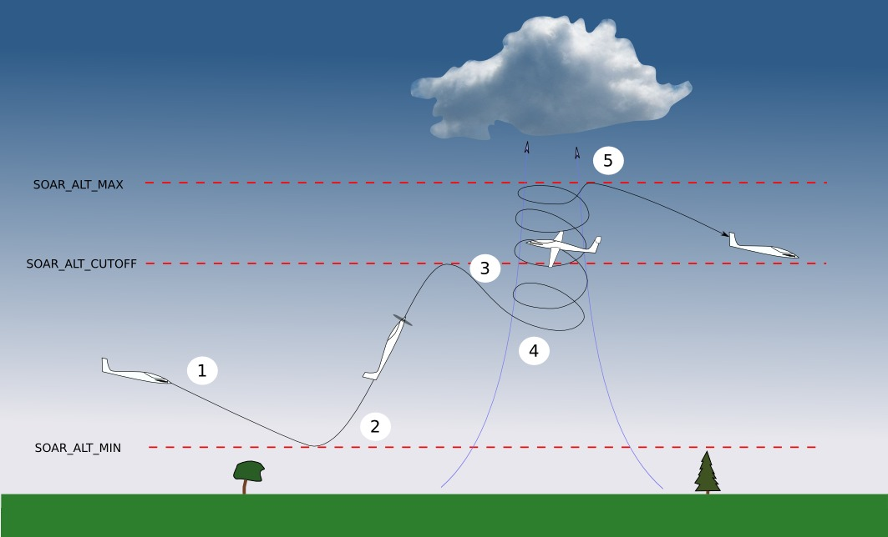
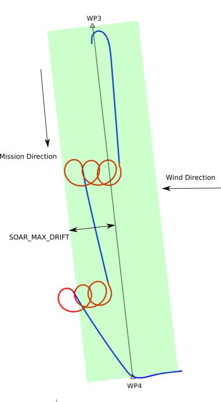

.. _soaring-4_1:

.. note::

  Refer to :ref:`this page <soaring>` if you're using a version earlier than 4.1.

=======
Soaring
=======

.. image:: ../../../images/soar-cover.jpg

The autonomous soaring functionality in ArduPilot allows the plane to respond to 
rising air current (thermals) in order to extend endurance and gain altitude with 
minimal use of the motor (soaring). Its full technical description is available in

*S. Tabor, I. Guilliard, A. Kolobov.* `ArduSoar: an Open-Source Thermalling Controller for Resource-Constrained Autopilots <https://arxiv.org/abs/1802.08215/>`_. *International Conference on Intelligent Robots and Systems (IROS), 2018.*

.. note:: Use of an airspeed sensor is strongly recommended in order to obtain optimum performance. Use without a sensor could yield unsatisfactory results. Consistent operation without an airspeed sensor is a pending future development.

This picture shows the different phases of flight when using the soaring
functionality:

#. If modes AUTO, FBWB or CRUISE are entered, and Soaring is enabled, the throttle is set to zero provided the aircraft is above :ref:`SOAR_ALT_MIN<SOAR_ALT_MIN>` altitude and the aircraft then begins gliding.
#. If the aircraft descends to :ref:`SOAR_ALT_MIN<SOAR_ALT_MIN>` altitude, throttle is re-enabled and the aircraft will begin to climb to the altitude of the next waypoint, in AUTO, or to :ref:`SOAR_ALT_CUTOFF<SOAR_ALT_CUTOFF>` altitude in CRUISE or FBWB. In AUTO, if the waypoint altitude is less than :ref:`SOAR_ALT_CUTOFF<SOAR_ALT_CUTOFF>` altitude, then Soaring can not begin before reaching the waypoint. If it is above :ref:`SOAR_ALT_CUTOFF<SOAR_ALT_CUTOFF>` altitude, then Soaring can occur once that altitude has been reached.
#. When the aircraft reaches :ref:`SOAR_ALT_CUTOFF<SOAR_ALT_CUTOFF>` altitude, throttle is set to zero again.
#. If, during gliding flight, the air is estimated to be rising at more than
   :ref:`SOAR_VSPEED<SOAR_VSPEED>` and the :ref:`RC switch position<soaring_rc-switch>` allows it, the aircraft will automatically enter THERMAL mode. While in THERMAL mode the aircraft will adjust the circling position to better centre the thermal.
#. THERMAL mode is exited under the following conditions:

   - :ref:`SOAR_ALT_MAX<SOAR_ALT_MAX>` is reached.
   - :ref:`SOAR_ALT_MIN<SOAR_ALT_MIN>` is reached.
   - Flight mode is changed by the pilot.
   - The estimate of achievable climb rate falls below :ref:`SOAR_VSPEED<SOAR_VSPEED>`, and 
     thermalling has lasted at least :ref:`SOAR_MIN_THML_S<SOAR_MIN_THML_S>` seconds.
   - The aircraft drifts more than :ref:`SOAR_MAX_DRIFT<SOAR_MAX_DRIFT>` - see :ref:`Limit maximum distance from home<soaring_maximum-distance-from-home>`

   The flight mode will be returned to whatever it was before THERMAL was triggered.

Airspeed Control
================

When in SOARING, the target airspeed while cruising is set via throttle stick position for FBWB and CRUISE modes, even while gliding. For AUTO mode, it is set at  :ref:`AIRSPEED_CRUISE<AIRSPEED_CRUISE>`, unless the :ref:`SOAR_CRSE_ARSPD<SOAR_CRSE_ARSPD>` parameter is set to a non-zero value ("0" is default). If it is set to "-1", then the :ref:`soaring-speed-to-fly` computed value will be used. If greater than zero, then that value in meters/sec will be used for target airspeed.

While in THERMAL mode, the target airspeed will be :ref:`AIRSPEED_CRUISE<AIRSPEED_CRUISE>`, unless the :ref:`SOAR_THML_ARSPD<SOAR_THML_ARSPD>` parameter is set to a non-zero value ("0" is default). Then that value in meters/sec will be used for target airspeed instead.

Hardware
========

To use your plane for soaring, it should ideally be a glider type aircraft with 
a good lift to drag ratio and be equipped with an airspeed sensor.

Generally all boards support soaring, *except* those with firmware limitations referred to on :ref:`this page <common-limited_firmware>`. As of June 2020 non-supported boards include:

 - KakuteF7Mini
 - KakuteF7
 - sparky2
 - Pixhawk1-1M
 - OMNIBUSF7V2

Setup
=====

Mission 
-------

The main requirement for a mission is that it take the aircraft above :ref:`SOAR_ALT_CUTOFF<SOAR_ALT_CUTOFF>`
so that gliding flight is initiated. To achieve this, set the waypoints' altitude(s)
above :ref:`SOAR_ALT_CUTOFF<SOAR_ALT_CUTOFF>`. 

Soaring Parameters
------------------

Enable
~~~~~~

Set the parameter :ref:`SOAR_ENABLE<SOAR_ENABLE>` to 1 and refresh the parameters. This will allow the other SOAR parameters
to appear in the GCS.

Drag Polar
~~~~~~~~~~~

To work out how fast the air is rising or sinking the autopilot needs to know the
aircraft's sink rate for a given airspeed in still air. This is related to the 
drag polar of the plane and is specified using the SOAR_POLAR parameters.
:ref:`SOAR_POLAR_K<SOAR_POLAR_K>` is the most important one to set initially and is calculated
using the following formula:

:ref:`SOAR_POLAR_K<SOAR_POLAR_K>` = 16*Weight/Area
(weight in kg, area in metres squared).

:ref:`SOAR_POLAR_K<SOAR_POLAR_K>` = 703*Weight/Area
(weight in oz, area in inches squared).

Calculating the other parameters is explained under tuning.

.. _soaring_rc-switch-upcoming:

RC switch (Optional)
~~~~~~~~~~~~~~~~~~~~

You can use a 3-position RC switch to control when the autopilot can use soaring. Set the parameter RCX_OPTION parameter for the desired channel to SOAR (index 88) - see :ref:`Auxiliary Functions <common-auxiliary-functions>`. The 3 positions have the following effect.

 - Low. Soaring is disabled (equivalent to setting SOAR_ENABLE = 0). Throttle will be used as normal. Switching to this from either of the positions below, will disable Soaring and maintain the current flight mode.
 
 - Mid. Soaring will have control over throttle. The mode will not automatically change to THERMAL based on detected rising air. However, when manually set to THERMAL mode using RC controller or GCS, the autopilot will try to follow rising air currents. It will still restore the previous mode if the aircraft is not climbing, or if it drifts too far (see below).
 
 - High. Fully automatic mode changes to THERMAL from AUTO, FBWB or CRUISE modes in response to detected rising air, and following of rising air currents.

+----------+----------------+---------------+-------------------+-------------------+-------------------+
| Position | PWM Value      | Auto throttle |  Tracking thermal | Automatic change  | Automatic change  |
|          |                | cutoff        |  updrafts         | back from THERMAL | to THERMAL        |
+----------+----------------+---------------+-------------------+-------------------+-------------------+
|  Low     | < 1500 us      |       N       |       N           |       N           |       N           |
+----------+----------------+---------------+-------------------+-------------------+-------------------+
|  Mid     | 1500 - 1700 us |       Y       |       Y           |       Y           |       N           |
+----------+----------------+---------------+-------------------+-------------------+-------------------+
|  High    | > 1700 us      |       Y       |       Y           |       Y           |       Y           |
+----------+----------------+---------------+-------------------+-------------------+-------------------+

When in THERMAL mode, changing the switch position between Mid and High positions commands exiting thermalling and restoring the previous mode.

When climbing back to altitude under throttle, changing the switch position to Low and back aborts the climb and starts gliding.

Set limits
----------

Because the soaring feature can follow rising air as required to gain altitude, it is important to set limits to avoid it leaving the original flight area completely. This is especially important in windy conditions as the autopilot will try to follow thermals downwind. There are three ways to set limits.

Altitude limits
~~~~~~~~~~~~~~~

:ref:`SOAR_ALT_MAX<SOAR_ALT_MAX>` sets the altitude you want the autopilot to stop thermalling.
:ref:`SOAR_ALT_MIN<SOAR_ALT_MIN>` sets the minimum altitude you want the autopilot to descend to while gliding.

Spatial limits
~~~~~~~~~~~~~~

The parameter :ref:`SOAR_MAX_DRIFT<SOAR_MAX_DRIFT>` can be used to limit how far (in metres) the aircraft can drift while in THERMAL mode. If the aircraft reaches this limit in THERMAL mode, it will revert to the original flight mode.

If the original flight mode was FBWB or CRUISE mode, the drift distance is measured from the location THERMAL was entered.

If the original flight mode was AUTO mode, the drift distance is measured from the closest point on the mission segment 
to where THERMAL was entered. Drift sideways or backwards, but not along the original mission track, is counted. This allows
thermalling to continue if the wind is moving the aircraft in the direction of the next waypoint.

The image below shows a scenerio where the mission track is north to south and the wind is causing thermals to drift east to west. The aircraft will follow them but will respect :ref:`SOAR_MAX_DRIFT<SOAR_MAX_DRIFT>`. Note that sometimes it will go a little beyond  :ref:`SOAR_MAX_DRIFT<SOAR_MAX_DRIFT>` as it lines up its heading to the next waypoint before reverting to AUTO mode.

If using FBWB or CRUISE mode, the parameter :ref:`SOAR_MAX_RADIUS<SOAR_MAX_RADIUS>` can be used to trigger RTL if the aircraft is more than this distance from home when in THERMAL mode. Note that this parameter won't stop the aircraft from exceeding this distance before it enters THERMAL mode.

:ref:`Geofence <geofencing>` can be used as a last line of defence. Set it up in the usual way.

.. _soaring_maximum-distance-from-home:

Tuning
======

Triggering lift
---------------

:ref:`SOAR_VSPEED<SOAR_VSPEED>` controls when the mode will be changed to THERMAL. The default of 0.7m/s
may be too low if you fly in strong conditions. Increasing this value makes the aircraft more "picky" about the lift it will
try to circle in.

Thermalling bank angle
----------------------

The parameter :ref:`SOAR_THML_BANK<SOAR_THML_BANK>` sets the bank angle when thermalling. 30 - 45 degrees works well depending on the size of the thermals in your area.

If the aircraft is not achieving this average bank angle when thermalling, you should check - 

 - that the limiting bank angle :ref:`ROLL_LIMIT_DEG<ROLL_LIMIT_DEG>` is set a bit larger than SOAR_THML_BANK (note the units are different) to give some room for manoeuvring;

 - that the navigation parameter NAVL1_PERIOD is no larger than the time needed for a complete turn at the specified bank angle.

Drag Polar
----------

While the default settings for :ref:`SOAR_POLAR_B<SOAR_POLAR_B>` and :ref:`SOAR_POLAR_CD0<SOAR_POLAR_CD0>`
should be OK for most foamie-style glider aircraft, improving the accuracy of these parameters will improve how
your aircraft detects and centres lift. You can use `this spreadsheet <https://docs.google.com/spreadsheets/d/1WA9CXRSPBc6mFydhQ3O_2SeDrQoFH1UrdiXd0PJ-zE4/edit?usp=sharing>`__ to calculate better values from glide tests.

Time hysteresis
---------------

Adding hysteresis can reduce the frequency of mode changes.

:ref:`SOAR_MIN_THML_S<SOAR_MIN_THML_S>`: Minimum time to remain in THERMAL once entered for a thermal before exiting due to low lift or altitude limits.

:ref:`SOAR_MIN_CRSE_S<SOAR_MIN_CRSE_S>`: Minimum time to remain in glide after exiting THERMAL due to low lift or altitude limits before entering mode again, or when entering Soaring initially.

TECS Tuning
-----------

.. note::

   In firmware revisions before 4.1, it was necessary to set :ref:`TECS_SPDWEIGHT<TECS_SPDWEIGHT>` to 2.0 when using soaring.
   This is now handled automatically.
 
For best results the TECS needs to be set up to fly the aircraft at a consistent airspeed when 
gliding.

If your aircraft has trouble maintaining airspeed accurately you can tune it by confirming that 
:ref:`TECS_SPDWEIGHT<TECS_SPDWEIGHT>` is set to 2.0, :ref:`SOAR_ENABLE<SOAR_ENABLE>` to 1 and set
:ref:`SOAR_VSPEED<SOAR_VSPEED>` to a large number, say 50.0, or use the :ref:`RC switch<soaring_rc-switch-upcoming>`
to inhibit mode changes. This means that the aircraft will
glide but will never begin thermalling. Set :ref:`SOAR_ALT_CUTOFF<SOAR_ALT_CUTOFF>` to an altitude high enough to
allow a good length of time to be spent gliding. 

Launch the aircraft and put it in AUTO mode. It should climb to :ref:`SOAR_ALT_CUTOFF<SOAR_ALT_CUTOFF>` 
and then begin a gliding descent. Watch the telemetry graphs or look at the Dataflash logs after the flight. Is the aircraft maintaining the demanded airspeed? The actual and demanded airspeed can be seen in the onboard log as 
``TECS.sp`` and ``TECS.spdem``, and via telemetry you can use ``NAV_CONTROLLER_OUTPUT.aspd_error``. Problems can usually be fixed
by increasing ``PTCH2SRV_IMAX`` and :ref:`TECS_INTEG_GAIN<TECS_INTEG_GAIN>` to achieve good airspeed
tracking in gliding flight.

Speed to Fly Feature
====================

.. toctree::
    :maxdepth: 1

    Soaring speed to fly <soaring-speed-to-fly>

Notes
=====

MAVLINK Telemetry
-----------------

Currently, the only effect on telemetry is that when soaring is active the climb rate item (VFR_HUD.climb) is altered. Rather that the estimated vertical speed of the aircraft, the estimated vertical speed of the air mass is sent. This field is used by Mission Planner and OpenTX radios to produce vario audio output.

Use of TECS synthetic airspeed
------------------------------

If your plane can't accommodate an airspeed sensor, it is possible to use the TECS synthetic airspeed estimate :ref:`TECS_SYNAIRSPEED<TECS_SYNAIRSPEED>`.
Make sure you read the warning regarding this feature before deciding to use it. To use this feature, set the parameter :ref:`TECS_SYNAIRSPEED<TECS_SYNAIRSPEED>` to 1.

.. toctree::
    :maxdepth: 1
    :hidden:

    Soaring (version prior to 4.1) <soaring>