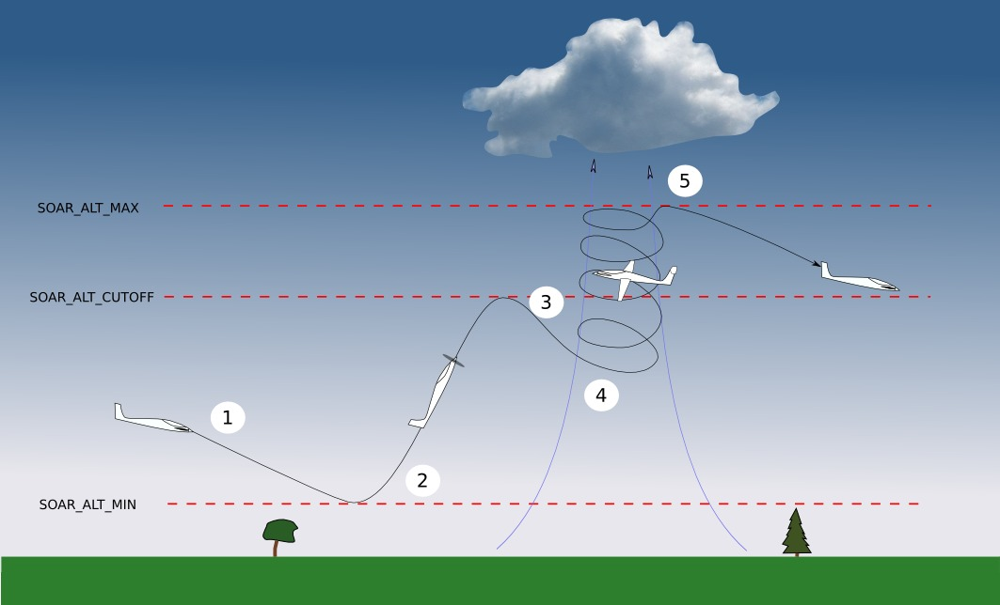
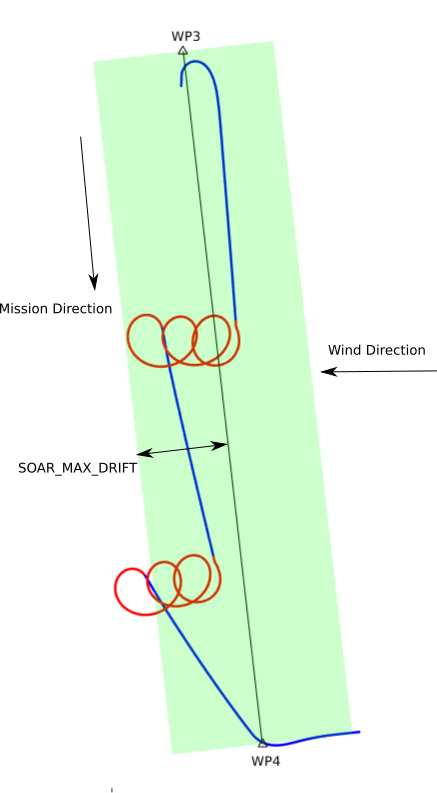

.. _soaring:

=======
Soaring
=======

.. image:: ../../../images/soar-cover.jpg

The autonomous soaring functionality in ArduPilot allows the plane to respond to 
rising air current (thermals) in order to extend endurance and gain altitude with 
minimal use of the motor (soaring). Its full technical description is available in

*S. Tabor, I. Guilliard, A. Kolobov.* `ArduSoar: an Open-Source Thermalling Controller for Resource-Constrained Autopilots <https://arxiv.org/abs/1802.08215/>`_. *International Conference on Intelligent Robots and Systems (IROS), 2018.*

This picture shows the different phases of flight when using the soaring
functionality:

#. When modes AUTO, FBWB or CRUISE are entered, throttle is set to zero provided
   the aircraft is above :ref:`SOAR_ALT_MIN<SOAR_ALT_MIN>` altitude. The aircraft begins gliding.
#. If the aircraft reaches :ref:`SOAR_ALT_MIN<SOAR_ALT_MIN>` altitude, throttle is re-enabled and the
   aircraft will begin to climb to the altitude of the next waypoint.
#. When the aircraft reaches :ref:`SOAR_ALT_CUTOFF<SOAR_ALT_CUTOFF>` altitude, throttle is set to zero
   again.
#. If, during gliding flight, the air is estimated to be rising at more than
   :ref:`SOAR_VSPEED<SOAR_VSPEED>` and the :ref:`RC switch position<soaring_rc-switch>` allows it, the
   aircraft will automatically enter LOITER mode. While in LOITER mode the aircraft will adjust the loiter position to better centre the thermal.
#. LOITER mode is exited under the following conditions:

   - :ref:`SOAR_ALT_MAX<SOAR_ALT_MAX>` is reached.
   - :ref:`SOAR_ALT_MIN<SOAR_ALT_MIN>` is reached.
   - Flight mode is manually changed.
   - The estimate of achievable climb rate falls below :ref:`SOAR_VSPEED<SOAR_VSPEED>` , and 
     thermalling has lasted at least :ref:`SOAR_MIN_THML_S<SOAR_MIN_THML_S>` seconds.
   - The aircraft drifts more than :ref:`SOAR_MAX_DRIFT<SOAR_MAX_DRIFT>` - see :ref:`Limit maximum distance from home<soaring_maximum-distance-from-home>`

   The flight mode will be returned to whatever it was before LOITER was 
   triggered, with the following exception. If the previous mode was FBWB or 
   CRUISE, and thermalling ended due to reaching :ref:`SOAR_ALT_MIN<SOAR_ALT_MIN>`, RTL will be
   triggered instead.

Setting up soaring
==================

To use your plane for soaring, it should ideally be a glider type aircraft with 
a good lift to drag ratio and be equipped with an airspeed sensor. There are a 
few steps involved in setting a plane up for soaring:

#. Set up a suitable mission.
#. Tune the TECS.
#. Estimate aircraft drag.
#. Set up the soaring parameters.
#. Set loiter radius and bank angle limit.

Mission Setup
=============

The main requirement for a mission is that it take the aircraft above :ref:`SOAR_ALT_CUTOFF<SOAR_ALT_CUTOFF>`
so that gliding flight is initiated. To achieve this, set the waypoint altitude 
above :ref:`SOAR_ALT_CUTOFF<SOAR_ALT_CUTOFF>` . 

Tune the TECS
=============

.. note::

   In firmware revisions before 4.1, it was necessary to set :ref:`TECS_SPDWEIGHT<TECS_SPDWEIGHT>` to 2.0 when using soaring.
   This is now handled automatically.
 
For best results the TECS needs to be set up to fly the aircraft at a consistent airspeed when 
gliding. To achieve this, set :ref:`SOAR_ENABLE<SOAR_ENABLE>` to 1 and set
:ref:`SOAR_VSPEED<SOAR_VSPEED>` to a large number, say 50.0, or use the :ref:`RC switch<soaring_rc-switch>`
to inhibit mode changes. This means that the aircraft will
glide but will never begin thermalling. Set :ref:`SOAR_ALT_CUTOFF<SOAR_ALT_CUTOFF>` to an altitude you
feel comfortable with. It should be high enough to allow a good length of time to
be spent gliding. 
Launch the aircraft and put it in AUTO mode. It should climb to :ref:`SOAR_ALT_CUTOFF<SOAR_ALT_CUTOFF>` 
and then begin a gliding descent.
Watch the telemetry graphs or look at the Dataflash logs. Is the aircraft maintaining
the demanded airspeed? The actual and demanded airspeed can be seen in the onboard log as 
``TECS.sp`` and ``TECS.spdem``, and via telemetry you can use ``NAV_CONTROLLER_OUTPUT.aspd_error``. You will 
probably need to increase :ref:`PTCH2SRV_IMAX<PTCH2SRV_IMAX>` and :ref:`TECS_INTEG_GAIN<TECS_INTEG_GAIN>` to achieve good airspeed
tracking in gliding flight.

Estimate Aircraft Drag
======================

To work out how fast the air is rising or sinking the autopilot needs to know the
aircraft's sink rate for a given airspeed in still air. This is related to the 
drag polar of the plane.
Estimating the polar can be a little involved. If you have an airframe reasonably
similar to a Parkzone Radian, it is reasonable to leave the :ref:`SOAR_POLAR_B<SOAR_POLAR_B>` and
:ref:`SOAR_POLAR_CD0<SOAR_POLAR_CD0>` unchanged. You should adjust :ref:`SOAR_POLAR_K<SOAR_POLAR_K>` for your plane using the
following formula:

:ref:`SOAR_POLAR_K<SOAR_POLAR_K>` = 16*Weight/Area
(weight in kg, area in metres squared).

Set up the Soaring Parameters
=============================

Change the :ref:`SOAR_VSPEED<SOAR_VSPEED>` parameter back to a sensible value. Remember, 
this parameter controls when the mode will be changed to LOITER and thermalling 
starts. Change :ref:`SOAR_ALT_MAX<SOAR_ALT_MAX>` to the altitude you want the autopilot to stop 
thermalling.

.. warning::
 
   Although thermalling will stop at :ref:`SOAR_ALT_MAX<SOAR_ALT_MAX>` , it is possible that for strong
   thermals to take the plane higher than this before it exits the thermal.

Set loiter radius and bank angle limit
======================================

The parameter :ref:`WP_LOITER_RAD<WP_LOITER_RAD>` sets how tight the loiter circle is. For thermalling it is usually
best to have the aircraft fly at a 30 - 45 degree bank angle. The corresponding loiter radius can be calculated as 
about airspeed squared over 10 (for 45 degrees) or 6 (for 30 degrees), from the equation

.. raw:: html

   

You should make sure that the limiting bank angle :ref:`LIM_ROLL_CD<LIM_ROLL_CD>` is set a bit larger to give some room
for manoeuvring.

.. _soaring_rc-switch:

Set up RC switch (Optional)
===========================

.. note::

   Available in firmware revisions 4.1 and later.

You can use a 3-position RC switch to control when the autopilot can use soaring. Set the parameter SOAR_ENABLE_CH to the corresponding channel number. The 3 positions have the following effect.

 - Below 1500us. Soaring is disabled (equivalent to setting SOAR_ENABLE = 0). Throttle will be used as normal.
 
 - 1500us to 1700us. Soaring will have control over throttle The mode will not automatically change to LOITER based on detected rising air. However, when manually set to LOITER mode using RC controller or GCS, the autopilot will try to follow rising air currents. It will still restore the previous mode if the aircraft is not climbing, or if it drifts too far (see below).
 
 - Above 1700us. Fully automatic mode changes to LOITER from AUTO, FBWB or CRUISE modes in response to detected rising air, and following of rising air currents.

+----------------+---------------+-------------------+------------------+-------------------+
| PWM Value      | Auto throttle |  Tracking thermal | Automatic change | Automatic change  | 
|                | cutoff        |  updrafts         | back from LOITER | to LOITER         |
+----------------+---------------+-------------------+------------------+-------------------+
| < 1500 us      |       N       |       N           |       N          |       N           | 
+----------------+---------------+-------------------+------------------+-------------------+
| 1500 - 1700 us |       Y       |       Y           |       Y          |       N           |
+----------------+---------------+-------------------+------------------+-------------------+
| > 1700 us      |       Y       |       Y           |       Y          |       Y           |
+----------------+---------------+-------------------+------------------+-------------------+

Set limits
===========

Because the soaring feature can follow rising air as required to gain altitude, it is important to set limits to avoid it leaving the original flight area completetly. This is especially important in windy conditions as the autopilot will try to follow thermals downwind. There are three ways to set limits.

Limit maximum drift
-------------------

.. note::

   Available in firmware revisions 4.1 and later.

The parameter :ref:`SOAR_MAX_DRIFT<SOAR_MAX_DRIFT>` can be used to limit how far (in metres) the aircraft can drift while in LOITER mode. If the airfraft reaches this limit in LOITER mode, it will revert to the original flight mode.

If the original flight mode was FBWB or CRUISE mode, the drift distance is measured from the location LOITER was entered.

If the original flight mode was AUTO mode, the drift distance is measured from the closest point on the mission segment 
to where LOITER was entered. Drift sideways or backwards, but not along the original mission track, is counted. This allows
thermalling to continue if the wind is moving the aircraft in the direction of the next waypoint.

The image below shows a scenerio where the mission track is north to south and the wind is causing thermals to drift east to west. The aircraft will follow them but will respect :ref:`SOAR_MAX_DRIFT<SOAR_MAX_DRIFT>`. Note that sometimes it will go a little beyond  :ref:`SOAR_MAX_DRIFT<SOAR_MAX_DRIFT>` as it lines up its heading to the next waypoint before reverting to AUTO mode.

.. _soaring_maximum-distance-from-home:

Limit maximum distance from home
--------------------------------

.. note::

   Available in firmware revisions 4.1 and later.

If using FBWB or CRUISE mode, the parameter :ref:`SOAR_MAX_RADIUS<SOAR_MAX_RADIUS>` can be used to trigger RTL if the aircraft is more than this distance from home when thernalling in LOITER mode. Note that this parameter won't stop the aircraft from exceeding this distance before it enters LOITER mode.

Use geofence
------------

:ref:`Geofence <geofencing>` can be used as a last line of defence. Set it up in the usual way.

Use of TECS synthetic airspeed
==============================

If your plane can't accommodate an airspeed sensor, it is possible to use the TECS synthetic airspeed estimate :ref:`TECS_SYNAIRSPEED<TECS_SYNAIRSPEED>`.
Make sure you read the warning regarding this feature before deciding to use it. To use this feature, set the parameter :ref:`TECS_SYNAIRSPEED<TECS_SYNAIRSPEED>` to 1.

MAVLINK Telemetry
=================

Currently, the only effect on telemetry is that when soaring is active the climb rate item (VFR_HUD.climb) is altered. Rather that the estimated vertical speed of the aircraft, the estimated vertical speed of the air mass is sent. This field is used by Mission Planner and OpenTX radios to produce vario audio output.

