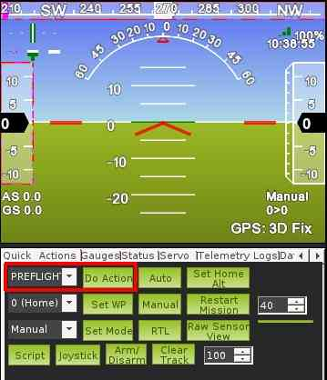

.. _starting-up-and-calibrating-arduplane:

=================================
Starting up and calibrating Plane
=================================

This article describes the basic setup and calibration that should be
performed before launching Plane.

Ground calibration
==================

Set your transmitter mode switch to :ref:`Manual <manual-mode>`. This is a safe mode in
which to start up the system.

When you power on your board at the field, you should leave the plane
motionless on the ground until the :ref:`LEDs <common-leds-pixhawk>` stop flashing blue and red
(about 30 seconds). This means that the gyros have been calibrated.

Disengage the safety switch (if present)
========================================

If the autopilot has a :ref:`safety switch <common-safety-switch-pixhawk>` connected, it must be disengaged before the vehicle can be :ref:`armed <arming-your-plane>`.

-  **Safety Switch LED Indications:**

   -  Fast Blinking indicates: Error Condition, Safety cannot be
      disengaged. Possibly not calibrated or sensor error.
   -  Slow Blinking indicates: Safe condition. Safety can be disengaged
      by depressing Safety Button for 5 seconds.
   -  LED Continuously on indicates: Safety has been disengaged. The
      autopilot may be armed with Throttle down and to the
      right.
   -  When the LED is continuously on indicating Safety Disengaged it
      may be toggled back to a Safety engaged condition by depressing
      the Safety button for 5 seconds.

.. note::

   Both the Safety engaged and Safety disengaged conditions require
   the button to be held down for 5 seconds to toggle them. This is a
   safety mechanism to prevent accidental disarming during flight and
   accidental arming during transportation.

Calibrate and check the Airspeed sensor (if present)
====================================================

If the vehicle has an :ref:`airspeed sensor <airspeed>` then the :ref:`pre-flight checks described here <calibrating-an-airspeed-sensor>` should be performed before each flight.

.. warning:: Be sure that the pitot ports are lightly covered during boot and/or forced pre-flight calibrations to prevent wind from causing a mis-calibration. And be sure to remove that cover before flight!

Wait for GPS lock
=================

You should wait for GPS lock before flying which is normally indicated by the autopilot's :ref:`LEDs <common-leds-pixhawk>` becoming green.
If you do not wait for GPS lock the barometric altimeter calibration will be incorrect and :ref:`RTL <rtl-mode>`, :ref:`Loiter <loiter-mode>`, :ref:`Auto <auto-mode>` and any other GPS dependent modes will not work properly.

For Plane the home position is initially established at the time the
plane acquires its GPS lock. It is then continuously updated as long as
the autopilot is disarmed.

This means that if you execute an RTL, your plane will return to the
location at which it was armed. If the place you arm is not a good return
point then please setup a :ref:`rally point <common-rally-points>` instead. A rally point will be
used in preference to the home location for RTL.

Check servo movements
=====================

**BEFORE EVERY FLIGHT**: before take off, hold the aircraft in your
hands and switch to :ref:`FBWA <fbwa-mode>` mode, then pitch and tilt the plane it to
confirm that the control surfaces move the correct way to return it to
level flight. (The ailerons and elevators will move; the rudder only
coordinates turns with the ailerons in flight, so it won't move much on
the ground). This will ensure that you haven't accidentally reversed a
channel.

You should do this before every flight, just as you move your control
surfaces with your RC transmitter to ensure that nothing's
reversed. \ **Failing to do this is the #1 cause of crashes.**

.. note::

   As a safety measure, your throttle will only arm on the ground in
   Manual mode, Stabilize or for an autotakeoff in Auto mode. It will not
   come on in any other Auto mode until you are in motion in the
   air.

..  youtube:: RUs62xmdnmg
    :width: 100%

First flight
============

It is highly recommended that you switch into either Stabilize or Fly By
Wire mode and observe the behavior of the control surfaces. They should
move to return the plane to level when you pitch or roll it. If it isn't
rock solid, you can tune the gains by following the
instructions \ :ref:`here <common-tuning>`.

If you have not tuned your PID gains then you may like to consider doing
the first takeoff in :ref:`AUTOTUNE <autotune-mode>` mode. That will start the tuning process
as soon as you takeoff.

Second flight
=============

For your second flight, change the third mode (position 3 of your RC
mode switch) to RTL in the Mission Planner's \ :ref:`mode setup page <common-rc-transmitter-flight-mode-configuration>`.

Once in the air switch the vehicle into RTL.  This will test navigation. The aircraft should return to the location at which it armed (or the nearest Rally point) and orbit
at a fixed altitude (which can be set with the \ :ref:`Mission Planner <planner:install-mission-planner>`).

If it does not return crisply and circle overhead in a near-perfect
circle, you need to tune the autopilot a bit for your particular
airframe. This can usually be done by adjusting the Roll parameters, as
described :ref:`here <roll-pitch-controller-tuning>`.

Once all this has checked out, you can program waypoint missions and
test them in Auto mode.

Level Adjustment
================

You may find after flying your plane in FBWA at the desired cruise throttle setting, that it does not hold level attitude with the transmitter sticks centered. If this happens, perform the following:

1) With your autopilot powered on the ground and connected to your
mission planner, select FBWA on your transmitter, select the FLIGHT DATA
tuning window and plot the nav_roll and nav_pitch data. With your
transmitter sticks centered, these should both be zero as shown in this
screenshot. If they are not, you need to repeat your RC calibration or
adjust your transmitter trims and repeat the FBWA flight test

If they are zero, then you need to adjust the level trim for the difference in angle between the
autopilot board and your planes attitude when flying straight and level, as explained below.

For roll errors (ie heading keeps changing with sticks neutral), use the "LEVEL" accelerometer calibrate button in Mission Planner with the wings level using a spirit level and the nose to tail fuselage line of the aircraft also level. Unless the plane is warped this will assure that the wings are level in flight. If the aircraft still rotates in heading with sticks neutral, then you will need to trim the rudder, if equipped, also in flight.

If the plane is not generally holding altitude in FBWA at the desired cruise throttle position (ie speed), then you can adjust the cruising pitch attitude using the :ref:`PTCH_TRIM_DEG<PTCH_TRIM_DEG>` parameter. Most planes required this to be a few degrees positive for best cruise trim in FBWA. This parameter is in centi-degrees, so 3 degs is 300 for its value.

