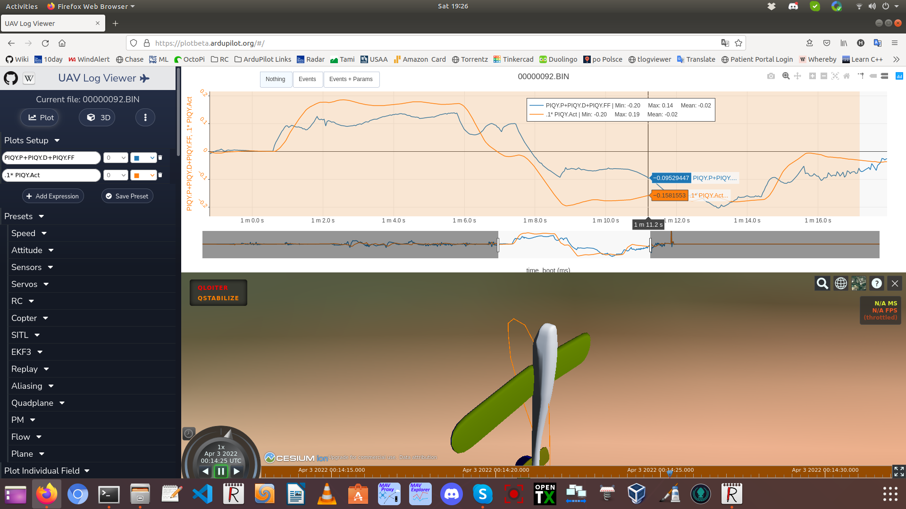

.. _tailsitter-tuning-guide:

======================
Tailsitter VTOL Tuning
======================

Tuning a tailsitter is different than tuning a normal SLT (Separate Lift Thrust) or Tilt-Rotor Quadplane. Those QuadPlanes tune very similarly to a Multirotor since the attitude in VTOL is controlled by motor speed/thrust in all axes (the exception being YAW in vectored yaw tilt rotor QuadPlanes).

In most tailsitters, VTOL attitude is usually controlled by some combination of fixed wing control surfaces and, in some configuratons, motor tilt for pitch and yaw. Roll is usually controlled by motor/speed thrust and can be tuned, and even AutoTuned, like a multicopter and follows the normal :ref:`QuadPlane<quadplane-vtol-tuning>` tuning for that axis. Most of the instructions for tuning setup and phases are the same for Tailsitters, except as described below:

.. _pitch-yaw-tuning:

Pitch and Yaw Tuning
====================

For pitch and yaw, control is provided by the fixed wing control surfaces, sometimes in conjunction with motor tilt, depending on type of tailsitter. These axes required a tuning approach more similar to normal fixed wing manual tuning, since the FF (Feed-Forward) component of the PID loop is the primary control path, with P and D PID terms providing disturbance corrections. The tuning process is as follows, starting from the default PID values:

- First, follow Steps 1 - 4 of the normal :ref:`QuadPlane Tuning Process Setup<quadplane-vtol-tuning-process>`.
- Normally, the vehicle is stable enough with the default PIDs to do a first test hover in QSTABILIZE or QHOVER. Do a short hover flight with logging enabled such that the :ref:`Harmonic Notch Filters<common-imu-notch-filtering>` can be setup. Its important to remove as much motor noise as possible in order to get a good tune using a throttle based harmonic notch filter.
- Once the notch filters are set, do another hover flight but briefly do short, but sharp pitch stick movements in both directions. Do not endanger the vehicle, but try to get several short full stick movements to the front and to the back. Do the same for yaw, but you should be able to hold full yaw stick each direction for a second or so, returning to neutral for a second in-between direction reversals.
- Download the :ref:`dataflash log<common-downloading-and-analyzing-data-logs-in-mission-planner>` for analysis. In order to determine the :ref:`Q_A_RAT_PIT_FF<Q_A_RAT_PIT_FF>` and :ref:`Q_A_RAT_YAW_FF<Q_A_RAT_YAW_FF>` terms, use a log analyzer like https://plot.ardupilot.org and setup the following plots on the same scale, using the "Add Expression" button:

.. code:: bash

   PIQP.FF+PIQP.P+PIQP.D 
   X * (PIQP.Act) , where X is 0.2 to start

- Next adjust the X value above until the magnitudes of both plots are about equal. This will now be value for the :ref:`Q_A_RAT_PIT_FF<Q_A_RAT_PIT_FF>` term. Set the :ref:`Q_A_RAT_PIT_I<Q_A_RAT_PIT_I>` term to equal this.
- Now do the same for the YAW axis using:

.. code:: bash

   PIQY.FF+PIQY.P+PIQY.D   
   X * (PIQY.Act) , where X is 0.2 to start

Below is an image of this where the X value is adjusted until the two curves are the same amplitude, with a value of x = 0.1. This is then set as the :ref:`Q_A_RAT_YAW_FF<Q_A_RAT_YAW_FF>` and :ref:`Q_A_RAT_YAW_I<Q_A_RAT_YAW_I>` values.

- Now you can hover again, and begin increasing the :ref:`Q_A_RAT_PIT_D<Q_A_RAT_PIT_D>` term, either iteratively, or using :ref:`common-transmitter-tuning`, until it oscillates and then reduce it to 1/2 to 1/3 that value.
- Then increase the :ref:`Q_A_RAT_PIT_P<Q_A_RAT_PIT_P>` term,, until it oscillates and then reduce it  1/2 to 1/3 that value.
- Do the same for the YAW axis.

Roll Tuning
===========

This should allow you to get a reasonable tune for Pitch and Yaw. Roll is tuned like STEP 10 for Roll in :ref:`QuadPlane<quadplane-vtol-tuning>`. Roll axis can even be AutoTuned using QAUTOTUNE, if restricted to only the roll axis using :ref:`Q_AUTOTUNE_AXES<Q_AUTOTUNE_AXES>`.

Using the Quick Tune LUA Applet
===============================

For systems using an autopilot with sufficient memory to run :ref:`LUA scripts <common-lua-scripts>`, such as F7 and H7 based controllers, this process has been automated via a LUA Applet for non-Tailsitter class QuadPlanes, which do not use FF PID terms in their tuning. However, it still can be used for Tailsitters on those types of axes.

See the `Quick VTOL Tune LUA script <https://github.com/ArduPilot/ardupilot/blob/master/libraries/AP_Scripting/applets/VTOL-quicktune.md>`__.

For each FF dominated axis, proceed as above to determine the FF term and set the I term equal to it. Then the applet can be run since it will not change the I term during the process if the FF term is non-zero.

VTOL Gain Scaling for Redundant Actuators
=========================================

Some tailsitters have redundant actuators for a given axis. Vectored thrust tailsitters may have both tilting motors for yaw as well as elevons. Copter tailsitters may have fixed wing control surfaces that produce pitch or yaw in addition to the copter style motors. In some cases, it would be desired to have those fixed wing control surfaces provide more attitude control in VTOL than the motors, reducing the thrust/throttle levels needed for that control.

The following parameters allow the adjustment of how much control is produced the fixed wing control surfaces for each axis. Larger values apply more gain to the control surfaces, this will give the overall system more gain so the ``Q_A_RAT_`` pitch and yaw PID gains may have to be reduced. To reduce the response of the motors, one would for example, half the PID P/D/I/FF rate gains and use a control surface scale factor of two. This would result in the control surfaces responding as before but with the motor outputs halved.

Default value is 1, which results in no behavior change from the past. These gains are only active in VTOL modes or under Q assist.

- :ref:`Q_TAILSIT_VT_P_P<Q_TAILSIT_VT_P_P>` Scales from Pitch PID output to control surfaces
- :ref:`Q_TAILSIT_VT_R_P<Q_TAILSIT_VT_R_P>` Scales from Roll PID output to control surfaces
- :ref:`Q_TAILSIT_VT_Y_P<Q_TAILSIT_VT_Y_P>` Scales from Yaw PID output to control surfaces
