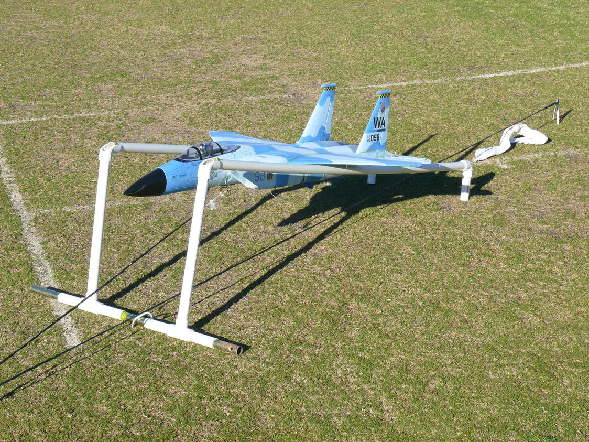

.. _takeoff-landingpage:

=======
Takeoff
=======

Taking the plane off can be accomplished in many ways: Rolling Takeoff, Hand Launch, Bungee, or VTOL (Verical Takeoff and Landing) if a :ref:`quadplane-support`. And it can be done manually or automatically.

Rolling Takeoff
===============

In this case, the plane has landing gear with steerable nose gear, usually coupled to the rudder control and the plane is usually launched from a smooth grass or paved surface (see the `Ground Steering parameters <https://ardupilot.org/plane/docs/parameters.html#steer2srv-parameters>`__ . Once aligned nose into the wind, throttle is gradually increased to takeoff value (usually full throttle) while the aircraft direction is controlled by rudder. Once sufficient airspeed to lift off is obtained, slight up elevator will rotate the nose to climb attitude.

MANUAL or FBWA modes are most commonly used during takeoffs.

For automatic takeoffs see :ref:`automatic-takeoff` section.

Hand Launch
===========

Many planes do not have landing gear, or a smooth runway is not available. Hand launching is a very common takeoff method, but also can be very frustrating if not setup and executed properly.

The keys to a successful hand launch are :

- :ref:`Proper CG <guide-center-of-gravity>` 
- Having flying surfaces centered and neutral at neutral RC stick positions
- Having the "level" calibration setup such that the level horizon (0 deg pitch) in FBWA mode results in the wing chord line being a few degrees positive, which will result in a positive angle of attack in "level" flight, the normally cruising attitude for a plane.
- Using FBWA mode or :ref:`automatic-takeoff` . While launching in MANUAL can be done, using a stabilized mode will eliminate a lot of pilot effort to overcome trim issues (see Tip at end of this page). If using FBWA mode, a few degrees of up elevator (~10%) during the launch will result in an automatic climb. Add this via a switch or stick pressure. Do not change TX trim positions used during RC calibration since it affects all other modes of flight.
- Throttle up and firmly throw the plane level directly into the wind, not nose pointed up. Common mistakes are pointing the nose up, throwing it toward the ground, or rotating your wrist like a football throw. In the first second or so, the plane has low airspeed and the flying surfaces have no authority to correct non-level attitude until it accelerates to flying speed.

Videos of hand launches
=======================

.. youtube:: -GH3nhh9ffU

.. youtube:: Yx1k8VgpHlU

Bungee
======

Bungee launching involves using an elastic band, stretched and attached to the plane, in order to provide a catapult-like takeoff.

.. youtube:: tLfbSr_3844

This is commonly used for very heavy or very high stall speed planes for launching.
A tutorial on building and using a bungee launcher is `here <https://www.rcgroups.com/forums/showthread.php?1459906>`__

VTOL
====

Perhaps the easiest of all takeoffs, it does require that the plane be a VTOL capable :ref:`Quadplane <quadplane-support>` 

.. tip:: While not necessary for a successful launch, enabling :ref:`SERVO_AUTO_TRIM<SERVO_AUTO_TRIM>` will automatically trim the plane during stabilized operations, such that switching to MANUAL or ACRO mode later will have an in-trim plane automatically.

.. tip:: The default PIDs usually will be acceptable for most planes for their first launch. However, powerful, small flying wings will sometimes wobble in pitch at high throttle climb-outs and can benefit from initially setting :ref:`PTCH2SRV_P<PTCH2SRV_P>` to half its default value. These can be optimized later manually or using AUTOTUNE mode. See :ref:`tuning-quickstart` 
