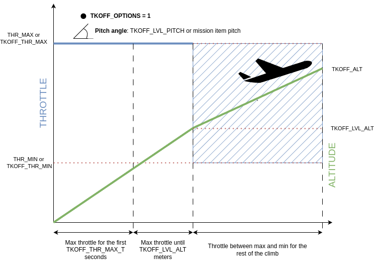

.. _takeoff-mode:

============
TAKEOFF Mode
============

Automatic takeoff can be accomplished either as a mission control command in AUTO mode (NAV_TAKEOFF) or by directly changing into the TAKEOFF mode. See also the :ref:`automatic-takeoff` topic for general setup information for automatic takeoffs.

NAV_TAKEOFF Mission Command
===========================

The takeoff mission command specifies a takeoff pitch and a target altitude.
The takeoff mission item is considered complete when the plane has
reached the target altitude specified in the mission. The mission will then execute its normal end of mission behavior if it runs out of commands in the mission list. For Plane, this is RTL.

TAKEOFF Flight Mode
===================

Automatic Takeoff is also a mode itself. When entered, the plane will use maximum throttle as set by the :ref:`TKOFF_THR_MAX<TKOFF_THR_MAX>` parameter, climbing with :ref:`TKOFF_LVL_PITCH<TKOFF_LVL_PITCH>` maximum and takeoff roll limits (:ref:`LEVEL_ROLL_LIMIT<LEVEL_ROLL_LIMIT>` ) up to the :ref:`TKOFF_ALT<TKOFF_ALT>` altitude.
Then, it will loiter at :ref:`TKOFF_ALT<TKOFF_ALT>` altitude until the mode is changed.
If the plane travels for :ref:`TKOFF_DIST<TKOFF_DIST>` from the point where the mode is entered, before reaching :ref:`TKOFF_ALT<TKOFF_ALT>` altitude, then it will loiter at that spot, still trying to climb to :ref:`TKOFF_ALT<TKOFF_ALT>`.

Once :ref:`TKOFF_LVL_ALT<TKOFF_LVL_ALT>` is reached, or the loiter point distance is reached, maximum throttle and takeoff roll limits (:ref:`LEVEL_ROLL_LIMIT<LEVEL_ROLL_LIMIT>` ) are stopped and normal navigation begins towards the loiter point and altitude. Normally, :ref:`TKOFF_LVL_ALT<TKOFF_LVL_ALT>` is 10 meters and is intended to limit navigation (roll) in order to prevent wing tip ground strikes.

If the mode is entered while already flying, it will immediately begin loitering as in LOITER mode if at or above :ref:`TKOFF_ALT<TKOFF_ALT>` altitude above ground, otherwise it will climb to that altitude and then begin loitering .

TAKEOFF mode can also be entered via a switch using an RCx_OPTION = 77, as well as via normal selection by the flight mode channel.

TAKEOFF Heading
===============

Before takeoff it is important that the plane be pointing into the wind,
and be aligned with the runway (if a wheeled takeoff is used). The plane
will try to hold its heading during takeoff, with the initial heading
set by the direction the plane is facing when the takeoff starts. It is
highly recommended that a compass be enabled and properly configured for
auto takeoff, as takeoff with a GPS heading can lead to poor initial heading
control such that heading can different from the initial heading by tens of degrees during the climb. While this may not be an issue for hand launches, runway takeoffs require a compass for adequate heading control during the takeoff rollout.

If you are using a wheeled aircraft then you should look at the
``WHEELSTEER_*`` PID settings for controlling ground steering. If you
are hand launching or using a catapult you should look at the
:ref:`TKOFF_THR_MINACC<TKOFF_THR_MINACC>` and :ref:`TKOFF_THR_MINSPD<TKOFF_THR_MINSPD>` parameters.

.. _takeoff-throttle:

TAKEOFF Throttle
================

By default, Plane will set the throttle to :ref:`TKOFF_THR_MAX<TKOFF_THR_MAX>` (or if that is 0, to :ref:`THR_MAX<THR_MAX>`) up until it reaches :ref:`TKOFF_ALT<TKOFF_ALT>`.
This behaviour is reflected in the :ref:`TKOFF_OPTIONS<TKOFF_OPTIONS>` bit 0 setting, which by default is 0 (unset).

In case more fine-grained throttle control is required, an airspeed sensor must be installed and enabled via the :ref:`ARPSD_USE<ARSPD_USE>` parameter and :ref:`TKOFF_OPTIONS<TKOFF_OPTIONS>` bit 0 must be set to 1. IF no airspeed sensor is enabled or :ref:`TECS_SYNAIRSPEED<TECS_SYNAIRSPEED>` is enabled (not recommended), then this bit has no effect.

In this configuration, right after takeoff the throttle is set to :ref:`TKOFF_THR_MAX<TKOFF_THR_MAX>` for :ref:`TKOFF_THR_MAX_T<TKOFF_THR_MAX_T>` or until :ref:`TKOFF_LVL_ALT<TKOFF_LVL_ALT>` (whichever lasts longer).

Finally, the throttle will be managed by the TECS controller to achieve a speed controlled, maximum (:ref:`TECS_CLMB_MAX<TECS_CLMB_MAX>`) climb, ranging between :ref:`TKOFF_THR_MIN<TKOFF_THR_MIN>` and :ref:`TKOFF_THR_MAX<TKOFF_THR_MAX>`.

The difference between these two throttle control options can be seen in the following diagrams:

