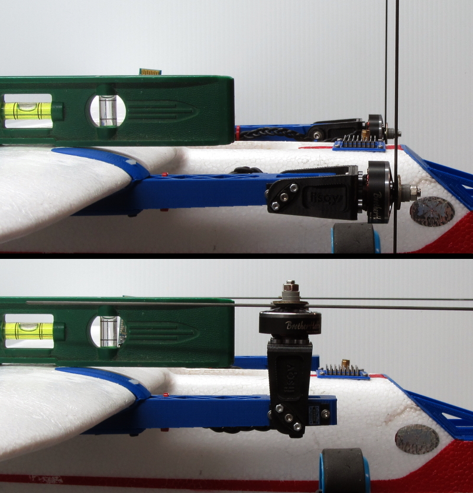

.. _tilt-rotor-tips:

=====================
Tilt Rotor Setup Tips
=====================

Once you have the servo function assignment completed, and other parameters discussed in :ref:`guide-tilt-rotor` entered, you can begin to setup the tilt mechanism's travel and range.

In Mission Planner's SETUP (or Initial Setup depending on release version) menu, under Mandatory Hardware/Servo Outputs you will see each outputs assignment, min/max/trim, and reverse. You will be switching back and forth between this tab and the DATA (previously Flight Data) tab several times.

.. tip:: Misalignment as the motors transition to/from forward flight can have a big impact on smoothness or even airworthiness. It is worthwhile to the get them synchronized and aligned as precisely as possible.

Mechanical Setup
================

- Remove props! Power the aircraft to enable servo's to be active (safety switch activation may be required). Do not turn on your transmitter. We want it to remain unarmed but servos active.
- Attach the tilt servo's output arm to the servo, or attach the servo to the tilt mechanism if direct mount style, such that it will produce equal travel from horizontal to vertical position. This is done while the servo is at mid-range (1500us). You can set the assigned tilt servos' output min/max both to equal 1500 in Mission Planner,so they will be driven to that value only in any mode, for now.
- Attach and adjust the linkage (if not direct mount style) such that the line from pivot point to ball link on the pivot arm and the output arm are at the same angle. Set the servo min/max to 1300/1700, respectively.
- Go to the ``DATA`` menu, use the ``Actions`` tab to use the ``SetMode`` button, and select MANUAL mode, if not already there. It will ask if you really want to do this since it's unarmed. Click yes. Check that the motors moved to forward flight position (more or less since range is very restricted now to prevent overrunning), then change mode to QSTABILIZE and check for movement toward vertical. Go back to Mission Planner ``SETUP``/Mandatory Hardware/Servo Output and reverse tilt servos as required to get proper direction.
- Now we will adjust travel. It's an iterative process, changing the value in MANUAL mode for one endpoint (min or max, depending on servo direction), then changing to QSTABLIZE and adjusting the other endpoint. The Servo Output screen is a "live screen". When you change it, its value is instantly reflected in servo output. You will want to be sure that the MANUAL mode position places both motors against the stops (if used), in full forward flight position with just a little bit of torque. Too much torque and the servo will overheat. Too little, and you get a loose position which can bounce a bit in the air. You want both motors EXACTLY aligned with props back on, a difference in fixed wing mode will result in roll force. Enough misalignment and you wont be able to stop the roll with full aileron!
- In QSTABILIZE, both motors should be aligned. They can be vertical, but you can set them up such that when the AHRS horizon is level, they are. This results in them pointing a little forward when the airframe is flat (and the horizon will be 2-5 deg negative since you are not in flying attitude)....read https://ardupilot.org/plane/docs/quadplane-tips.html for more information

(Photo courtesy of `Mark Qvale <http://www.itsqv.com/QVM/index.php?title=X-UAV_Mini_Talon_VTOL_Project>`__)

- Once setup, double check alignment several times in both modes.

.. note:: You can watch that both move exactly in sync by setting :ref:`Q_TILT_RATE_DN<Q_TILT_RATE_DN>` =0  and :ref:`Q_TILT_RATE_UP<Q_TILT_RATE_UP>`  =2 (degs/second) temporarily. But you must use FBA/FBWB/ or STABILIZE instead of MANUAL mode for the forward flight mode for this test since MANUAL mode forces the downward rate to be at least 90 degs/sec.

- Finally, go to the ``SETUP``/Optional Hardware/Motors tab and click Motor A,B,and D (for a Tricopter Tilt Quadplane) in sequence to verify motor direction is correct (without props!)
