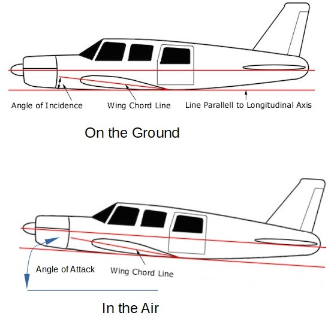

.. _tuning-cruise:

===========================
Tuning Cruise Configuration
===========================

Overview of Constant Altitude, Level Flight Operation
=====================================================

"Hands-off" constant altitude hold cruising occurs in automatic throttle modes such as FBWB, CRUISE, AUTO, GUIDED, CIRCLE, LOITER, RTL, etc. See :ref:`flight-modes` for the full list of automatic throttle modes.

In FBWB and CRUISE modes, without an airspeed sensor, the autopilot will set the target throttle at :ref:`TRIM_THROTTLE<TRIM_THROTTLE>` with the throttle at mid-stick, and adjust pitch to hold altitude. The airspeed will be whatever results from the change in thrust. Raising the throttle stick will increase throttle and thereby airspeed.

When using an airspeed sensor, the autopilot will use throttle position to set the target airspeed as a linear interpolation between :ref:`AIRSPEED_MAX<AIRSPEED_MAX>` and :ref:`AIRSPEED_MIN<AIRSPEED_MIN>`. And pitch will be adjusted for constant altitude flight. 

In the automatic throttle controlled modes, :ref:`AIRSPEED_CRUISE<AIRSPEED_CRUISE>` is used for the target airspeed if an airspeed sensor is being used, while :ref:`TRIM_THROTTLE<TRIM_THROTTLE>` will be set for the average throttle value if no sensor is used. In AUTO and GUIDED modes, the :ref:`THROTTLE_NUDGE<THROTTLE_NUDGE>` option allows the pilot to tweak these values while in flight with the throttle, if desired, in these modes.

.. warning:: While :ref:`TRIM_THROTTLE<TRIM_THROTTLE>` is not used when using an airspeed sensor directly, it is important to set it at a working value since it will be used in case of an airspeed sensor failure.

AHRS Level Attitude
===================

During :ref:`common-accelerometer-calibration`, a "level" attitude position is set with the wings and fuselage perfectly level. A plane can fly holding a constant altitude at range of speeds, depending on throttle level and Angle of Attack (AOA).

The AOA is usually several degrees but varies depending on cruise speed/throttle. This is the "trim level" pitch. This is explained in the diagrams above and is known as the "trim level" condition. While many planes will have some Angle of Incidence (i.e. the cord of the wing is at a positive angle to the fuselage cord) built-in, some do not, and some need a slightly higher AOA to fly at desired cruise speeds.

If the level step of calibration is done with the plane's fuselage line level, initial flights will be safe, but the aircraft may not hold altitude at the desired flying speed in non-altitude controlled modes (i.e. require too much throttle to hold altitude and/or the cruising speed may be faster or slower than desired).

Adjusting FBWB or CRUISE Mode Airspeed
======================================

The autopilot's goal in automatic throttle modes is to obtain the correct combination of elevator and throttle to maintain constant altitude flight. How the autopilot does this is detailed in :ref:`tecs-total-energy-control-system-for-speed-height-tuning-guide`.

When an Airspeed Sensor is Enabled
----------------------------------

In FBWB or CRUISE, the target airspeed can be directly controlled with the throttle stick position. Mid throttle will set the speed as halfway between :ref:`AIRSPEED_MAX<AIRSPEED_MAX>` (high stick) and :ref:`AIRSPEED_MIN<AIRSPEED_MIN>` (low stick). 

.. note:: The :ref:`TRIM_THROTTLE<TRIM_THROTTLE>` parameter should be adjusted to the average throttle value used at cruise speed. It optimizes the bias point for the speed control loops and is used in case of airspeed failure.

While cruising, the artificial horizon in the OSD or GCS may show an average positive or negative pitch above the level indicator (ie fuselage/autopilot level). This means that the "trim level" pitch or AOA is different than what was set during the accelerometer calibration step. This can be trimmed out so that non altitude controlled modes fly at the same speed and throttle. Do this by adjusting the pitch trim, adding the desired degrees nose up or down using :ref:`PTCH_TRIM_DEG<PTCH_TRIM_DEG>`. This also optimizes the speed control loop bias point and will allow non altitude controlled modes to fly level at the same throttle and speed. 

Using :ref:`PTCH_TRIM_DEG<PTCH_TRIM_DEG>` to adjust cruise attitude will also add an offset to the artificial horizon on a GCS or an OSD, but this can be disabled, if desired, using the :ref:`FLIGHT_OPTIONS<FLIGHT_OPTIONS>` bitmask bits 8 and/or 9, if the attitude of the autopilot in level flight is desired, rather than a leveled artificial horizon when flying level .

Without an Airspeed Sensor
--------------------------

Without an airspeed sensor, both the pitch trim and the :ref:`TRIM_THROTTLE<TRIM_THROTTLE>` parameter would need to be changed appropriately for the desired mid-stick cruise speed. 

.. tip:: Often planes need 2 or 3 degrees of pitch trim to fly at their optimum cruising speed/throttle rather than at the fuselage/autopilot level pitch, especially small light planes or gliders. This can be done at setup by:

- **(Preferred)** Add the desired degrees nose up(usually) or down to :ref:`PTCH_TRIM_DEG<PTCH_TRIM_DEG>`. 
- Position vehicle with a few degrees nose up or down during the first, Level step of accelerometer calibration to match the cruising attitude.
- Position vehicle with a few degrees nose up and use the  ``Calibrate Level`` button on the Mission Planner page. This adjusts the AHRS_TRIM parameters. AHRS_TRIM parameters can only change the difference between the autopilot's plane and "level" by 10 degrees maximum. If more is needed, (e.g. the autopilot is mounted slightly downward), then you can use :ref:`PTCH_TRIM_DEG<PTCH_TRIM_DEG>` to alter the AOA manually.

.. tip:: You can examine ATT.Pitch in the logs when at cruise speed in FBWB or CRUISE to determine the average pitch trim required in these modes. Appropriately adjusting :ref:`PTCH_TRIM_DEG<PTCH_TRIM_DEG>` to lower this to zero when flying level in these modes.

.. note:: when using :ref:`PTCH_TRIM_DEG<PTCH_TRIM_DEG>` to adjust trim, it will be reflected in the ATT.Pitch log message, and also in the OSD and GCS horizon displays (ie level horizon pitch = :ref:`PTCH_TRIM_DEG<PTCH_TRIM_DEG>` + the calibrated level pitch) so that the display will be level when flying "in trim" even though the plane's pitch is different than the autopilots calibrated pitch. 
