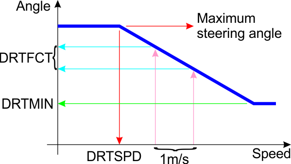

.. _tuning-ground-steering-for-a-plane:

==================================
Tuning Ground Steering for a Plane
==================================

The Plane firmware has the ability to control ground steering if you
have either a tail wheel or nose wheel in your aircraft. Ground steering
is activated in all modes except MANUAL, and when properly tuned it
makes it much easier to keep a plane on a straight track along the
runway for takeoff and landing.

When setting up ground steering for a plane there are 4 key parameters
you need to get right. This guide provides a set of steps to get those
parameters right, so that your plane will accurately track down a runway
on the ground.

Controlling steering
~~~~~~~~~~~~~~~~~~~~

To enable ground steering you need to set the :ref:`GROUND_STEER_ALT<GROUND_STEER_ALT>`
parameter to something above zero. This is the barometric altitude above
the initial altitude at which the steering changes from ground steering
of a wheel to rudder steering for aerodynamic control. It is recommended
that you set this to 5 meters to allow for a bit of barometric drift.

When ground steering is active it locks onto a compass heading whenever
you have no rudder or aileron input. So to steer the plane on the ground
while taxiing you should use the rudder to change direction, then take
your hand off both rudder and aileron to hold the current compass
heading. Ground steering will only work properly if you have a compass
enabled.

THE KEY PARAMETERS
~~~~~~~~~~~~~~~~~~

-  **STEER2SRV_P**: This tells the code what the turning circle (as a
   diameter in meters) is for your plane. It is critical that you get
   this parameter right, as it tells the code what steering angle to
   choose to achieve a desired turn rate.
-  **STEER2SRV_I**:This is the gain from the integral of steering
   angle. Increasing this gain causes the controller to trim out steady
   offsets due to an out of trim vehicle..
-  **STEER2SRV_D**: This adjusts the damping of the steering control
   loop. This gain helps to reduce steering jitter with vibration. It
   should be increased in 0.01 increments as too high a value can lead
   to a high frequency steering oscillation that could overstress the
   vehicle.
-  **STEER2SRV_IMAX**: This limits the number of degrees of steering in
   centi-degrees over which the integrator will operate. At the default
   setting of 1500 centi-degrees, the integrator will be limited to +-
   15 degrees of servo travel. The maximum servo deflection is +- 45
   centi-degrees, so the default value represents a 1/3rd of the total
   control throw which is adequate unless the vehicle is severely out of
   trim.
-  **STEER2SRV_MINSPD**: This is the minimum assumed ground speed in
   meters/second for steering. Having a minimum speed prevents
   oscillations when the vehicle first starts moving. The vehicle can
   still driver slower than this limit, but the steering calculations
   will be done based on this minimum speed.
-  **STEER2SRV_TCONST**: This controls the time constant in seconds
   from demanded to achieved steering angle. A value of 0.75 is a good
   default and will work with nearly all rovers. Ground steering in
   aircraft needs a bit smaller time constant, and a value of 0.5 is
   recommended for best ground handling in fixed wing aircraft. A value
   of 0.75 means that the controller will try to correct any deviation
   between the desired and actual steering angle in 0.75 seconds.
   Advanced users may want to reduce this time to obtain a faster
   response but there is no point setting a time less than the vehicle
   can achieve.
-  **GROUND_STEER_ALT**: Altitude at which to use the ground steering
   controller on the rudder. If non-zero then the STEER2SRV controller
   will be used to control the rudder for altitudes within this limit of
   the home altitude.

STEP 1: SETTING INITIAL PARAMETERS
~~~~~~~~~~~~~~~~~~~~~~~~~~~~~~~~~~

To start the tuning process set the following values:

-  **STEER2SRV_P**:             =      See step 2
-  **STEER2SRV_I**:              =      0.1
-  **STEER2SRV_D**:             =     0.02
-  **STEER2SRV_IMAX**:      =    1500
-  **STEER2SRV_MINSPD**: =    1
-  **STEER2SRV_TCONST**: =    0.5
-  **GROUND_STEER_ALT**: =    5

These are conservative values that should give you reasonable behaviour
for most PLANES.

STEP 2: SETTING THE :ref:`STEER2SRV_P<STEER2SRV_P>`
~~~~~~~~~~~~~~~~~~~~~~~~~~~~~~~~~~~~~~~~~~~~~~~~~~~

To set your :ref:`STEER2SRV_P<STEER2SRV_P>` parameter you need to measure the diameter of
the turning circle of your plane.

With your motor off put your plane into MANUAL mode, and put the rudder
hard over to one side. Then slowly push your plane in a circle. Use a
tape measure to measure the diameter of that circle and set :ref:`STEER2SRV_P<STEER2SRV_P>`
to that value in meters. Most planes have a turning diameter of around 4
meters. If your turning diameter is a long way from 4 then you may have
the rates or throw on your rudder set incorrectly.

Fixing Problems with weaving
~~~~~~~~~~~~~~~~~~~~~~~~~~~~

A common issue with ground steering is that the steering 'weaves',
turning from side to side rather than turning smoothly. There can be
several possible reasons for this happening.

The first thing you need to work out is if the problem is confined to
low speed or also affects higher speed driving. If the problem only
happens at very low speed then the most likely problem is that
:ref:`STEER2SRV_MINSPD<STEER2SRV_MINSPD>` is too low. The default is 1.0 m/s, which is quite
low, and if your GPS heading isn't very reliable at low speed then you
may need to raise that number. Try 2.0 and see if that helps with low
speed weaving.

In the steering controller there are 3 key parameters that will control
weaving:

-  A smaller :ref:`STEER2SRV_P<STEER2SRV_P>` will reduce weaving, try reducing it by 0.1 at
   a time
-  A larger :ref:`STEER2SRV_D<STEER2SRV_D>` will "damp" the weaving, but if you make it too
   large then you will get high speed oscillation. For example you may
   find that a value of 0.1 reduces the damping, but a value of 0.2
   could cause a high speed oscillation in the steering servo. If you
   get fast oscillation then reduce the :ref:`STEER2SRV_D<STEER2SRV_D>` value by 50%.
-  A larger :ref:`STEER2SRV_TCONST<STEER2SRV_TCONST>` will slow down the steering controller,
   which will reduce weaving. Try raising it in steps of 0.1.

With the current controller system you do need to experiment a bit with
these values to get the behaviour you want.

Tuning for auto-takeoff
~~~~~~~~~~~~~~~~~~~~~~~

To tune the ground steering for auto-takeoff it is generally best to do
the tuning in FBWA mode, and only change to auto-takeoff once you can
takeoff in FBWA mode without overriding the steering at all (ie. takeoff
without using the rudder stick).

It can also be very helpful to use the :ref:`FBWA_TDRAG_CHAN<FBWA_TDRAG_CHAN>` option to setup
the same automated elevator behaviour as is used in auto-takeoff when in
FBWA mode. That helps keep tail wheels on the ground in taildragger
aircraft (and can also be used to keep nose wheels on the ground in
tricycle aircraft).

Limiting the steering to prevent a roll on a wing
~~~~~~~~~~~~~~~~~~~~~~~~~~~~~~~~~~~~~~~~~~~~~~~~~

On a large fast planes, especially with large wingspan, there is a chance
on rolling on the wing if the steering is too aggressive.
To coupe with this problem steering limiting can be setup that will derate
steering angles with increasing speed.
When the speed is lower than the set derating speed, no limit occurs and
the angle for steering is passed through without changes.
When the speed increase, the steering angle starts to decrease at a setup
rate until the minimum steering angle is reached.

-  **DRTSPD** - After this speed the steering angle gets reduced
-  **DRTFCT** - Amount of degrees to reduce per each additional m/s increase in speed
-  **DTRMIN** - minimum angle of steering that will not be decreased further

The steering angle vs. speed can be illustrated with following chart:

