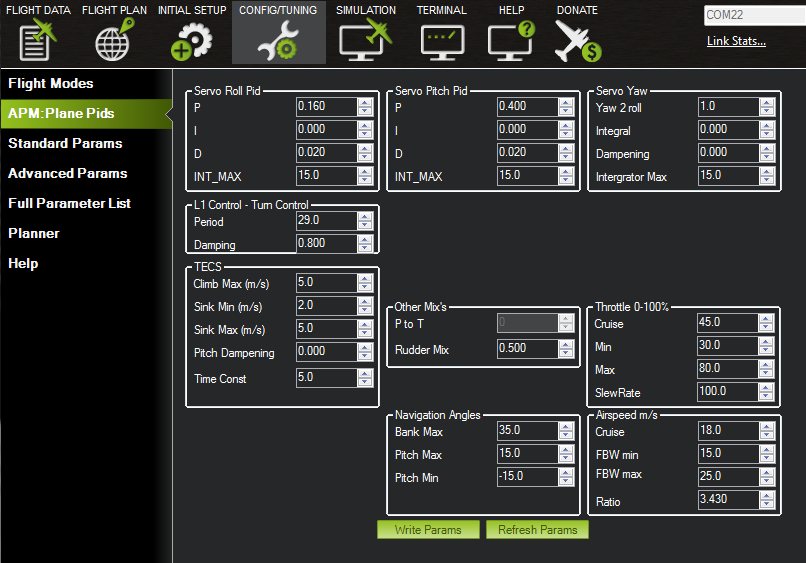

.. _tuning-quickstart:

=================
Tuning QuickStart
=================

This article provides information to help you get started with airframe
tuning. It includes an overview of the main steps, tools and concepts.

How to tune the airframe
========================

With the default PID settings, Plane will fly the majority of
lightweight RC airframes (not full size, full speed airframes) safely,
right out of the box. To fly well, with tight navigation and reliable
performance in wind, you'll want to tune your autopilot.

The most important configuration is Roll and Pitch tuning, as this is
essential for responsive and stable flight as well as effective
navigation. The best way to tune the roll and pitch is to use :ref:`Automatic Tuning with AUTOTUNE <automatic-tuning-with-autotune>` (a flight mode
that uses changes in flight attitude input by the pilot to learn the key
values needed).

.. tip::

   To use AUTOTUNE you must to be able to fly the aircraft. Plane will
   fly the majority of lightweight RC airframes right out of the box. We
   also provide :ref:`configuration values for many common aircraft <configuration-files-for-common-airframes>` that you can use
   to get your aircraft flying before doing further tuning.

   If AUTOTUNE doesn't work with your plane, a fully manual approach is
   described in the :ref:`Roll, Pitch and Yaw Controller Tuning Guide <roll-pitch-controller-tuning>`.

After tuning the Roll, Pitch (and optionally yaw) you should tune the
height controller using the :ref:`TECS tuning guide <tecs-total-energy-control-system-for-speed-height-tuning-guide>`
and the horizontal navigation using the \ :ref:`L1 controller tuning guide <navigation-tuning>`.

Information on how to tune other aspects of Plane are linked from the
:ref:`Tuning landing page. <common-tuning>`

Mission Planner configuration screens
=====================================

The *Mission Planner* provides access to all configuration and tuning
parameters through the CONFIG/TUNING section. The column on the left
links to the full parameter set. The screen on the right lists some (but
not all) of the more commonly modified parameters. You can use either
side to make the same parameter change. Parameter updates are sent to
the connected board as soon as you press "write params", many affect the
current flight (if any) immediately, and are written to permanent storage so they
survive power cycling.

   Mission Planner: CONFIG/TUNINGPlane Pids Screen

The starting point for Plane tuning is via the Plane PIDs screen shown
above. This is where you can tune the Servo Roll and Servo Pitch PID
gains to enable flight in FBW-A mode, and also enable tuning of the L1
Control for more accurate horizontal positioning.

You can also load and save configuration files (to your PC) from the
*Advanced Parameters* screen. Configuration files are versioned - an
older parameter file found by Plane is ignored if the parameter version
number is not current.

You will note that several of these parameters are PID (Proportional,
Integral, Differential) settings which are explained in the next
section.

PID gain values
===============

The control of roll or pitch angle is adjusted using a
`Proportional-Integral-Derivative (PID) Controller <https://en.wikipedia.org/wiki/PID_controller>`__.

The final control applied to the plane's control surface, is a
combination of the effects of three gain values:

-  *Proportional gain (P)* is the simplest form of control, it is the
   "present" error. Autopilot wants 10 degrees of pitch, has 5 degrees,
   that is an error of 5: apply some amount of elevator (the amount
   applied for the amount of error is determined - scaled - by the P
   number).
-  *Integral gain (I)* takes into consideration previous errors and is
   able to compensate for steady errors. It can be thought of as an
   automatic trim adjustment. The disadvantage with the "I" gain is that
   because it is always reacting to past errors, it reduces damping of
   the control loop as it is always playing 'catchup'.
-  *Derivative gain (D)* adds damping because it feeds back the rate of
   change of the angle. It can also be thought of as attempting to
   anticipate future changes in angle. The disadvantage of the "D"
   gain is that it increases the amount of noise driving the servo and
   if turned up too high will cause rapid pitch or roll oscillation
   that can in some cases damage the aircraft.

Tuning P, PI or PID values can improve how quickly an observed error
between desired attitude (pitch, speed, bearing, whatever) and actual
attitude can be cancelled out, without undue oscillation.

.. tip::

   A simple configuration can just specify a P term (I and D is zero
   and ``INT_MAX`` is not used when I is zero).

Refer to the :ref:`Roll, Pitch and Yaw controller tuning guide <roll-pitch-controller-tuning>` for more information
