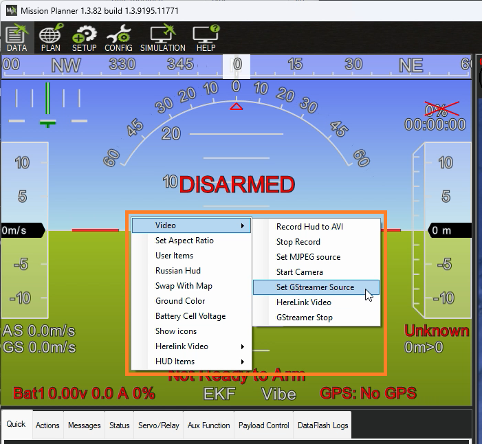
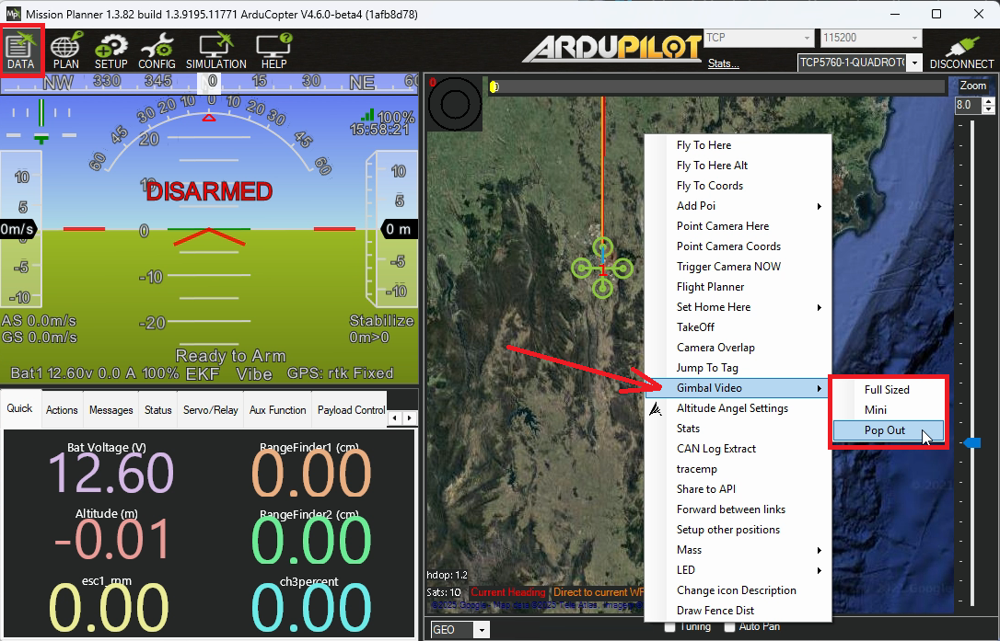
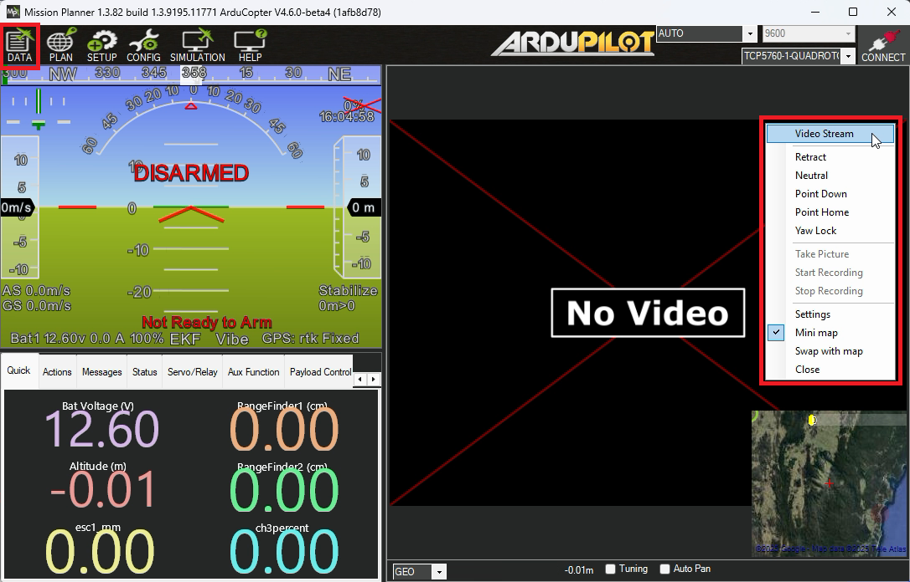

.. _live-video:

==========
Live Video
==========

This page explains how live video can be displayed on Mission Planner's Data screen

HUD
---

To display video from a :ref:`Herelink <common-herelink>` on the HUD please follow the `CubePilot instructions <https://docs.cubepilot.org/user-guides/herelink/herelink-user-guides/share-video-stream>`__ which include:

- Ensure the camera gimbal is connected to the Herelink AirUnit's HDMI port (see RTSP video instructions below if using ethernet)
- Ensure the PC is connected to the Herelink GroundUnit's Wifi AP
- Right-mouse-button click on Mission Planner's Data screen's HUD and select Video, Herelink
- Enter the Herelink GroundUnit's IP address which is normally 192.168.43.1

For non-Herelink setups, an RSTP video stream can be displayed on the HUD by doing the following:

- Right-mouse-button click on the HUD and select Video, Set GStreamer Source
- Input the GStream pipeline.  The pipeline below is known to work for the :ref:`Siyi A8 <common-siyi-zr10-gimbal>` using IP address of '192.168.144.25:8554'

    ``rtspsrc location=rtsp://192.168.144.25:8554/main.264 latency=41 udp-reconnect=1 timeout=0 do-retransmission=false ! application/x-rtp ! decodebin3 ! queue max-size-buffers=1 leaky=2 ! videoconvert ! video/x-raw,format=BGRA ! appsink name=outsink sync=false``

Pop-Out or within Map
---------------------

To display video in a pop-out window or within the Data screen's map area:

- Right-mouse-button click on the Data screen's map area and select Gimbal Video, and then "Full Sized", "Mini" or "Pop Out"
- An new window or portion of the map view should display "No Video"
- Right-mouse-button click on "No Video" to display the menu and select "Video Stream" to display the "VideoStreamSelector" window

- The "Detected Streams" drop-down will be populated if the autopilot or camera gimbal is publishing the `VIDEO_STREAM_INFORMATION <https://mavlink.io/en/messages/common.html#VIDEO_STREAM_INFORMATION>`__ mavlink message

  - Please install the `video-stream-information.lua <https://raw.githubusercontent.com/ArduPilot/ardupilot/refs/heads/master/libraries/AP_Scripting/applets/video-stream-information.lua>`__ script on the autopilot and set the VID1_CAMMODEL parameter to the camera being used
  - Alternatively if the above script cannot be used, fill in the GStreamer pipeline directly.  The pipeline below is known to work for the :ref:`Siyi A8 <common-siyi-zr10-gimbal>` using IP address of '192.168.144.25:8554'

      ``rtspsrc location=rtsp://192.168.144.25:8554/main.264 latency=41 udp-reconnect=1 timeout=0 do-retransmission=false ! application/x-rtp ! decodebin3 ! queue max-size-buffers=1 leaky=2 ! videoconvert ! video/x-raw,format=BGRA ! appsink name=outsink sync=false``

- The gimbal movements can be controlled directly from the live video screen by left-mouse-button clicking on the video or via keyboard shortcuts. These shortcuts can be viewed and changed by right-mouse-button clicking on the video area and selecting Settings
