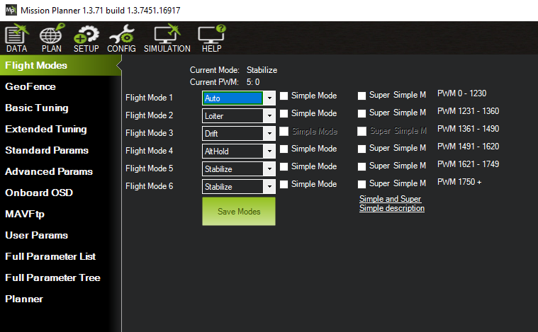
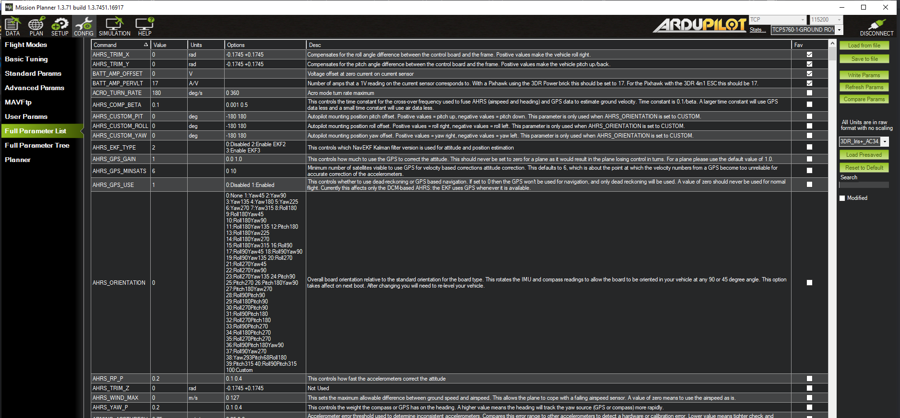

.. _mission-planner-configuration-and-tuning:

========================================
Mission Planner CONFiguration and Tuning
========================================

This section of Mission Planner, invoked by the Menu item ``CONFIG``
at the top of Mission Planner, has several subsections. The subsection
are where you configure the parameters that control how your auto pilot
controls your vehicle.

Tuning refers to adjusting parameters in the control loops so your vehicle behaves the way you desire. Most of these parameters are set for you when you first install your firmware but some
must be set before your first flight or roaming adventure.

What you see when you enter this section depends on whether or not you are connected and which vehicle is connected. Each menu item will bring up a new screen, each is discussed below with links to more detail.

Planner
=======

You will see this menu item if the auto pilot is or is not connected. when disconnected, this will be the only item that is active.

This is where you set up most of the options related to Mission Planner
appearance and operation. Such things as enabling speech, where the logs are saved, the
units of measure you want to use, etc.

Flight Modes
============

This is where you can set the 6 flight modes controlled by the flight mode channel. This channel defaults to RC channel 8 for Plane, and channel 5 for Copter and Rover, but can be re-assigned by the :ref:`FLTMODE_CH<FLTMODE_CH>` parameter for  Plane and Copter, and the :ref:`MODE_CH<MODE_CH>` for Rover.

GeoFence (Copter only)
======================

This allows configuration of the various Fence/Exclusion Zone/Inclusion Zone parameters. The coordinates of these fences are setup and saved via the PLAN screen. For Plane and Rover, these associated fence parameter must be set manually via the Full Parameter Screen described below. 

For more information on Geo-Fences, see :ref:`geofencing` , or :ref:`common-ac2_simple_geofence` and/or :ref:`common-polygon_fence` for Copter and Rover.

Basic Tuning
============

For all vehicles, this shows the relevant basic tuning parameters for that vehicle's attitude and navigation control loops. Read the Tuning section for that vehicle for explanations and instructions on how to tune.

Extended Tuning (Copter only)
=============================

For Copter, the Basic Tuning screen is very simple to enable an easy way for beginners to generally adjust roll and pitch tuning. But this screen is similar to the Basic Tuning screen for Plane and Rover, showing the most common parameters for each control loop.

Standard Params
===============

This screen provides access to parameters which are most commonly adjusted by users to alter the behavior of the vehicle for each individual application.

Advanced Params
===============

This screen provide access to many parameters not normally adjusted by the average user, but by more advance users.

OnBoard OSD
===========

Some autopilots have integrated On Sceen Display (OSD) capability. This provides a means to easily setup the display elements, layout, and parameters associated with these displays.

MAVftp
======

In firmware versions 4.1 and later, an integrated FTP (File Transfer Protocol) has been implemented to allow access to the SD card (if the autopilot has one) via Mission Planner. (It is not recommended to use it for log download, use the DataFlash Logs button in the DATA screen, it's faster).

User Params
===========

Currently, this allows easy access to setting the :ref:`common-auxiliary-functions` on RC channels.

Full Parameter List
===================

Displays every parameter of the connected vehicle. Allows any parameter to be changed and the new value saved (with some minor exceptions for certain read-only parameters). You can also save parameters to a file and restore them from a file, or compare the current parameters to a saved file and decide which, if any to change to that file's list.

- Load from File: load saved parameters from a file
- Save to file: Save parameters to a file
- Write Params: Write the modified parameters on this screen to the autopilot
- Refresh Params: Reload the parameter list from the autopilot. Often this is required, to display a group of parameters that were just enabled, such when you enable Q_ENABLE (QuadPlane enable mode) on Plane, or a battery monitor.
- Compare Params: Compares current parameters on the screen (including modified but not saved yet) to a file, and allows selection of which will be modified to that file's value.

.. note:: An important aspect of the Compare Params feature: After you select the file with the saved parameters you want to compare, you will get a window that lists every parameter that is different. At this point nothing has been changed, but if you check some items and then click Continue, those items will be changed in parameter screen of Mission Planner. You will then need to click the Write Params parameters button in the right hand panel to copy the changes to your autopilot.

- Load Presaved: Many common vehicle platform typical parameters are available to load via the dropdown box. On loaded, they could be saved to the vehicle with the Write Params button
- Reset to Default: CAUTION! this will immediately reset all parameters to the vehicle's default settings. Recalibration and setup via the SETUP menu will be required or a restore of previously save parameters from a file.
- Search: Allows a rapid search for parameters by name or included descriptions.
- Modified: Will display only parameters currently modified and unsaved.

Full Parameter Tree
===================

A tree style  view of the Full Parameter Screen.

