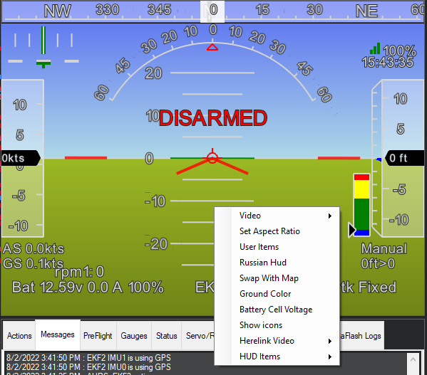
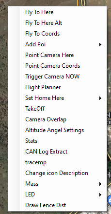

.. _mission-planner-flight-data:

==================================
Mission Planner Flight Data Screen
==================================

This section covers the information you will need to use the features in
the Mission Planner Flight DATA screen - selected in the Top menu of Mission
Planner.:ref:`An Introduction <mission-planner-ground-control-station>` privodes a brief overview with pointers to the various areas of information.

Heads Up Area  (HUD)
====================
This is the area in the upper left side of the Mission Planner menu.

.. note:: You can detach the HUD to a separate window by double clicking
      anywhere in the window.  Close the window to put back in the
      Mission Planner.
      
Options
-------

Several Options are available by right clicking the HUD.

-  Video:
    - You can start or stop recording the HUD as an .avi video stored in the logs folder.
    -  Set MJPEG Source: Connect and display MJPEG video source from network
    -  Start Camera: If a video source has been selected in the CONFIG/Planner page, starts displaying it in the HUD window.
    -  Set GStreamer Source: Connect and display Gstreamer video stream
    -  HereLink Video: Display HereLink video, use same IP as when connecting MP via UDPCL to Herelink for telemetry. See Herelink documentation.
    -  GStreamer Stop: Stop GStreamer video 

.. note:: In the CONFIG/Planner screen, you can select to display video from a capture source on the PC in the HUD window, and have the HUD display overlaid or not on that video.

-  Set Aspect Ratio: clicking this alternates between 4:1 and 16:9 aspect ratio.
-  User Items: You can add any of the telemetry parameters to the display by right clicking on the HUD, clicking User Items, and checking the items you want displayed.  Note that you can view all of the telemetry in the Control and Status area by clicking the Status button.
-  Russian HUD: clicking this changes to/from a Russian style HUD (ground horizon fixed)
-  Swap with Map: swap map to this window and vice versa
-  Ground Color: Click to change ground color

Control and Status (Lower Left)
===============================
The Control and Status area of the Flight Data screen is in the lower left hand portion of Mission Planner.  In this area you can select any of several different menu items. Some items provide information (status) and other items allow control of the vehicle using the telemety uplink. (Telemetry radio connection is required)

-  Quick:  This allows a quick look at just a few telemetry values in large text.  Double click to add items.
-  Actions: Use this area to control your Auto Pilot either for testing (using USB and no motor battery) or for controlling your vehicle. You can modes,arm/disarm (while on the ground),enable an attached joystick,restart a mission in the air, control a camera mount, etc.
-  Gauges: This shows four popular telemetry gauges. Double click the speed gauge to change the top speed.
-  Status: Clicking the Status menu button will display all of the telemetry parameters
-  Servos/Relay: This allows the setting of any relay pins or setting/overriding RC values for channels 5 thru 14. (Use servo settings with caution, you could change flight modes)
-  :ref:`Telemetry Logs <common-mission-planner-telemetry-logs>` :  Use this section to view, analyze, convert, and play back telemetry logs that are recorded by Mission Planner. See :ref:`Playing Back Missions with Tlogs <common-recording-and-playing-back-missions>` for specifics on playing back your mission and viewing the mission in the map area.
-  Data Flash Logs:  This provides a means to download data flash logs, analyze them, or create KML/gpx files from them. Click Review a Log to open a log file and establish a new window to view/analyze the log. Details :ref:`here <common-downloading-and-analyzing-data-logs-in-mission-planner>`.
-  :ref:`Scripts: <using-python-scripts-in-mission-planner>` - A different way to create missions

Map Area
========
The map area on the right side of the Flight Data screen displays the vehicle track as it moves, provides other information and allows the user to enter some control actions - which send commands to the vehicle (telemetry required)

Right click on the map area to select one of these options.

-  Fly to here: (Command) This is guided mode  (see bottom of this page :ref:`Guided Mode <mission-planner-ground-control-station>`)
-  Fly to here Alt:  (Command) Lets you enter an altitude.
-  Fly to Coords: (Command) Lets you fly to a latitude and longitude
-  Add POI: Lets you set, delete, save, and load Points of Interest to display on the map
-  Point Camera Here: (Command) Points vehicle and camera at location
-  Point Camera Coords: (Command) Point vehicle and camera at location using latitude and longitude coordinates
-  Trigger Camera Now  (Command): Triggers camera if :ref:`setup <common-camera-shutter-with-servo>`.
-  Flight Planner:  You can open the flight planner window in the map window area and leave the rest of the Flight Data Screen as is. Click the "CLOSE" button at top to return.
-  Set Home Here: (Command) Set new HOME position for RTL
-  TakeOff: (Command) Takeoff and loiter at input altitude. Copter and QuadPlane only.
-  Camera Overlap: If checked will show camera overlaps on the map during a survey mission
-  Altitude Angel Settings: Allows reporting and connection to `Altitude Angel services <https://www.altitudeangel.com/>`_
-  Stats : (in development)

Information/options at the bottom of the screen
===============================================
   -  hdop, sats: shows information about the GPS reception quality and
      the number of satellites in view.
   -  Legend:  Each color corresponds to the color of the corresponding
      line showing directions and headings. Black is the GPS track as
      you vehicle travels.
   -  Tuning:  Opens/closes the tuning window. Any value in the Status list (double click) can be graphed real time. 
   -  Auto Pan: Checking this box will make the map follow the vehicle
      and thus keep the vehicle in the center of the screen.
   -  Zoom: Shows or selects the current zoom level of the map. You can also use the:
   -  Scroll bar: Use the scroll bar to change the zoom level of the map.

