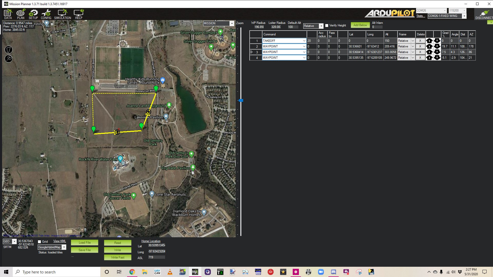
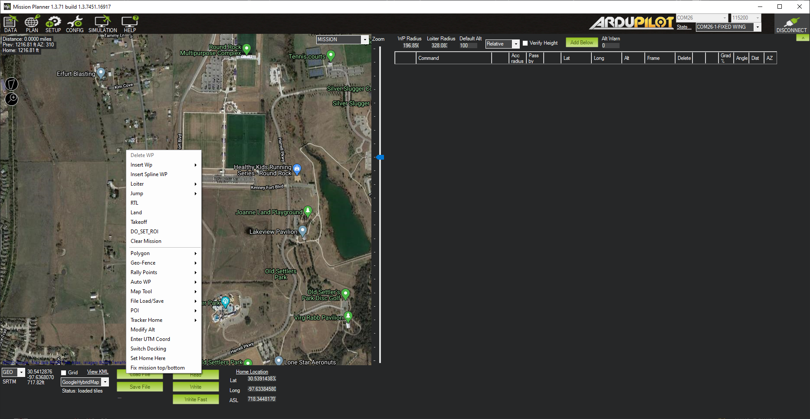
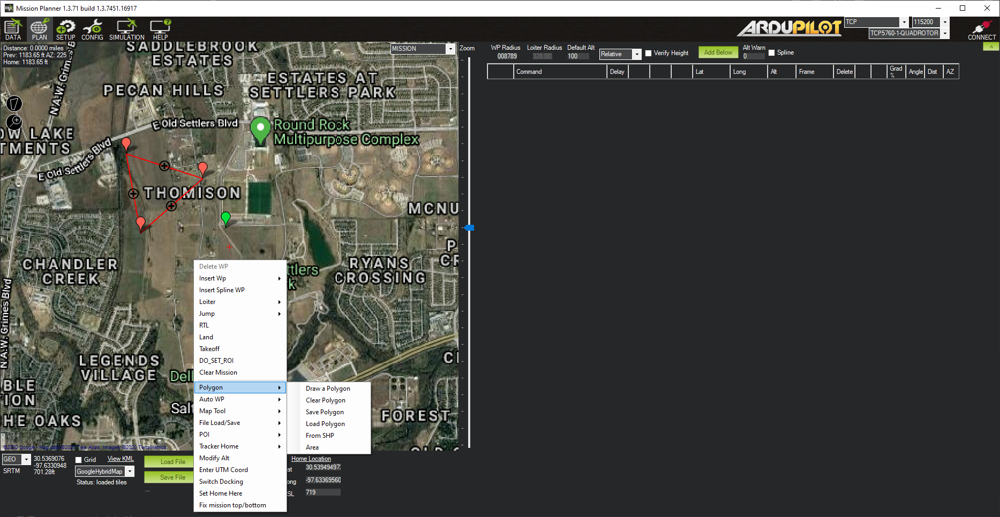
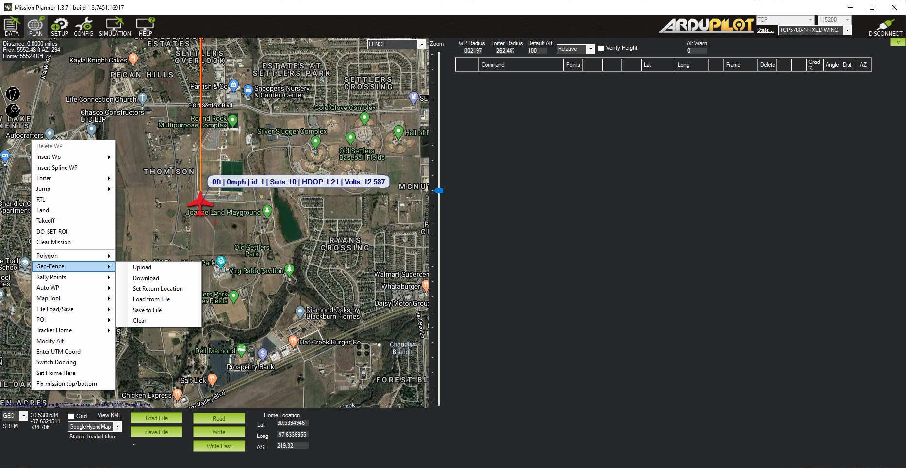
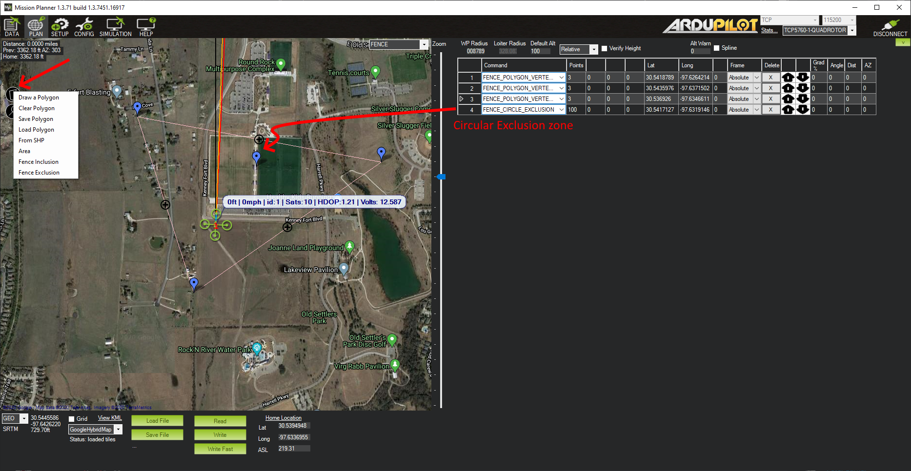
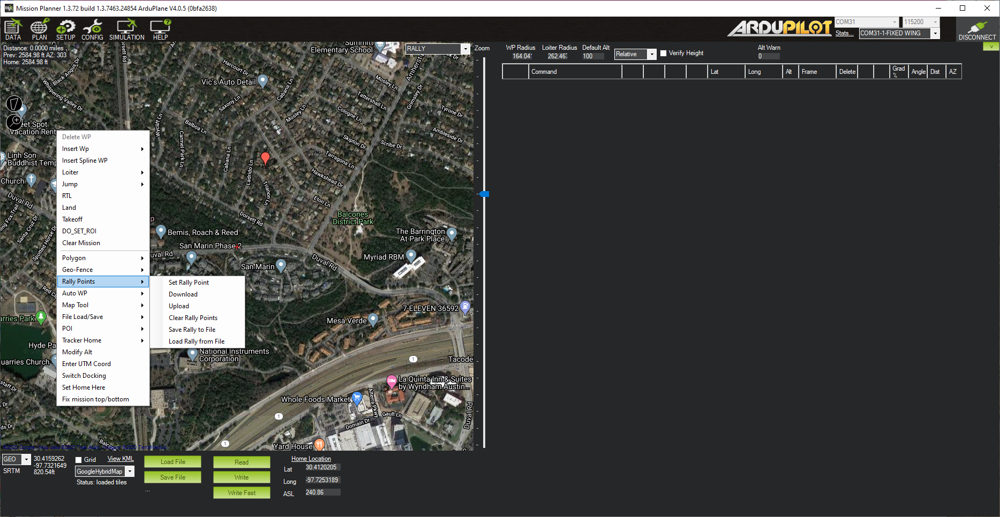

.. _mission-planner-flight-plan:

===========================
Mission Planner Flight PLAN
===========================

This section covers what you see and what you can do when in the Flight
PLAN screen of Mission Planner - selected in the menu at the top of the
Mission Planner application.  This section provides for planning and
executing flight plans - called missions.

The Flight PLAN Screen
======================

-  **Upper left corner**: Displays the distance from HOME, the heading and distance from the last entered waypoint (HOME if one does not exist), and total mission trip distance
-  **Right side**: Displays the Waypoints list for the mission. See :ref:`common-planning-a-mission-with-waypoints-and-events` for more details. Above this you can set the WPradius, Loiter Radius,and default altitude for waypoints. Altitudes can be entered in Relative (above HOME altitude),Absolute (ASL), and above Terrain. Units are set in the CONFIG/Planner page.
-  **Bottom** :At the bottom of the planner view you will see the latitude and longitude of the mouse cursor, its ASL (from SRTM, ie Terrain, data). You can select different map providers, Load or Save waypoints files, Read or Write the mission to the autopilot. In addition, the details of the HOME position on the map is shown.

Any left mouse click adds a waypoint to the mission.

Right Click Menu
----------------

Many options are available with a right mouse click:

- Delete WP: left click a waypoint, Ineright click and select this, deletes it.
- Insert WP: adds a waypoint to the mission list at the current vehicle location
- Insets Spline WP: Inserts a spline waypoint at current mouse position into the mission list. See `here <https://en.wikipedia.org/wiki/Spline_%28mathematics%29>`_ for more info on spline paths. (valid only for Copter, will insert normal waypoint in other vehicles)
- Loiter: Adds a Loiter waypoint to the mission at the cursor
- Jump: Adds a JUMP command to the mission
- RTL: Adds an RTL to the mission at the cursor
- Land: Adds a Land point to the mission at the cursor
- Takeoff: Adds a TAKEOFF point to the mission at the cursor
- DO_SET_ROI: Adds a SET_ROI mission command
- Clear Mission: Clears the displayed mission, but only in the workspace, not the autopilot. To clear the autopilot mission, WRITE a cleared workspace to the autopilot

Advanced Mission Creation Tools
--------------------------------

Mission Planner has the ability to auto-generate numerous survey and grid type missions. Most are based on a drawn polygon on the map.

- Polygon:
    - Draw a Polygon: Clicking this starts drawing a polygon between mouse clicks.
    - Clear Polygon: Clears the displayed polygon
    - Save Polygon: Save points to a file
    - Load Polygon: Load polygon points from a file
    - From SHP: Load polygon shape from a .shp file
    - Area: Displays area of drawn polygon

Once drawn, many different surveys,fences, or waypoint grids can be generated with:

- GeoFence (Plane only): Plane uses a different method for loading and reading its GeoFence to/from the autopilot, than Copter and Rover use, so this submenu is provided. See below, under Fence Creation, for details.

- Rally Points (Plane only): Plane uses a different method for loading and reading its Rally points to/from the autopilot, than Copter and Rover use, so this submenu is provided. See below, under Rally Points Creation, for details.

- Auto WP:
     - Create WP Circle: Creates a circle of waypoints
     - Create Spline WP Circle: Creates a circle of spline waypoints.
     - Area:Displays area of polygon
     - Text:(in development)
     - Create Circle Survey: Creates a circular survey. A survey is a set of spaced waypoints designed to allow a camera to take overlapping photos of the survey area. This does not require a drawn polygon.
     - Survey (Grid): Creats a survey mission based on drawn polygon.
     - Face Map: (in development)
     - Survey(Gridv2): Creates a box survey mission with a different user interface. No pre-drawn polygon required.
     - Simple Grid: Creates a simple grid of waypoints within the drawn polygon.

- Map Tools: Provides several map tools for measuring distances, pre-fetching map areas for off line use in the field, the ability to plot the mission altitude vs terrain, etc.

- File Load and Save: Load and Save waypoint, KML, and SHP files

- POI: This provides a means to create map markers for points of interest. This allows an easy method to be able to point the camera or fly to points of interest on the map. You can add, delete,save them to a file or load them from a file you have created. They will appear on the map.

- Tracker Home: Set or retrieve an Antenna Trackers HOME position.

- Modify Alt: Quickly change all mission altitudes.

- Enter UTM Coord: Sets your current location to a UTM location in the absence of GPS lock

- Set Home Here: Sets the HOME position at current cursor location.

- Fix mission top/bottom: experimental

Mission Planning Details
========================

Here is where you will find the details for mission planning:

* :ref:`Planning a Mission with Way points and Events <common-planning-a-mission-with-waypoints-and-events>`
* :ref:`Using Python Scripts in Mission Planner <using-python-scripts-in-mission-planner>`

FENCES Creation
===============

In the upper right of the map panel is a drop-down box, normally showing MISSION. If the FENCES option, is selected, then instead of mission/waypoint planning, fence creation is enabled.

Fences can be circular, or polygons. In Plane only polygon fences are allowed. In Copter and Rover,  circular and polygon, or both superimposed, are possible. Also, exclusion zones (normally a fence is an inclusion zone), are possible.

For Plane, the right click menu item, has the GeoFence sub-menu:

- Geo-Fence:

    - Upload: Upload a fence based on drawn polygon
    - Download: Retrieve fence from autopilot
    - Set Return Location: Plane fences require a return location. See :ref:`geofencing`.
    - Load from File: Load a geo-fence from a file
    - Save to File: Save the geo-fence points and return point to a file
    - Clear: Clear the geo-fence on the map. This **does clear** the fence in the autopilot as well as the map workspace.

For Copter and Rover, the polygon drawing icon in the upper left of the screen is used to create fences.

This is an expanded version of the Polygon tools in the right click menu.

To create a polygon fence, select "Draw a Polygon", and left click the points desired. Then select "Fence Inclusion". You will see a list of items in the mission list area. These are fence items and can be loaded to the autopilot with the "Write" button below, like waypoint lists were. Similarly, they can be read from the autopilot, saved or loaded from a file.

To create a circular fence, simply left click. An item will be placed in the mission list. You can adjust the radius of the zone. This may be either an inclusion zone, where flight is allowed, or an exclusion zone, where flight will be prevented.

.. note:: These circular zones may only be shown as blue markers in the PLAN and DATA view at certain zoom levels.

In Copter, various parameters of the fences can be set in the CONFIG/GeoFence screen. You can have different types of geo-fences loaded in the autopilot, but elect only to use combinations or altitude, circular, and/or polygon fences loaded by selecting the "Type" on this page. For Rover, these parameters must be set manually in the CONFIG/Full Parameter List screen

Rally Points Creation
=====================

The third option in the MISSION/FENCES/RALLY drop-down box, RALLY, allows creation of a RALLY points list. For use of RALLY points, see :ref:`common-rally-points`.

Left clicking will create a Rally Point at the cursor, and it will appear in the mission list to the right. Just like waypoints, these can be written to and read from, the autopilot, as well as being saved or loaded to/from a file using the "Read", "Write", "Load File", and "Save File" buttons.

In Plane only, saving and loading, is done from  the right-click menu:

- Rally Points:

    - Set Rally Point: Create rally point at cursor location
    - Download: Retrieve rally points from autopilot
    - Upload: Save rally points to autopilot
    - Clear Rally Points: Clear the rally points. This **does clear** the points in the autopilot as well as the map workspace.
    - Save Rally to File: Save the rally points to a file
    - Load Rally from File: Load the rally points from a file

