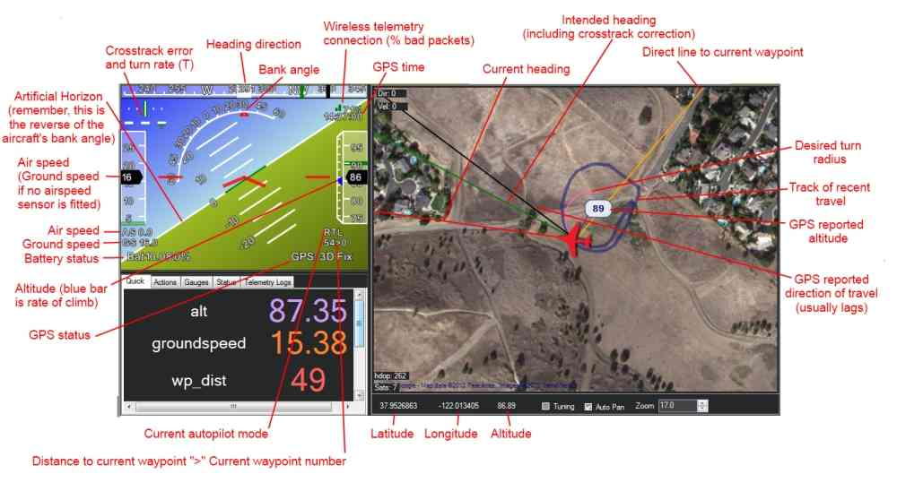
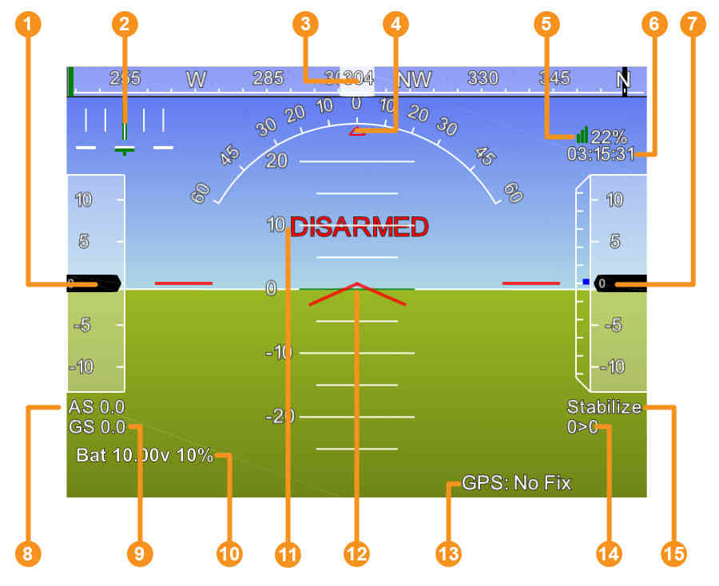
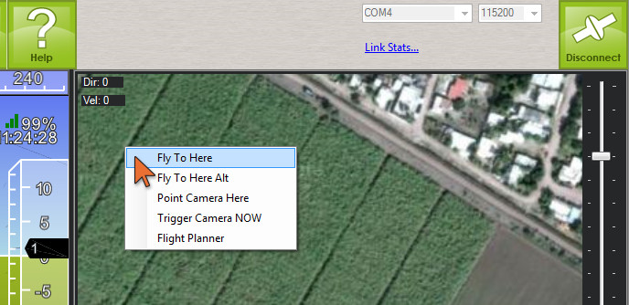

.. _mission-planner-ground-control-station:

======================================
Mission Planner Ground Control Station
======================================

The GCS Flight Data Screen Overview
===================================

The screenshot below shows the main "Heads-up Display (HUD)" view of the
Mission Planner Ground Station. Once you have connected to a vehicle
this screen will display the telemetry sent by ArduPilot.

A more detailed view of the HUD (with legend) is given below.

#. Air speed ( Ground speed if no airspeed sensor is fitted )
#. Crosstrack error and turn rate (T)
#. Heading direction
#. Bank angle
#. Telemetry connection link quality (averaged percentage of good packets)
#. GPS time
#. Altitude ( blue bar is rate of climb )
#. Air speed
#. Ground speed
#. Battery status
#. Artificial Horizon
#. Aircraft Attitude
#. GPS Status
#. Current Waypoint Number > Distance to Waypoint
#. Current Flight Mode

Tips for using the Flight Data screen
-------------------------------------

-  The map will only show current position when you have GPS lock or are
   using a flight simulator
-  Remember how artificial horizons work: when the aircraft tilts to the
   right, the horizon tilts to the left. (Just tilt your head and you'll
   see what I mean). This is normal! Please don't tell us it's reversed ;-)
-  You can issues mode changes and other action commands in the air with
   the Mission Planner and other GCSs, but note that you must be under
   autopilot control for them to take effect. When your RC toggle switch
   is in the Manual position, you are no longer under autopilot control
   and no commands will take effect. You must be in one of the other
   positions (Stabilize, Fly-by-Wire, Auto or any other
   autopilot-controlled mode) for MAVLink commands to take effect.
-  You can change the voice used in the speech synthesis in the Ease of
   Access center in Windows Control Panel. Go to the "Text to Speech"
   options.
-  If you double-click the HUD it will popout, allowing you to run the
   HUD full screen on a second screen.
-  Below the HUD are several buttons for actions, status,etc. See :ref:`Flight Data Screen Details<mission-planner-flight-data>`.
-  If you enable the Tuning checkbox at the bottom of the map, and then double-click tuning window that appears,you can
   graph any data that is available in the Status tab under the HUD. This means you
   can have alt, attitude, or many other options shown in real time.
-  You can use custom imagery instead of Google Maps. Press control-F.
   This allows you to upload your own orthophotos. Use will require
   Globalmapper, as this is currently one of the key steps in exporting
   in the required format for use in the planner.
   +For more details on this screen, see:

.. toctree::
   :maxdepth: 1

   Flight Data <mission-planner-flight-data>

For more details on this screen, see:

.. toctree::
    :maxdepth: 1

    Flight Data <mission-planner-flight-data>

Guided Mode
===========

One of the most commonly-used features in pro UAVs is point-and-click
mission control in real time. Rather than just pre-planned missions or
manually flying the UAV, operators can just click on a map and say "go
here now".

That's now implemented in the Mission Planner. On the GCS map, you can
right-click on the map and just select "Fly To Here". The UAV will fly
there and loiter until you give it another command. We call this "Guided
Mode". There are more commands coming in this mode soon, but the
functionality is now built-in.

Note: Guided is a separate flight mode. If you enter it you will remain
in it until you do something to change modes. So if you tell it to "go
here now", once it arrives there it will loiter at the Guided waypoint
till you tell it to do something else. Something else could either be
going to another Guided waypoint (staying in Guided mode) or changing to
some other flight mode. If you change to Auto your mission will resume
where it left off.

.. note::

    :ref:`Go to this page <copter:ac2_guidedmode>` for a full description 
    of how to use Guided Mode on Copter.
