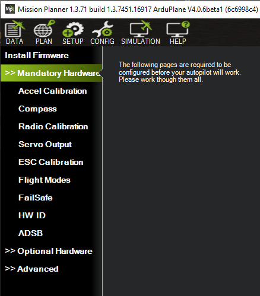
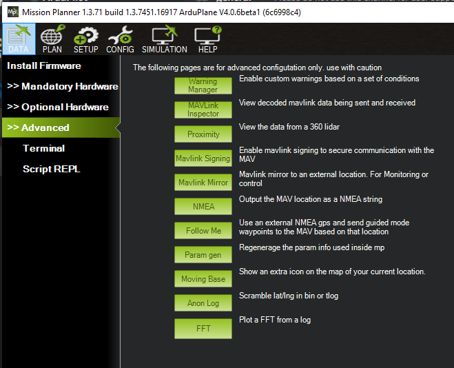

.. _mission-planner-initial-setup:

=============================
Mission Planner Initial SETUP
=============================

This section of Mission Planner, invoked by the Menu item  ``SETUP``
at the top of Mission Planner, has several subsections. The subsection
are where you set up and configure you auto pilot to prepare it for your
particular vehicle. Typically these sections are "must do" actions that
are required.

What you see when you enter this section depends on whether or not you
are connected. Each menu item will bring up a new screen, each is
discussed below with links to more detail.

Install Firmware
~~~~~~~~~~~~~~~~

You will see this menu item If the auto pilot is Not connected. If you
have a new auto pilot or if you want to update the control software that
resides in you autopilot, you must install (upload) the
:ref:`firmware <common-glossary>` into it.

The firmware is located at `firmware.ardupilot.org <https://firmware.ardupilot.org>`__ .
If the autopilot has ArduPilot firmware already installed, you can use this page to upload firmware for different vehicles or version. See this :ref:`Loading firmware <common-loading-firmware-onto-pixhawk>` page. Otherwise, you must use other methods than Mission Planner for getting ArduPilot installed for the first time, see this :ref:`section<common-loading-firmware-onto-chibios-only-boards>` . 

From this screen you can also select "All Options" allowing you to select and load any variation of the firmware, or "Load custom firmware", most often used when a developer has trial code to load.

Install Firmware Legacy
~~~~~~~~~~~~~~~~~~~~~~~

Yet another way load older versions of the firmware. Again, shown only when not connected.

Mandatory Hardware
~~~~~~~~~~~~~~~~~~

You will see this menu item If the auto pilot IS connected.  Click this
menu item to see the items you must setup before you attempt to
operate your vehicle.  Specifics are located in the Ardupilot.org documents which
cover you specific vehicle (Copter, Plane, Rover).

Before operating the vehicle, you must setup:

- :ref:`Accel Calibration <common-accelerometer-calibration>`
- :ref:`Compass (optional for Plane)<common-compass-calibration-in-mission-planner>`
- :ref:`Radio Calibration<common-radio-control-calibration>`
- Servo Output : configure each :ref:`output's function<common-rcoutput-mapping>`. Default values get loaded upon initial firmware install, but be sure to check them here.
- :ref:`ESC Calibration<esc-calibration>` for Copter only (not required for ESCs running DShot protocol, but must be :ref:`configured <common-dshot>` in ArduPilot) Plane uses its own :ref:`guide-esc-calibration` technique, but is also a mandatory setup item.
- Flight Modes: Refer to :ref:`Plane <plane:flight-modes>`, :ref:`Copter <copter:flight-modes>` or :ref:`Rover<rover-control-modes>` mode pages.
- Failsafe: Refer to :ref:`Plane <apms-failsafe-function>`, :ref:`Copter <failsafe-landing-page>` or :ref:`Rover<rover-failsafes>` failsafe pages.

Optional Hardware
~~~~~~~~~~~~~~~~~

This submenu allows the configuration of optional devices, many of which can be configured while Mission Planner is unconnected. Programming of the Sik  Telemetry Radio, UAVCAN setup, PX4 Optical Flow sensor,Antenna Tracker can be done here, as well as setup of a joystick to be used in conjunction with Mission Planner.

When connected, peripherals such as Battery Monitors, Integrated OSD, Airspeed Sensors, and Rangefinders can be configured. Also, this submenu has a Motor Test function allowing you to test direction and order of Copter and Quadplane Motors.

Advanced
~~~~~~~~

This section is for advanced users.

- Warning Manager:You can create custom warning messages to be displayed on the HUD and in the messages tab of the DATA screen, based on values of the status items.
- MAVLink Inspector: allows monitoring, real time, of the various MAVLink status messages being received.
- Proximity: View the data from a 360 lidar, if equipped
- Mavlink Signing: Allows you to setup :ref:`secure communications<common-MAVLink2-signing>` with the vehicle.
- Mavlink mirror: allows you to forward the MAVLink traffic to another network connected location for monitoring. Also see :ref:`MAVProxy Forwarding<mavproxy:mavproxy-forwarding>` for another method.
- NMEA: Output the vehicle location as a NMEA GPS string over the network or to a COM port
- Follow Me: If using an attached NEMA mode gps on a COM port to establish the MP GPS location, can send Guided Mode waypoints to the vehicle to follow the GCS.
- Param Gen: Regenerates Mission Planners parameter list. Occasionally required if new firmware parameters are not being displayed.
- Moving Base: if NMEA GPS is attaced to PC, shows PCs location as moving on the map display
- Anon Log: Allows you to hide your location when sharing log files by creating a version with scrambled locations
- FFT: Plot an FFT from a log that has IMU batch sampling enabled. See :ref:`common-imu-notch-filtering` for an example of its use.
