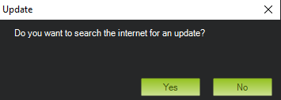

.. _mission-planner-initial-setup:

=============================
Mission Planner Initial SETUP
=============================
This section of Mission Planner, invoked by the Menu item  ``SETUP`` at the top of Mission Planner, has several subsections. The subsections are where you set up and configure your autopilot to prepare it for your particular vehicle. Typically these sections are "must do" actions that are required before first flight.

What you see when you enter this section depends on whether or not you
are connected. Each menu item will bring up a new screen, each is
discussed below with links to more detail.

Install Firmware
================
You will see this menu item if the autopilot is both connected or not; however, this menu will only be functional when disconnected. If you have a new autopilot or if you want to update the control software that resides in your autopilot, you must install (upload) the :ref:`firmware <common-glossary>` into it.

The firmware is located at `firmware.ardupilot.org <https://firmware.ardupilot.org>`__.
If the autopilot has ArduPilot firmware already installed, you can use this page to upload firmware for different vehicles or versions. See this :ref:`Loading firmware <common-loading-firmware-onto-pixhawk>` page. Otherwise, you must use other methods than Mission Planner for getting ArduPilot installed for the first time, see this :ref:`section<common-loading-firmware-onto-chibios-only-boards>`. 

From this screen you can also select "All Options" allowing you to select and load any variation of the firmware, or "Load custom firmware", most often used when a developer has trial code to load.

Install Firmware Legacy
=======================
Yet another way to load older versions of the firmware. Again, shown only when not connected.

Mandatory Hardware
==================
You will only see this menu item if the autopilot is connected. Click this menu item to see the items you must set up before you attempt to operate your vehicle. Specifics are located in the ArduPilot.org documents which cover your specific vehicle (Copter, Plane, Rover, Blimp).

Before operating the vehicle, you must setup:

- :ref:`Accel Calibration <common-accelerometer-calibration>`
- :ref:`Compass (optional for Plane)<common-compass-calibration-in-mission-planner>`
- :ref:`Radio Calibration<common-radio-control-calibration>`
- Servo Output : configure each :ref:`output's function<common-rcoutput-mapping>`. Default values get loaded upon initial firmware installation, but be sure to check them here.
- :ref:`ESC Calibration<esc-calibration>` for Copter only (not required for ESCs running DShot protocol, but must be :ref:`configured <common-brushless-escs>` in ArduPilot) Plane and Rover use their own :ref:`common-esc-calibration` technique, but is also a mandatory setup item.
- Flight Modes: Refer to :ref:`Plane <plane:flight-modes>`, :ref:`Copter <copter:flight-modes>` or :ref:`Rover<rover-control-modes>` mode pages.
- Failsafe: Refer to :ref:`Plane <apms-failsafe-function>`, :ref:`Copter <failsafe-landing-page>` or :ref:`Rover<rover-failsafes>` failsafe pages.

Optional Hardware
=================
This submenu allows the configuration of optional devices, many of which can be configured while Mission Planner is unconnected. Programming of the Sik  Telemetry Radio, UAVCAN setup, PX4 Optical Flow sensor, and Antenna Tracker can be done here, as well as the setup of a :ref:`joystick <common-joystick>` to be used in conjunction with Mission Planner.

When connected, peripherals such as Battery Monitors, Integrated OSD, Airspeed Sensors, and Rangefinders can be configured. Also, this submenu has a Motor Test function allowing you to test the direction and order of Copter and QuadPlane Motors.

.. _dronecan-uavcan-slcan:

DroneCAN/UAVCAN SLCAN
---------------------
The SLCAN tool inside Mission Planner allows viewing, configuration, and software updates of DroneCAN nodes connected to the CAN bus port of the autopilot. There are two ways to connect to the DroneCAN node:

- Using SLCAN directly
- Using SLCAN over MAVLink

Connecting to the DroneCAN node
~~~~~~~~~~~~~~~~~~~~~~~~~~~~~~~

If using the direct SLCAN connection method, autopilot parameters have to be configured first. See :ref:`common-slcan-f4` or :ref:`common-slcan-f7h7` for setup information. Mission Planner should be in the disconnected state, and make sure the SLCAN port is shown as the selected COM port in the dropdown box in the upper right corner of Mission Planner.

If using the MAVLink method, nothing is required for setup and Mission Planner should be in the connected state via the normal MAVLink connection to the autopilot.

In Mission Planner, navigate to Initial Setup->Optional Hardware->DroneCAN/UAVCAN click on the highlighted red button if connecting using the direct SLCAN method, or the appropriate green button for MAVLink communication over either CAN bus port 1 or port 2, depending on which port the node is attached. 

.. image:: ../../../images/can-drivers-parameters-slcan-mp.png

The autopilot will connect to Mission Planner using SLCAN, the window will populate with DroneCAN nodes connected.

.. image:: ../../../images/can-slcan-mpc.png

If the node has a bootloader only installed, then the firmware will need to be uploaded. ``MAINTENANCE`` will be displayed. Click on update firmware. Firmware can be found `here <https://firmware.ardupilot.org/AP_Periph/>`__ and downloaded for the node.

.. image:: ../../../images/can-slcan-mp-maint.png

A pop-up will open. Select no and then find firmware for your node previously downloaded and select it.

The window will show the firmware being uploaded and a pop-up will show the status.

.. image:: ../../../images/can-slcan-mp-upd.png

.. image:: ../../../images/can-slcan-mp-updw.png

Once complete mode will change to ``OPERATIONAL``. Press the ``Parameters`` button to access node settings. From here DroneCAN device parameters can be accessed or changed.

.. image:: ../../../images/can_slcan_mp_param.png

Clicking on ``Inspector`` will open a popup window to view messages on the CAN bus.

.. image:: ../../../images/can-slcan-mp-insp.png

To return to normal Mission Planner operation, change to another tab, and re-connect. You may need to wait 2 seconds before re-connecting.

Advanced
========
This section is for advanced users.

.. image:: ../../../images/MP-advanced-setup.png

- Warning Manager: You can create custom warning messages to be displayed on the HUD and in the messages tab of the DATA screen, based on the values of the status items.
- MAVLink Inspector: allows monitoring, real-time, of the various MAVLink status messages being received.
- Proximity: View the data from a 360 lidar, if equipped
- Mavlink Signing: This allows you to setup :ref:`secure communications<common-MAVLink2-signing>` with the vehicle.
- Mavlink mirror: This allows you to forward the MAVLink traffic to another network-connected location for monitoring. Also see :ref:`MAVProxy Forwarding<mavproxy:mavproxy-forwarding>` for another method.
- NMEA: Output the vehicle location as a NMEA GPS string over the network or to a COM port
- Follow Me: If using an attached NEMA mode GPS on a COM port to establish the MP GPS location, can send Guided Mode waypoints to the vehicle to follow the GCS.
- Param Gen: Regenerates Mission Planners parameter list. Occasionally required if new firmware parameters are not being displayed.
- Moving Base: if NMEA GPS is attached to PC, shows PCs location as moving on the map display
- Anon Log: Allows you to hide your location when sharing log files by creating a version with scrambled locations
- FFT: Plot an FFT from a log that has IMU batch sampling enabled. See :ref:`common-imu-notch-filtering` for an example of its use.
