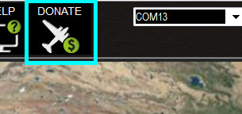

.. _mission-planner-overview:

========================
Mission Planner Overview
========================

Mission Planner is a full-featured ground station application for the
ArduPilot open source autopilot project. This page contains information
on the background of Mission Planner and the organization of this site.

What is Mission Planner
=======================

.. image:: ../../../images/mission_planner_flight_data.jpg
    :target: ../_images/mission_planner_flight_data.jpg

Mission Planner is a ground control station for Plane, Copter and Rover.
It is compatible with Windows only. Mission Planner can be used as a
configuration utility or as a dynamic control supplement for your
autonomous vehicle. Here are just a few things you can do with Mission
Planner:

-  Load the :ref:`firmware <common-glossary>` (the software) into the
   autopilot board (i.e. Pixhawk series) that controls your vehicle.
-  Setup, configure, and tune your vehicle for optimum performance.
-  Plan, save and load autonomous missions into you autopilot with
   simple point-and-click way-point entry on Google or other maps.
-  Download and analyze mission logs created by your autopilot.
-  Interface with a PC flight simulator to create a full
   hardware-in-the-loop UAV simulator.
-  With appropriate telemetry hardware you can:

   -  Monitor your vehicle's status while in operation.
   -  Record telemetry logs which contain much more information the the
      on-board autopilot logs.
   -  View and analyze the telemetry logs.
   -  Operate your vehicle in FPV (first person view)

All of these and many more features are covered here.

History
=======

Mission Planner is a free, open-source, community-supported application
developed by Michael Oborne for the open-source APM autopilot project.
If you would like to donate to the ongoing development of Mission
Planner, please select the Donate button on the Mission Planner
interface.

.. _mission-planner-overview_support:

Support
=======

**The Help Screen:**

Clicking the Help icon at the top of the Mission Planner interface will
open a screen with general information about help with Mission Planner.
The "Check for Updates" button will check for available updates to
Mission Planner manually. Mission Planner automatically checks for
updates upon start up and notifies you if an update is available. Please
always run the most current version of Mission Planner, although it is
not necessary to check for updates more often than upon start up. 

The "Check for BETA Updates" button will install the current development version of Mission Planner. This contains all the latest features and updates, but also might have bugs, since it does not have extensive community testing.

At the bottom of the HELP screen is the check box "Show Console Window (restart)" , which enables the console window during Mission Planner operation.  That window shows Mission Planner
activity and is primarily for diagnostic purposes.  It sometimes shows
some interesting information. A restart of Mission Planner is required
for the option to take effect.  (TBD need a link to console page TBD)

**Getting Help:**

The support for Mission Planner comes from the community of users like
you.  All of the documentation is created by users who volunteer their
time. If you have questions, first look through the table of contents
(upper left of every page) for a topic that may address your question.
Next, try a search of the website.  If you still need help, then the
community forums are the place to go. There you will find may friendly
users, developers and often, even Michael will chime in.  There are two
primary forums. The diydrones.com forum
`here <https://diydrones.com/forum>`__ and the Arduilot forum
`here <https://discuss.ardupilot.org/>`__. The diydrones forum has existed
for years and has a very large community and numerous general topics.
The ArduPilot forum is newer and is more specific to ArduPilot and
its vehicles.

**Reporting Issues:**

Usually, you can either resolve a question on a forum. Sometimes you
will discover a bug and can confirm the problem on a forum. If you have
discovered a bug, use the forums to request it be logged as an official
issue. One of the developers will normally be glad to do so.

If you see a need to change or enhance the documentation, please let us
know - again using the forums.  We welcome your suggestions and there
are dozens of qualified editors who can implement your suggestions.

Navigating the Documentation
============================

Use the table of contents at the top of each page to navigate the
Mission Planner Manual - and the contents of the vehicle specific areas.

This section of our website contains information on how to use Mission
Planner as a "general" application. However, some of the pages will also
have some vehicle specific information. Those pages will also be
contained in the specific vehicle's section of the website. Information
that is primarily specific to a particular vehicle will only be located
in that vehicles section so, if you cannot find information here, try
the section of the website for the vehicle you are using.
