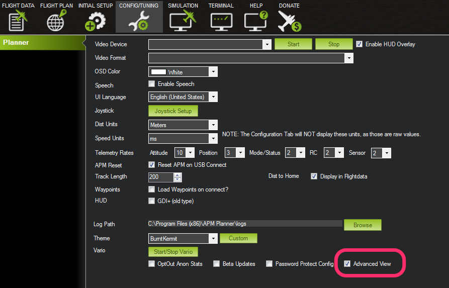

.. _mission-planner-simulation:

==========================
Mission Planner Simulation
==========================

The Simulation tab is visible when the "Advanced View" option is
selected in the Configuration tab

This section of Mission Planner, invoked by the Menu item Simulation at
the top of Mission Planner, opens a window with configuration options to
set when using HIL simulation techniques.

At the moment, this is only supported on Airplanes. 
Please see :ref:`common-simulation` for instructions on
how to use it.
