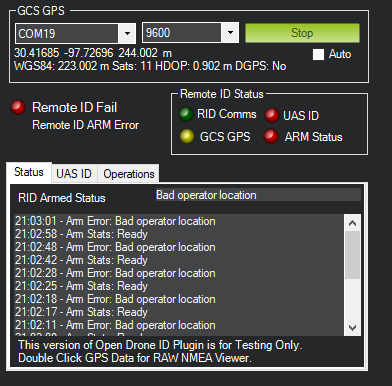
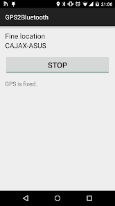

.. _opendroneid:

=================
OpenDroneID Panel
=================

Mission Planner has a special Drone ID tab in its DATA view for use with OpenDroneID modules attached to the autopilot which allows monitoring status, attaching the required GPS for operator location of the GCS, and UAS and Operator ID string setup.

.. note:: This feature is rapidly evolving and is available only on the latest Beta Mission Planner updates. Updates will be made frequently so check for the latest version, frequently.

This control manages the exchange of GCS/Operator information with the RID module, 
via the AutoPilot connection. 

GPS
===

Mission Planner must have a source of GPS information about its location. The GPS must provide valid NMEA GPGGA or GNGGA sentences.

This can be accomplished by either attaching a GPS to the PC's COM or USB port (some GPS may require an FTDI adapter) or by using an app like `GPS to Bluetooth <https://play.google.com/store/apps/details?id=com.cajax.gps2bt2&hl=en_US&gl=US>`__ on your phone to feed GPS data via a Bluetooth serial COM port to Mission Planner.

The COM port and baud rate (normally 9600) are entered in the ``GCS GPS`` dialogs and then Connect to Base GPS pushed. If successful, location data will immediately appear below those dialog boxes.

GPS raw output can be viewed in real time by double clicking the GPS status string under the COM Port dropdown.

Remote ID Status Box
====================

- GCS GPS: Red - Lost Connection to GPS, Orange - Connected, no Fix, Yellow - Fix, no DGPS and Green - DGPS Fix.
- RID Comms: Green - Healthy Connection, Red - Timeout (Currently 5 seconds)
- ARM Status: Green when Armed, Otherwise Red with Reason in RID Armed Status Reason in Status tab.
- UAS ID: Red when the UAS ID tab is not fully populated. Typically, this information will be provided by the RID module when using Standard ID, and may be populated by the user in future implementation of after-market or add-on RemoteID Broadcast Modules.

String Setup Tabs
=================

Two tabs are provided for input of UAS and Operator information in these initial test and development version of the interface. Some of these may become read-only and obtained from the RemoteID module in the future, depending on jurisdiction and implementation. They are provided for experimentation and testing initially.

Master Status Indicator
=======================
Located in the left middle side of the panel. The master status will indicate RED if any conditions for proper operation are not valid.

Local regulations may require such a master indicator. In Mission Planner, this will be present in this tab as well as on the map (pending).
