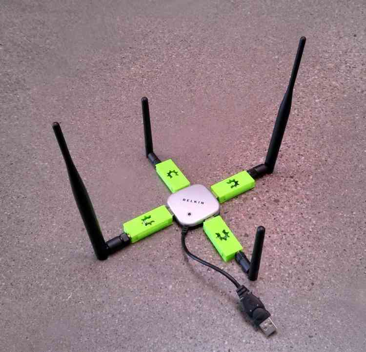
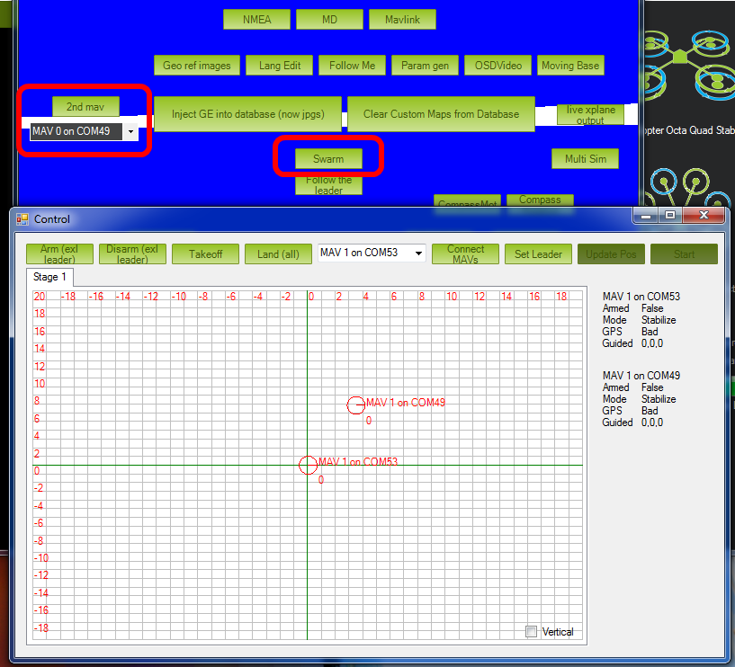

.. _swarming:

========
Swarming
========

Swarming/Formation-Flying Interface (Beta)
==========================================

Mission Planner supports limited "swarming", or formation-flying with
multiple UAVs.  At the moment this is in an experimental beta
implementation, which is admittedly neither easy to use nor 100%
reliable. However, if you're interested in multiple-UAV coordination,
this is a good place to start.

More sophisticated swarming/multiple-UAV control is available in
QGroundControl and APM Planner 2.0, which are both built on a
multiple-vehicle architecture. But Mission Planner accomplishes this in
a limited way by simply opening multiple serial port MAVLink connections
simultaneously (see four-UAV USB hub above) and passing GPS position
information from one ("leader", flying in any mode, from manual to auto)
to the other ("followers", flying in Guided mode). The GPS position of
the leader is adjusted by a set offset and then sent to the followers as
a series of dynamic waypoints.  In this fashion the followers will
follow the leader at set X,Y and Z offset distances.

This interface can be entered by pressing Control-F in the Mission
Planner. That will bring up a pretty crowded box of buttons (see below),
but the key ones are marked below: identifying the serial port of the
"follower" UAVs, and the "swarm" button, which will bring up the second
window, with a grid showing the relative position offset of the other
UAVs.

   Mission Planner: Screen with SwarmButton

**Setup Procedure:**

#. Plug in one 3DR radio per vehicle
#. Connect to the "leader" in the Mission Planner
#. Press Control-F and click "swarm"
#. Click "set leader"
#. Click "Connect MAVs" ("MAV" stands for "micro air vehicle"). Click it
   once for each MAV. As each connects via MAVLink they will appear on
   the grid
#. Drag the MAV circles around the grid to set the desired offsets. The
   Mission Planner assumes that "up" is North.
#. "Start" will start sending Guided Mode waypoints to all vehicles
   except the leader.

Now, as you may have guessed, getting the starting position can be the
hardest. In the grid they are identified by the MAV number and COM port.
It's a good idea to tape that MAV number to the physical vehicles
themselves, so you can correspond the on-screen numbers and grid
position with the physical layout of the vehicles on the ground.

Currently the code does no path prediction etc. A good place to start is
with two quadcopters about 20 m apart to test, and work up from there.

**First Flight:**

#. Take off with the leader, sit at say 2-10 m high (loiter). The leader
   flight mode doesn’t matter
#. Click start. This should make the follower take off in guided mode
   (it will take 3-5 seconds to launch) and sit at the same altitude as
   the master (assuming you haven't changed the altitude offsets)
#. Manually move the leaders, and the 2nd quad (follower) should follow.
#. When you're done, manually land the leader. Use the "Land" button to
   tell the follower to land, too.

**Tips**

-  Don't close the swarming screen, as it will stop the swarming. (Since
   we use guided mode, if you do the quad will just sit at the last
   commanded location.)
-  The main map interface will show both quads.
-  If you drag the quad around the grid screen, while it's active. the
   quad should actually move as well.
-  Increase the position stream rate in the mp. config>planner>position.
   to say 5, from the default of 3. to reduce the latency

