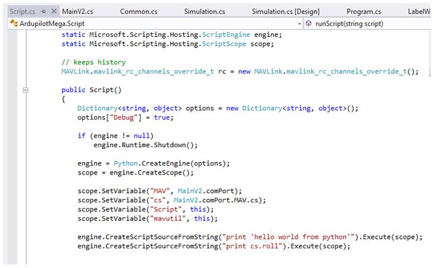

.. _using-python-scripts-in-mission-planner:

=======================================
Using Python Scripts in Mission Planner
=======================================

One of the cool features of the Mission Planner is that it can run
Python scripts, which is an easy way to extend the functionality of the
program beyond its built-in functions. It can also enable integration
easily with other dlls and modules far beyond the original scope of the
Mission Planner.

Overview
========

You can easily program your UAV to do anything, from robotic acrobatics
to just script-driven missions. Python 2.x is currently supported, up to
2.7 (Mission Planner uses an implementation of
`IronPython <http://ironpython.codeplex.com/>`__ internally)

Aside from the regular Python commands, these are the special Mission
Planner commands you can use:

.. code-block:: python

    cs.VARIABLENAME = currentstate
    
    

Any variable on the status tab in the planner can be used.

.. code-block:: python

    Script.METHODNAME(...)

options are

-  ``Script.Sleep(ms)``
-  ``Script.ChangeParam(name,value)``
-  ``Script.GetParam(name)``
-  ``Script.ChangeMode(mode)`` (same as displayed in mode setup screen
   'AUTO')
-  >\ ``Script.WaitFor(string,timeout)``
-  ``Script.SendRC(channel,pwm,sendnow)``

Here's an example, which tells a multicopter to do a roll in the air!

.. code-block:: python

    print 'Start Script'
    for chan in range(1,9):
        Script.SendRC(chan,1500,False)
        Script.SendRC(3,Script.GetParam('RC3_MIN'),True)
    
    Script.Sleep(5000) 

    while cs.lat == 0:
        print 'Waiting for GPS' 
        Script.Sleep(1000) 
        
    print 'Got GPS' 
    jo = 10 * 13 
    print jo 
    Script.SendRC(3,1000,False) 
    Script.SendRC(4,2000,True) 
    cs.messages.Clear() 
    Script.WaitFor('ARMING MOTORS',30000) 
    Script.SendRC(4,1500,True) 
    print 'Motors Armed!'
    Script.SendRC(3,1700,True) 

    while cs.alt < 50:   
        Script.Sleep(50)    
        
    Script.SendRC(5,2000,True) # acro   
    Script.SendRC(1,2000,False) # roll      
    Script.SendRC(3,1370,True) # throttle    

    while cs.roll > -45: # top half 0 - 180 
        Script.Sleep(5) 

    while cs.roll < -45: # -180 - -45    
        Script.Sleep(5)     
        
    Script.SendRC(5,1500,False) # stabilize     
    Script.SendRC(1,1500,True) # level roll     
    Script.Sleep(2000) # 2 sec to stabilize     
    Script.SendRC(3,1300,True) # throttle back to land  
    thro = 1350 # will descend   

    while cs.alt > 0.1: 
        Script.Sleep(300)
        
    Script.SendRC(3,1000,False) 
    Script.SendRC(4,1000,True) 
    Script.WaitFor('DISARMING MOTORS',30000) 
    Script.SendRC(4,1500,True)

    print 'Roll complete'

Classes Exposed by Mission Planner to Python
============================================

Mission Planner exposes classes using the following code:

   Linking classes into python

.. code-block:: python

    scope.SetVariable(Variablename, ClassInstance);

That the following classes are exposed:

-  ``scope.SetVariable("MAV", MainV2.comPort);``
-  ``scope.SetVariable("cs", MainV2.comPort.MAV.cs);``
-  ``scope.SetVariable("Script", this);``
-  ``scope.SetVariable("mavutil", this);``

This is where you can add your own classes. For now lets us explore the
important methods and properties you can use into your script using
these classes.

**Class Name:** Script.cs

**Python Variable:** Script , mavutil

+--------------------------------------+--------------------------------------+
| Method                               | Description                          |
+--------------------------------------+--------------------------------------+
| bool ChangeParam (string param,      |                                      |
| float value)                         |                                      |
+--------------------------------------+--------------------------------------+
| Float GetParam (string param)        |                                      |
+--------------------------------------+--------------------------------------+
| bool ChangeMode (string mode)        | Changes flying mode                  |
+--------------------------------------+--------------------------------------+
| bool SendRC (int channel, ushort     | Send Chxout values.                  |
| pwm, bool sendnow)                   |                                      |
+--------------------------------------+--------------------------------------+

**Class Name:** CurrentState.cs

**Python Variable:** cs

+-------------------------+-------------------------+-------------------------+
| Method                  | Type                    | Description             |
+-------------------------+-------------------------+-------------------------+
| roll                    | float                   | Roll (deg)              |
+-------------------------+-------------------------+-------------------------+
| pitch                   | float                   | Pitch (deg)             |
+-------------------------+-------------------------+-------------------------+
| yaw                     | float                   | Yaw (deg)               |
+-------------------------+-------------------------+-------------------------+
| lat                     | float                   | Latitude (deg)          |
+-------------------------+-------------------------+-------------------------+
| lng                     | float                   | Longitude (deg)         |
+-------------------------+-------------------------+-------------------------+
| groundcourse            | float                   | Ground Course (deg)     |
+-------------------------+-------------------------+-------------------------+
| alt                     | float                   | Altitude (dist)         |
+-------------------------+-------------------------+-------------------------+
| altoffsethome           | float                   | Altitude Home Offset    |
|                         |                         | (dist)                  |
+-------------------------+-------------------------+-------------------------+
| gpsstatus               | float                   | GPS Status              |
+-------------------------+-------------------------+-------------------------+
| gpshdop                 | float                   | GPS HDOP                |
+-------------------------+-------------------------+-------------------------+
| satcount                | float                   | Satellite Count         |
+-------------------------+-------------------------+-------------------------+
| altd100                 | float                   | Altitude / 100          |
+-------------------------+-------------------------+-------------------------+
| altd1000                | float                   | Altitude / 1000         |
+-------------------------+-------------------------+-------------------------+
| airspeed                | float                   | Airspeed (speed)        |
+-------------------------+-------------------------+-------------------------+
| targetairspeed          | float                   | Airspeed Target (speed) |
+-------------------------+-------------------------+-------------------------+
| groundspeed             | float                   | Ground Speed (speed)    |
+-------------------------+-------------------------+-------------------------+
| verticalspeed           | float                   | Vertical Speed (speed)  |
+-------------------------+-------------------------+-------------------------+
| wind_dir                | float                   | Wind Direction (deg)    |
+-------------------------+-------------------------+-------------------------+
| wind_vel                | float                   | Wind Velocity (speed)   |
+-------------------------+-------------------------+-------------------------+
| ax, ay, az              | float                   | Acceleration Values in  |
|                         |                         | x,y,z                   |
+-------------------------+-------------------------+-------------------------+
| gx, gy, gz              | float                   | Gyro Values in x,y,z    |
+-------------------------+-------------------------+-------------------------+
| mx, my, mz              | float                   | Mag Values in x,y,z     |
+-------------------------+-------------------------+-------------------------+
| failsafe                | bool                    | Fail Safe Active or     |
|                         |                         | Not                     |
+-------------------------+-------------------------+-------------------------+
| rxrssi                  | float                   |                         |
+-------------------------+-------------------------+-------------------------+
| chx1in, chx2in, ....    | float                   | Input Channels from 1   |
| chx8in                  |                         | to 8                    |
+-------------------------+-------------------------+-------------------------+
| ch1out, chx2out, ....   | float                   | Output Channel form 1   |
| chx8out                 |                         | to 8                    |
+-------------------------+-------------------------+-------------------------+
| nav_roll                | float                   | Roll Target (deg)       |
+-------------------------+-------------------------+-------------------------+
| nav_pitch               | float                   | Pitch Target (deg)      |
+-------------------------+-------------------------+-------------------------+
| nav_bearing             | float                   | Bearing target (deg)    |
+-------------------------+-------------------------+-------------------------+
| target_bearing          | float                   | Bearing Target (deg)    |
+-------------------------+-------------------------+-------------------------+
| wp_dist                 | float                   | Distance to Next        |
|                         |                         | Waypoint (dist)         |
+-------------------------+-------------------------+-------------------------+
| alt_error               | float                   | Altitude Error (dist)   |
+-------------------------+-------------------------+-------------------------+
| ber_error               | float                   | Bearing Error (dist)    |
+-------------------------+-------------------------+-------------------------+
| aspd_error              | float                   | Airspeed Error (speed)  |
+-------------------------+-------------------------+-------------------------+
| wpno                    | float                   | Flying Mode             |
+-------------------------+-------------------------+-------------------------+
| mode                    | String                  | Flying Mode             |
+-------------------------+-------------------------+-------------------------+
| dimbrate                | float                   | Climb Rate (speed)      |
+-------------------------+-------------------------+-------------------------+
| tot                     | int                     | Time over target (sec)  |
+-------------------------+-------------------------+-------------------------+
| distTraveled            | float                   | Distance Traveled       |
|                         |                         | (dist)                  |
+-------------------------+-------------------------+-------------------------+
| timeInAir               | float                   | Time in Air (sec)       |
+-------------------------+-------------------------+-------------------------+
| turnrate                | float                   | Turn Rate (speed)       |
+-------------------------+-------------------------+-------------------------+
| radius                  | float                   | Turn Radius (dist)      |
+-------------------------+-------------------------+-------------------------+
| battery_voltage         | float                   | Battery Voltage (volt)  |
+-------------------------+-------------------------+-------------------------+
| battery_remaining       | float                   | Battery Remaining (%)   |
+-------------------------+-------------------------+-------------------------+
| current                 | float                   | battery Current (Amps)  |
+-------------------------+-------------------------+-------------------------+
| HomeAlt                 | float                   |                         |
+-------------------------+-------------------------+-------------------------+
| DistToHome              | float                   | Absolute Pressure Value |
+-------------------------+-------------------------+-------------------------+
| press_abs               | float                   | Absolute Pressure Value |
+-------------------------+-------------------------+-------------------------+
| sonarrange              | float                   | Sonar Range (meters)    |
+-------------------------+-------------------------+-------------------------+
| sonarVoltage            | float                   | Sonar Voltage (volt)    |
+-------------------------+-------------------------+-------------------------+
| armed                   | bool                    | True if Armed           |
+-------------------------+-------------------------+-------------------------+

Please note that although these properties are read/write howvever
writing to some of them can corrupt the status. Use methods from Script
class to control the vehicle. for example use Script.ChangeMode(xmode)
rather than cs.mode = xmode.

**Class Name:** MavLink.cs

**Python Variable:** MAV

+-------------------------------------------------+--------------------------------+
| Method                                          | Description                    |
+-------------------------------------------------+--------------------------------+
| bool setParam (string paramname, float value)   | Same as Script.ChangeParam()   |
+-------------------------------------------------+--------------------------------+
| bool doARM (bool armit)                         | BE CAREFUL when using it.      |
+-------------------------------------------------+--------------------------------+
| byte getWPCount ( )                             | Gets Waypoints Count.          |
+-------------------------------------------------+--------------------------------+

Using CPython Standard Libraries
================================

You can import standard libraries from your regular Python 2.x folders
by adding this line to top of your script (replacing "c:\\python27\\lib"
with whatever the folder is on your drive):

.. code-block:: python

    import sys
    sys.path.append(r"c:\python27\lib")

Here, for example, we're importing the serial, os, and threading
libraries, which are in two folders in a typical Python 2.7
installation. Appending the specific folder paths for those three
libraries first allows us to import them with the next "import" command:

.. code-block:: python

    import sys
    sys.path.append(r"c:\Python27\Lib\site-packages")
    sys.path.append(r"c:\Python27\Lib")
    import serial, os, threading

Tutorials and sample scripts
============================

-  `Scripting fixed-wing acrobatics <https://diydrones.com/profiles/blogs/scripted-fixed-wing-acrobatics>`__
-  `Adding new variables and classes <https://diydrones.com/profiles/blogs/python-scripting-in-mission-planner>`__
-  `Writing a time-based script <https://diydrones.com/forum/topics/how-to-python-script-a-time-based-flight-plan>`__
