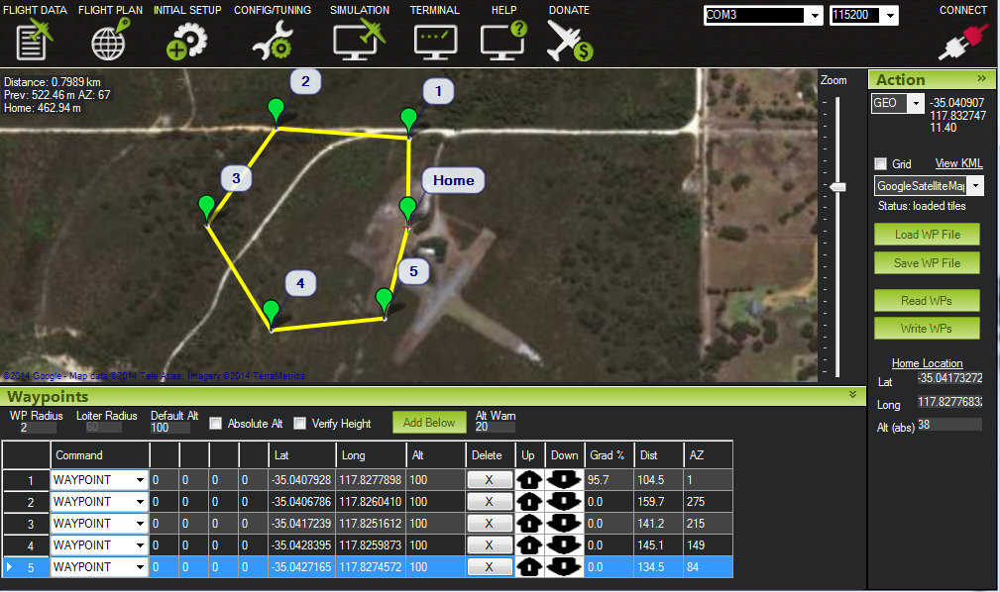

.. _home:

====================
Mission Planner Home
====================

--------

The Mission Planner, created by Michael Oborne, does a lot more than its
name. Here are some of the features:

-  Point-and-click waypoint/fence/rally point entry, using Google Maps/Bing/Open street
   maps/Custom WMS.
-  Select mission commands from drop-down menus
-  Download mission log files and analyze them
-  Configure autopilot settings for your vehicle
-  Interface with a PC flight simulator to create a full
   software-in-the-loop (SITL) UAV simulator.
-  Run its own SITL simulation of many frames types for all the ArduPilot vehicles.

Please use the sidebar menus for instructions and more information.

.. toctree::
   :maxdepth: 1
   :hidden:

   Mission Planner Overview <docs/mission-planner-overview>
   docs/mission-planner-installation
   Loading Firmware onto boards with existing ArduPilot firmware <docs/common-loading-firmware-onto-pixhawk>
   Loading Firmware onto boards without existing ArduPilot firmware (first time only) <docs/common-loading-firmware-onto-chibios-only-boards>
   docs/common-connect-mission-planner-autopilot
   docs/common-mission-planning
   docs/mission-planner-features
   docs/mission-planner-building
   docs/common-appendix
   docs/common-table-of-contents
    

