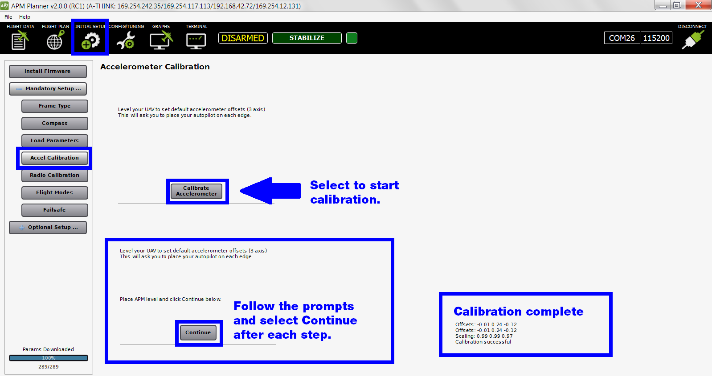

.. _accelerometer-calibration:

======================================
Calibration: Accelerometer Calibration
======================================

This article explains how to calibrate your autopilot's accelerometer to
work with your vehicle configuration. For other calibration tasks see
:ref:`Autopilot calibration <autopilot-calibration>`.

1 Prerequisites
===============

Before preforming setup, ensure that:

-  The vehicle is completely built to flight condition.
-  :ref:`Firmware has been loaded onto the autopilot. <install-firmware>`
-  :ref:`Autopilot is connected to APM Planner. <connect-autopilot>`

2 Accelerometer Calibration
===========================

Select **Accel Calibration** to view the accelerometer calibration
wizard. Select **Calibrate Accelerometer** to begin. Follow the prompts
and select **Continue** after each step. It is important not to move the
copter immediately after pressing the key for each step.

Check out this video for an example of how to hold your vehicle during accelerometer calibration.

.. vimeo:: 56224615
   :width: 400
   :height: 400
