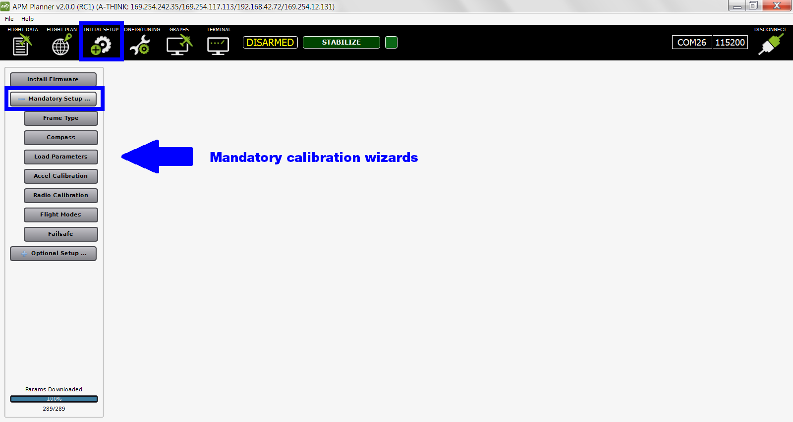

.. _autopilot-calibration:

=====================
Autopilot Calibration
=====================

After installing firmware, follow these steps to calibrate and configure
your autopilot to work with your vehicle.

1 Prerequisites
===============

Before preforming setup, ensure that:

-  The vehicle is completely built to flight condition.
-  Propellers are removed.
-  :ref:`Firmware has been loaded onto the autopilot. <install-firmware>`
-  :ref:`Autopilot is connected to APM Planner. <connect-autopilot>`

2 Select Initial Setup, Mandatory Setup
=======================================

Select **Initial Setup** and **Mandatory Setup** to view the menu of
calibration wizards.

3 Complete the Calibration Wizards
==================================

Perform each of the calibration wizards shown below

.. toctree::
    :maxdepth: 1

    Frame Type (Copter Only) <frame-type>
    Accelerometer <accelerometer-calibration>
    Compass <compass-calibration>
    Radio <radio-calibration>
    Flight Modes <flight-modes>

You may also wish to perform:
    
-  Failsafe calibration
-  3DR radio setup