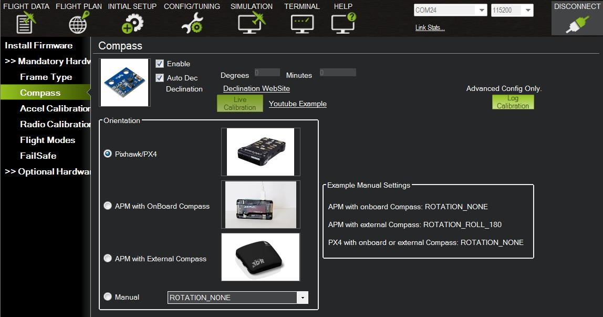

.. _compass-calibration:

================================
Calibration: Compass Calibration
================================

This article explains how to use APM Planner to calibrate your
autopilot's compass to work with your vehicle configuration. For other
calibration tasks see :ref:`Autopilot calibration <autopilot-calibration>`.

1 Prerequisites
===============

Before preforming setup, ensure that:

-  The vehicle is completely built to flight condition.
-  :ref:`Firmware has been loaded onto the autopilot. <install-firmware>`
-  :ref:`Autopilot is connected to APM Planner. <connect-autopilot>`

2 Select option
---------------

Under **Orientation**, **select your autopilot** configuration:
Pixhawk, APM 2.5 and earlier, or APM 2.6 with 3DR GPS+Compass.
Ensure that the option to **Enable the compass** and **allow Auto
Declination** are selected as shown below.

To perform **manual declination**, follow the link to the **Declination
Website**. Find the two numbers listed as the **Magnetic Declination**
and input the first number in the **Degrees** field and the second
number in the **Minutes** field.

3 Calibrate
===========

Select **Live Calibration** to begin calibration. APM Planner will start
a timer. During these next 60 seconds, hold your vehicle in the air and
rotate it slowly so that each side (front, back, left, right, top and
bottom) points down towards the earth for a few seconds in turn. `Check out this video <https://www.youtube.com/watch?v=DmsueBS0J3E>`__ for a
demonstration of how to calibrate the compass.

When the calibration period ends, APM Planner will display the resulting
offsets. For APM, all three values should be between -150 and 150. For
PX4 and Pixhawk, values may be greater than 150 and less than -150.

4 Advanced compass calibration (copters)
========================================

For more information about :ref:`advanced compass calibration for copters, click here <copter:common-compass-setup-advanced_compassmot_compensation_for_interference_from_the_power_wires_escs_and_motors>`.
For a general discussion of :ref:`ways to reduce magnetic interference on your copter, click here. <copter:common-magnetic-interference>`
