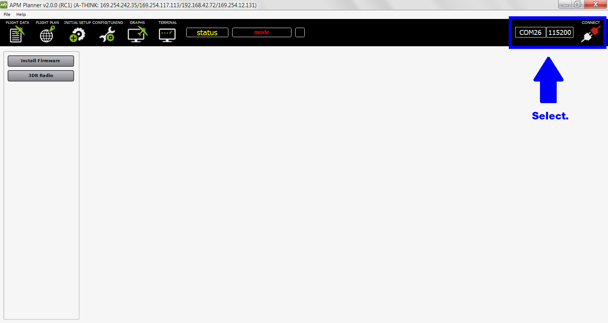
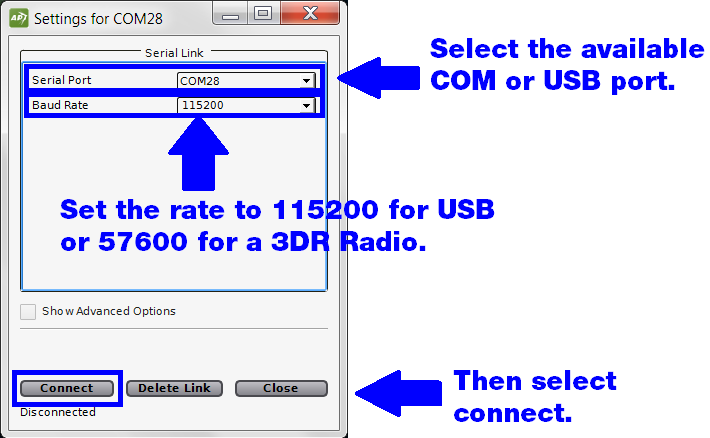
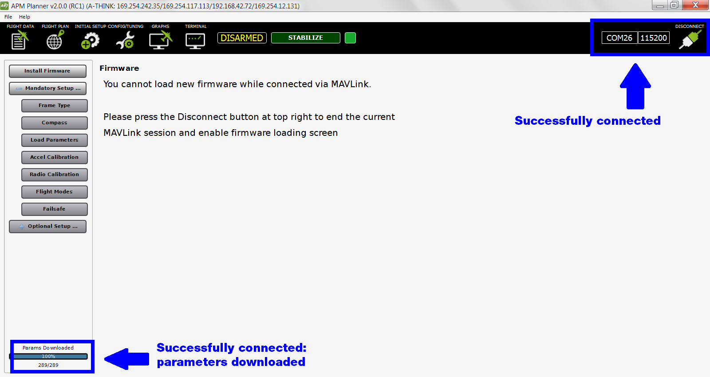

.. _connect-autopilot:

==================================
Connect Autopilot to APM Planner 2
==================================

For setup, to load a mission, and to view data, follow these instruction
to connect your autopilot to APM Planner.

1 Connect autopilot
-------------------

Connect the autopilot to your computer using a USB cable or a 3DR Radio.
A 3DR Radio allows you to communicate with your vehicle in flight and
provides more mobility during calibration.

.. figure:: ../images/apm-to-usb.jpg
   :target: ../_images/apm-to-usb.jpg

   USB Connection to APM Autopilot

.. figure:: ../../../images/new-radio-laptop.jpg
   :target: ../_images/new-radio-laptop.jpg

   Laptop Connection via TelemetryRadio

2 Connect to MavLink
--------------------

Select the **connect box** to select a port.

Set the rate to **115200** for USB and **57600** for a 3DR Radio. Select
**Connect**.

When connected, AP2 will display the green connected icon as shown
below.

3 Disconnect when installing firmware
-------------------------------------

The autopilot must be unconnected to MAVLink (showing the red
disconnected icon) to install firmware. Otherwise you will receive the
warning shown above.
