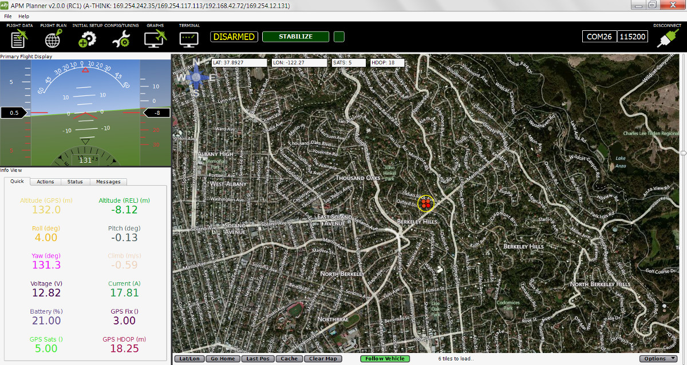
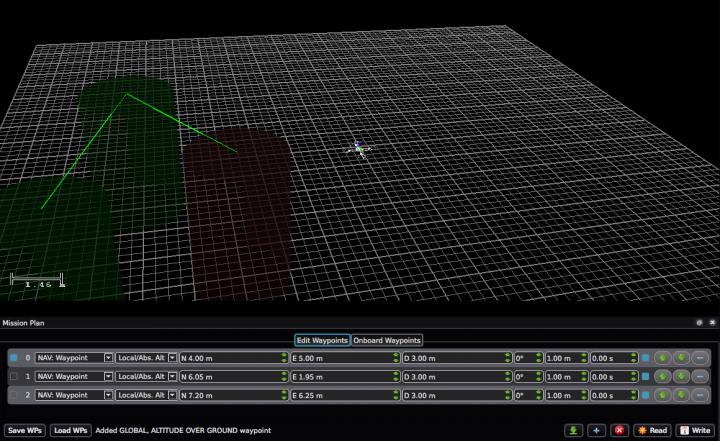

.. _credits-and-contributors:

========================
Credits and Contributors
========================

APM Planner 2.0 is the next generation of ground control station. It is
the offspring of :ref:`Mission Planner <planner:home>` and
`QGround Control <http://qgroundcontrol.org/>`__, combining the simple
user interface of Mission Planner and cross platform capability of
QGround Control.

We offer a special thanks to `Michael Oborne <https://diydrones.com/profiles/profile/show?id=Michaelo&>`__ and his team at
:ref:`Mission Planner <planner:home>` and `Lorenz Meier <https://diydrones.com/profiles/profile/show?id=LorenzMeier&>`__ and the team at
`QGround Control <http://qgroundcontrol.org/credits>`__.

APM Planner 2.0 is written in `Qt <http://www.qt.io/developers/>`__, a
cross platform development environment that allows it to run on Windows,
Mac, and Linux.

APM Planner is currently lead by:

-  Bill Bonney  (`GitHub <https://github.com/billbonney>`__  `DiyDrones <https://diydrones.com/profiles/profile/show?id=BillBonney&>`__)

with contributions from:

- `Michael Carpenter <https://diydrones.com/profiles/profile/show?id=MichaelCarpenter&>`__
- `Stephen Dade <https://diydrones.com/profiles/profile/show?id=StephenDade&>`__
- `Kelly Schrock <https://diydrones.com/profiles/profile/show?id=KellySchrock&>`__
- `others <https://github.com/ArduPilot/apm_planner/graphs/contributors>`__

**APM Planner**

**Mission Planner**

.. image:: ../../../images/mission_planner_screen_flight_plan.jpg
    :target: ../_images/mission_planner_screen_flight_plan.jpg

**QGround Control**

