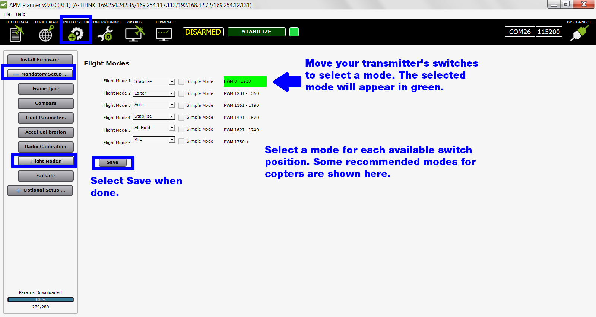

.. _flight-modes:

=========================
Calibration: Flight Modes
=========================

This article shows how to use APM Planner to select flight modes and
save them to your transmitter's switch positions. For other calibration
tasks see :ref:`Autopilot calibration <autopilot-calibration>`.

1 Prerequisites
===============

Before preforming setup, ensure that:

-  The vehicle is completely built to flight condition.
-  :ref:`Firmware has been loaded onto the autopilot. <install-firmware>`
-  :ref:`Autopilot is connected to APM Planner and connected to MavLink. <connect-autopilot>`
-  :ref:`Radio calibration is complete. <radio-calibration>`

2 Assign Flight Modes
=====================

Under Mandatory Hardware, select Flight Modes. Turn on your transmitter
and move the switches to their available positions to see which flight
mode will apply to each position. The currently selected position is
shown highlighted in green. Select a flight mode for each available
switch position. Some sample modes for copters are shown below.

Select Save to save the flight modes to the autopilot.

Click here to learn about available :ref:`flight modes for copter <copter:flight-modes>` and :ref:`flight modes for planes <plane:flight-modes>`.

3 Simple Mode (copter only)
===========================

To apply simple mode to any of your selected flight modes, check the
simple mode box next to that mode. For more information about simple
mode, :ref:`visit the wiki page here <copter:simpleandsuper-simple-modes>`.
