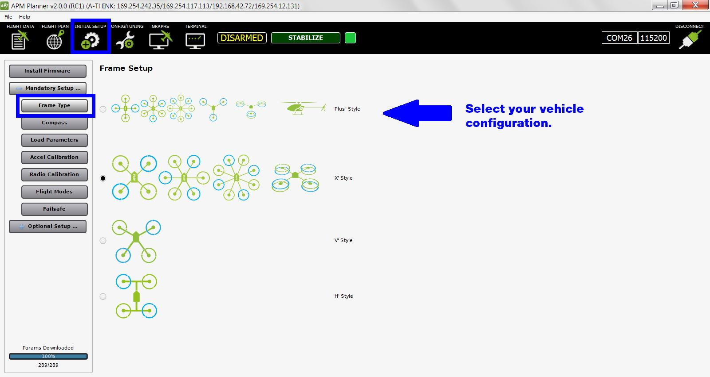

.. _frame-type:

======================================
Calibration: Frame Type (Copters Only)
======================================

This article explains how to select/calibrate your frame orientation in
APM Mission Planner 2 (copter-only). For other calibration tasks, see
:ref:`Autopilot calibration <autopilot-calibration>`.

1 Prerequisites
---------------

-  The vehicle is completely built to flight condition.
-  :ref:`Firmware has been loaded onto the autopilot <install-firmware>`.
-  :ref:`Autopilot is connected to APM Planner and connected to Mavlink. <connect-autopilot>`

2 Select frame
--------------

Select **Mandatory Hardware**, **Frame Type** and choose the correct
diagram to **select your vehicle configuration**.

3 X and plus
------------

The default configuration is X. If you want one of the arms to serve as
the exclusive front-facing direction, select the Plus configuration. For
tricopters, traditional helis and Y6s, the frame type is ignored.

4 H frame
---------

For an H-Frame quadcopter, use the option to set the frame type to ’3′
in the Advanced Parameter Tab. To apply the H-frame configuration, swap
the left rear and right rear props and reverse the motor direction for
each of those motors (by swapping any two motor wires). Repeat the same
process for the front two motors.

5 V frame
---------

Select the V frame for a quadcopter with wide-angled front arms.
