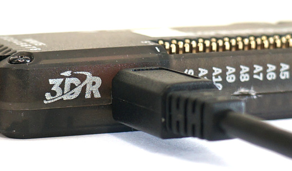
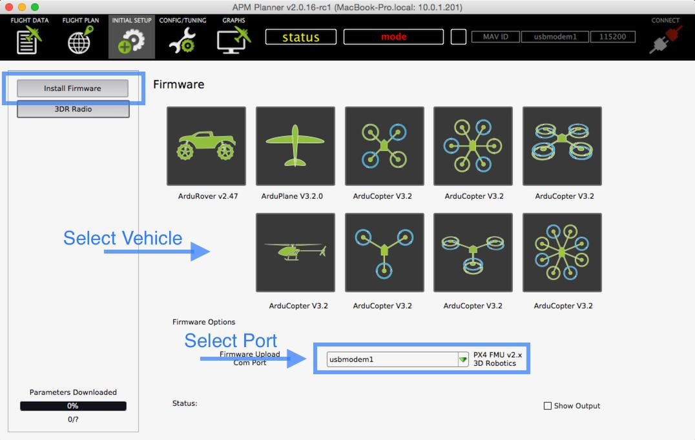
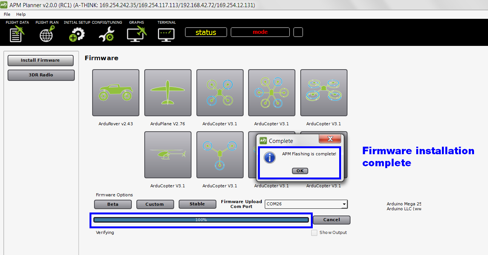
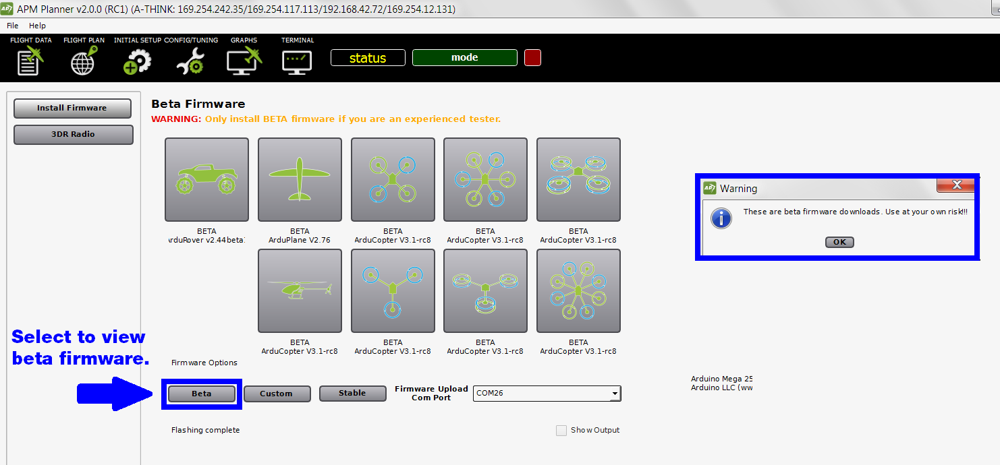

.. _install-firmware:

================
Install Firmware
================

This article explains how to use APM Planner 2 to program your Autopilot
with the latest APM firmware.

1 Connect autopilot.
--------------------

Connect the autopilot to your computer with a micro-USB cable. Don't
select Connect yet; APM Planner can only load firmware while it displays
Disconnected.

2 Select Initial Setup and Install Firmware. Then select your vehicle type.
---------------------------------------------------------------------------

APM Planner will notify you when the status bar reaches 100% and the
firmware installation in complete.

3 (Pixhawk) Power cycle and listen for the tone.
------------------------------------------------

After the firmware installation is complete, power cycle your vehicle by
disconnecting and reconnecting the USB. Listen for the tone! If you hear
a musical tone, your firmware installation is complete. If you hear a
tone followed by three beeps, disconnect the USB. Reconnect the USB
while holding down the safety button. You will hear several tone
sequences followed by two beeps. This indicates your firmware
installation is complete.

4 Beta firmware
---------------

If you are an experienced tester looking to download a beta version of
developing firmware, select beta to view the available beta firmwares.

.. note::
    You may need to put APM Planner 2.0 in Advanced Mode by selecting File -> Advanced in the menu to show the extra options

