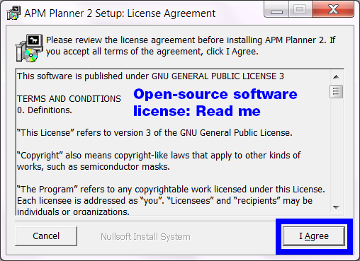
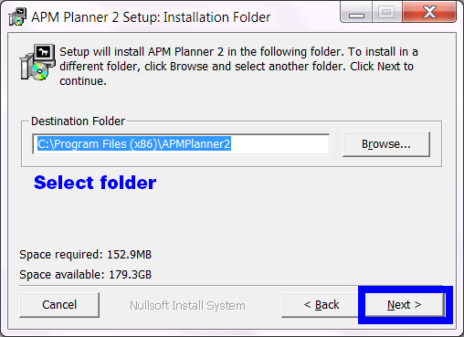
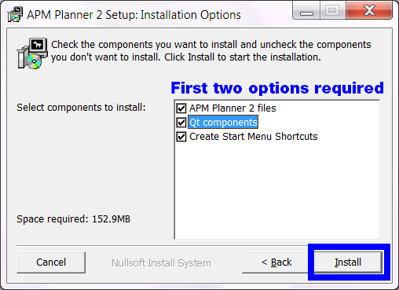
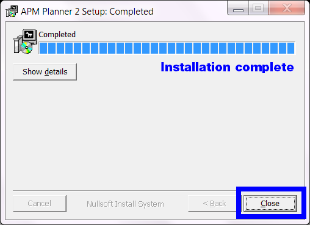

.. _install-windows:

==================================
Installing APM Planner for Windows
==================================

System Requirements
===================

Windows 7 or later

.NET

300 MB free space

Internet connection to use maps

Download
========

Download the insatller (XXX_win.exe) file for your machine from

`firmware.ardupilot.org/Tools/APMPlanner <https://firmware.ardupilot.org/Tools/APMPlanner/>`__

And also check the discussion forum for lastest info

`<https://discuss.ardupilot.org/c/ground-control-software/apm-planner-2-0>`__

Run .exe file
=============

Open the .exe file to run the installation wizard. Read the open-source
license agreement, and select Accept. Select a destination folder for
the installation (the default option is fine if you aren't sure).

Select options
==============

Choose your installation options. Select **APM Planner 2 files** and
**Qt components**. Select **Create Start Menu Shortcuts** to make APM
Planner easy to access from the start menu. Select **Install**.

Close wizard to complete installation
=====================================

Select **Close** to exist the wizard. Your installation is now complete.
Open APM Planner to run the application.

