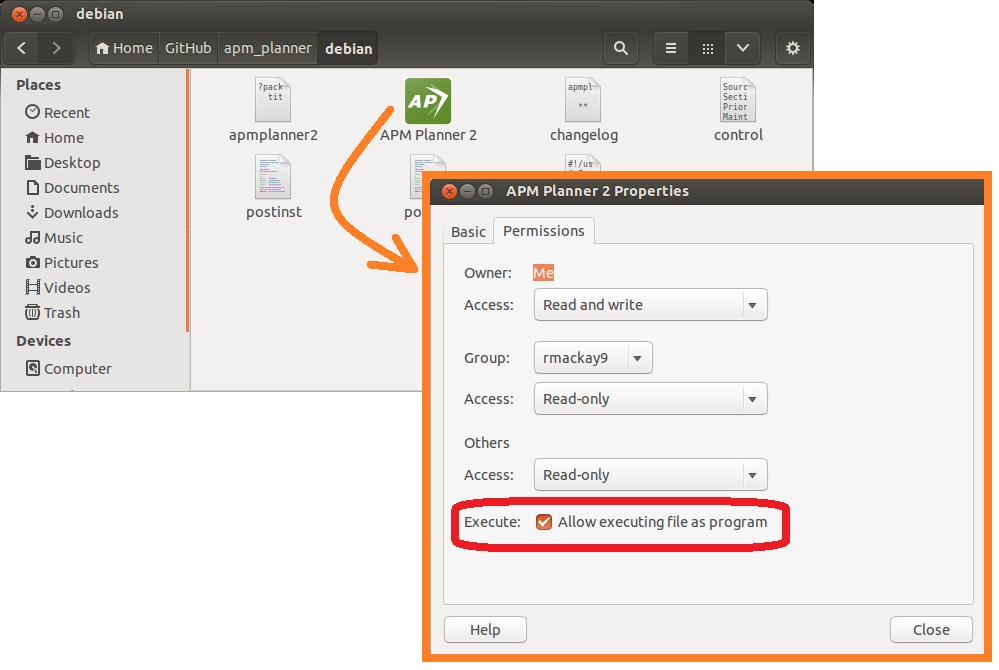

.. _installation-for-linux:

================================
Installing APM Planner for Linux
================================

System Requirements
===================

-  Ubuntu 16.04 LTS (Xenial Xerus) or equivalent
-  300 MB free space
-  Internet connection to use maps

.. Note::

    Check the `downloads <https://firmware.ardupilot.org/Tools/APMPlanner/>`__ link for other pre-built binaires for other distros and versions. If not available APM Planner 2.0 can be easily `built from source <https://github.com/ArduPilot/apm_planner>`__ for many platforms, for example Arch Linux

Download
--------

Download the latest deb file for your machine from 

`firmware.ardupilot.org/Tools/APMPlanner <https://firmware.ardupilot.org/Tools/APMPlanner/>`__

There is a `RC-Model <http://download.opensuse.org/repositories/hardware:/RC-Model/>`__ repository available for OpenSUSE which contains APM Planner. 

And also check the `discussion forum for latest info <https://discuss.ardupilot.org/c/ground-control-software/apm-planner-2-0>`__

Install Packages
================

Open a terminal window and go to the location where you downloaded the
.deb file from step 2 and type the following command:

::

    sudo dpkg -i apm_planner*.deb

The installation will likely fail because of missing dependencies. 
These dependencies can be installed with this command:

::

    sudo apt-get -f install

Then retry the apmplanner installation again:

::

    sudo dpkg -i apm_planner*.deb

Start APM Mission Planner 
=========================
Open Terminal windows and run

::

    apmplanner2

Or use the link create in your launcher

Common problems
===============

If you find the APM Planner 2 is unable to connect to the APM2/Pixhawk,
it may be because of the modemmanager package.  Uninstall this package
by entering the following command into a terminal window:

::

    sudo apt-get --purge remove modemmanager

Missing desktop icon
--------------------

Click on `this link to download the apmplanner2.desktop <https://raw.githubusercontent.com/ArduPilot/apm_planner/master/common/apmplanner2.desktop>`__
file from github.  Set the properties on the file to "Allow executing
file as program", then drag and drop the file to your start bar.

