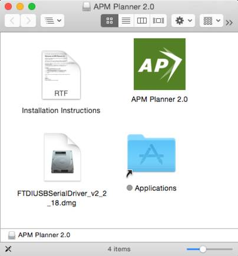
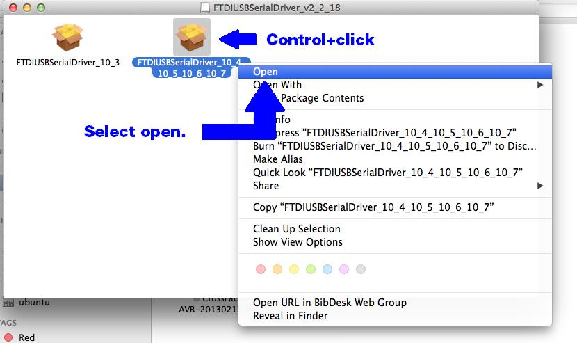
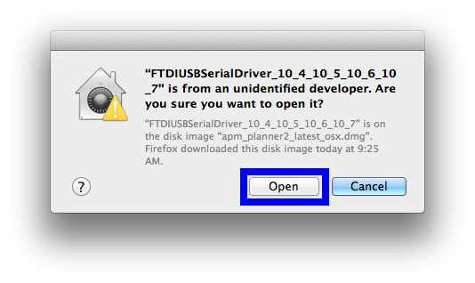
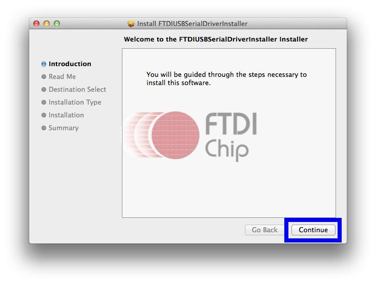
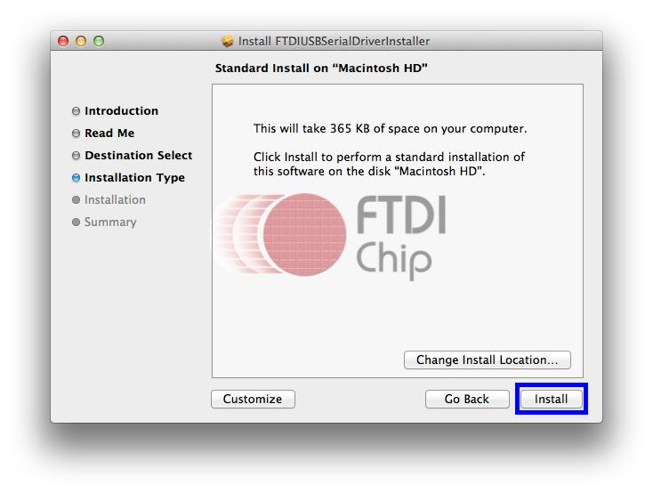
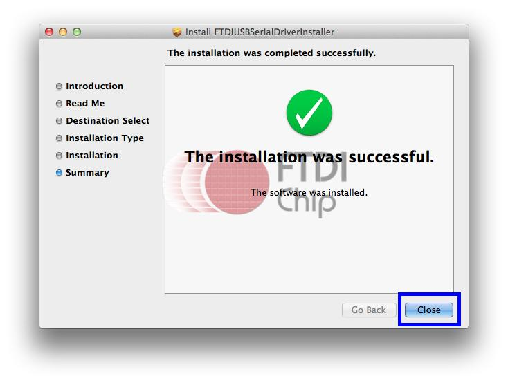
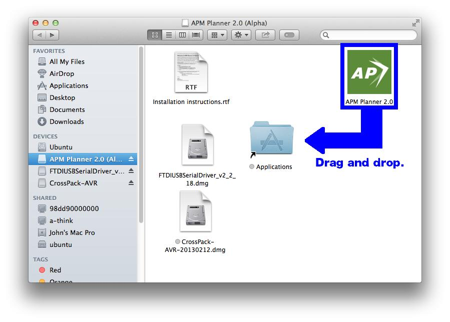
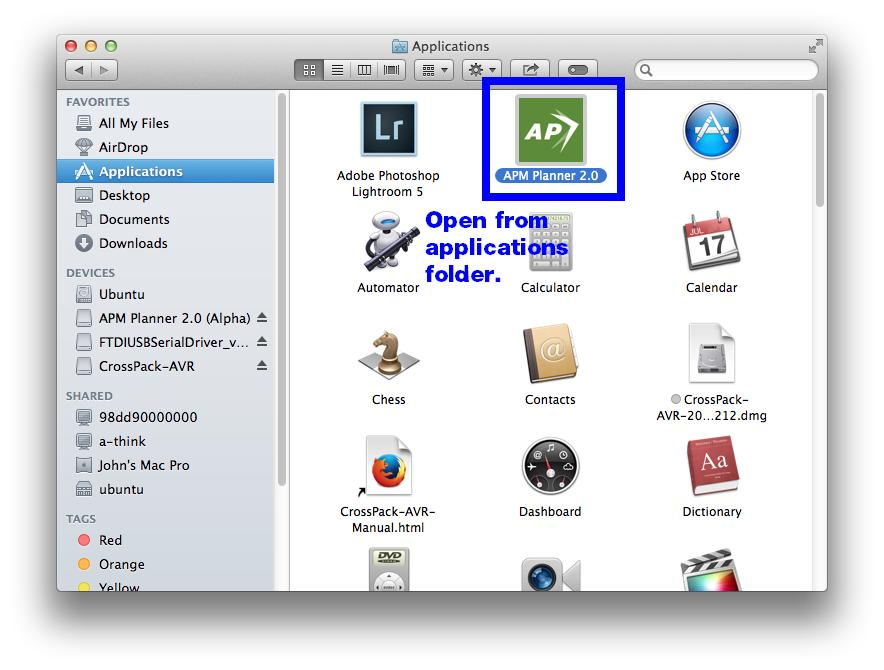
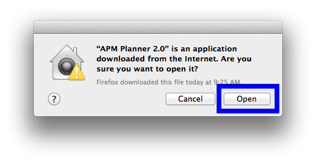

.. _mac-install:

==============================
Installing APM Planner for Mac
==============================

System Requirements
===================

-  OS X 10.8 or later
-  300 MB free space
-  Internet connection to use maps

Download
========

Download the installer .dmg file for your macOS (OSX) machine from 

`firmware.ardupilot.org/Tools/APMPlanner <https://firmware.ardupilot.org/Tools/APMPlanner/>`__

And also check the discussion forum for lastest info

`<https://discuss.ardupilot.org/c/ground-control-software/apm-planner-2-0>`__

Install Packages
----------------

.. note::

   The FTDI Driver install is optional for OSX Yosemite 10.10, but some users have required this install.

Open the .dmg file to see the one additional package files that needs to
be installed: the **FTDI USB Serial Driver**. To install the packages,
they will need to be opened by control-click\* the icon and select
'Open'. Full instructions for `opening a downloaded <http://support.apple.com/kb/ph14370>`__ file can be
found on the Apple site.

\*Control-Click is the same as 'right mouse button click'

Open the **FTDI USB .dmg** file to view the two packages inside. Open
the package labeled "**10_4\_10_5\_10_6\_10_7**\ " by
**control-click**\ ing on the icon and selecting **Open** from the
drop-down menu. This will bypass the security permissions and open the
package.

.. note::

   The driver says 10_7 and it's the correct one for OSX 10.8, 10.9
   & 10.10

Once open, follow the installation instructions to install the package.

Install Application
===================

Drag the AP icon into the applications folder.

Open the applications folder, and open APM Planner.

Select **Open** to run APM Planner. Your installation is now complete.
