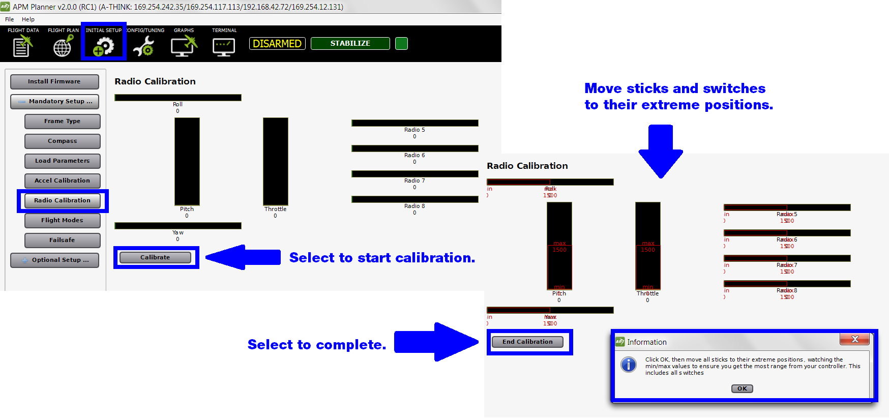

.. _radio-calibration:

==============================
Calibration: Radio Calibration
==============================

This article explains how to calibrate your autopilot to work with your
RC transmitter and receiver. See :ref:`Autopilot calibration <autopilot-calibration>`
for other calibration tasks.

1 Prerequisites
---------------

Before preforming setup, ensure that:

-  The vehicle is completely built to flight condition.
-  :ref:`Firmware has been loaded onto the autopilot. <install-firmware>`
-  :ref:`Autopilot is connected to APM Planner and connected to Mavlink. <connect-autopilot>`
-  RC transmitter and receiver are bound and powered.
-  Propellers are removed.

2 Prepare transmitter
---------------------

Turn on the transmitter, and verify that it is in **airplane mode** (APM
needs airplane mode regardless of the platform type being piloted) and
all trims are centered.

For Mode 1 transmitters, the left stick will control pitch and yaw, the
right stick will control throttle and roll. For Mode 2 transmitters, the
left stick will control throttle and yaw; the right stick will control
pitch and roll. For either type of transmitter, the transmitter’s
three-position switch should be attached to channel 5 and will control
flight modes.

3 Calibrate
-----------

Select Radio Calibration to teach your autopilot to work with your RC
transmitter and receiver. Select **Start Calibration** to begin. Read
the instructions in the following prompt and select **OK**.

   APM Planner2: Radio CalibrationScreen

Select Start Calibration to begin. Move both sticks in the largest
circle possible so that they reach their complete range of motion. Move
the Ch 5 and 6 toggle switches through their range of positions.

Your transmitter should cause the following control changes:

Channel 1: low = roll left, high = roll right.

Channel 2: low = pitch forward, high=pitch back.

Channel 3: low = throttle down (off), high = throttle up.

Channel 4: low = yaw left, high = yaw right.

Watch the red bars on the screen to ensure that the correct controls
activate for each stick movement. If the red bars move in the opposite
direction that you're moving the sticks, you will need to reverse the
channel on your transmitter. Select **End Calibration** when complete.
Resulting normal values are around 1100 for minimums and 1900 for
maximums.
