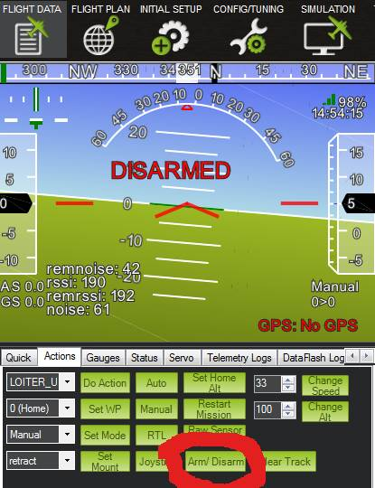

.. _arming-your-rover:

==================
Arming / Disarming
==================

Before the rover's motors will move it must be armed.  Arming is required for two reasons:

-  to prevent the motors from turning when the user is not ready to drive
-  prevent movement before the autopilot is fully configured and ready to go

How to Arm
==========

Before arming you should normally wait for the LED on the flight controller to become flashing blue
(if you only intend to use :ref:`Manual <manual-mode>`) or flashing green (for all other modes).
If the LEDs never become blue or green please see the "Pre-Arm Checks" section below.

There are three ways to arm the vehicle:

-  **From the transmitter sticks**.  Ensure the vehicle is in :ref:`Hold <hold-mode>`, :ref:`Manual <manual-mode>`, :ref:`Acro <acro-mode>` or :ref:`Steering <steering-mode>` mode, then center the throttle stick and hold the steering stick fully to the right for 2 seconds
-  **From a transmitter switch**.  Raise the auxiliary switch to the high position (see :ref:`how to configure aux functions here <rover-auxiliary-functions>`)
-  **From the Ground Station**.  Press the arm/disarm button on your ground station.  If using the Mission Planner this can be found on the Flight Data screen's action tab on the bottom left

If the vehicle fails to arm, please see the "Pre-Arm Checks" section below.

How to Disarm
=============

-  **From the transmitter sticks**.  Ensure the vehicle is in :ref:`Hold <hold-mode>`, :ref:`Manual <manual-mode>`, :ref:`Acro <acro-mode>` or :ref:`Steering <steering-mode>` mode, then hold the steering stick fully left for 2 seconds
-  **From a transmitter switch**.  Lower the auxiliary switch to the low position (see :ref:`how to configure aux functions here <rover-auxiliary-functions>`)
-  **From the Ground Station**.  Press the arm/disarm button on your ground station.  If using the Mission Planner this can be found on the Flight Data screen's action tab on the bottom left

.. note::

   Skid-steering vehicles can only be disarmed from the transmitter in :ref:`Hold <hold-mode>` mode because otherwise they would turn around and
   around in circles whilst the pilot was trying to disarm

Pre-Arm Checks
==============

Rover includes a suite of safety checks which prevent the vehicle from arming
if any of a fairly large number of issues are discovered including missed
calibration, configuration or bad sensor data.  These checks help prevent sudden
motor startups and drive-aways but they can also be disabled by setting the
:ref:`ARMING_CHECK <ARMING_CHECK>` parameter if necessary.

The reason for the failure can be seen by connecting the flight controller to
a ground station (using telemetry or a USB cable), after attempting to arm
the reason should be displayed on the HUD in red letters.

A more complete list of failures can be found on the `Copter wiki <http://ardupilot.org/copter/docs/prearm_safety_check.html>`__
but some common of the Rover specific checks are listed below:

-  Safety switch. The safety switch must be set to the off
   state before arming is allowed. This is either done by pressing the
   safety switch for 2 seconds until it stops flashing, or you can
   disable the use of the safety switch by setting :ref:`BRD_SAFETY_ENABLE <BRD_SAFETY_ENABLE>` to 0.
-  Inertial Sensor Checks. The accelerometers and gyroscopes must all be
   healthy and all be calibrated. If you have more than one accel or
   gyro then they need to be consistent with each other.
-  AHRS checks. The AHRS (attitude heading reference system) needs to be
   initialized and ready. This normally takes at least 30 seconds after boot.
-  Compass checks. All compasses must be configured and calibrated, and
   need to be consistent with each other (if you have more than one compass)
-  GPS Checks. You need to have a 3D GPS fix for most modes.
   **GPS n has not been fully configured** is displayed when the GPS driver
   is unable to fully configure the GPS. This can be caused by a bad
   wire between the autopilot and GPS, or by a bad response from the GPS.
-  Battery checks. The battery voltage must be above the failsafe
   voltage (if configured)
-  Logging checks. The logging subsystem needs to be working (ie. a
   microSD must be fitted and working)
-  RC Control checks. The RC input must have be calibrated and not in failsafe (i.e. transmitter switched on).

The pre-arm checks can be partially or completely disabled by setting the
:ref:`ARMING_CHECK <ARMING_CHECK>` parameter.  The default of 1 means all checks are
enabled.  If set to 0 all checks are disabled.  Ground Stations including the
mission planner also allow disabling individual checks.

In general the cause of a failure should be addressed and the :ref:`ARMING_CHECK <ARMING_CHECK>` parameter should be reset back to 1. 

.. note::

   If you are arming from the transmitter and no failure message is being displayed on the HUD
   then it may be that the RC calibration is off so the autopilot is not seeing the throttle at middle
   or steering at the full right position.  Try re-doing the :ref:`RC calibration <common-radio-control-calibration>`.

Disabling Arming/Disarming
==========================

Although it is not recommended, it is possible to disable the requirement to
arm the vehicle by setting the :ref:`ARMING_REQUIRE <ARMING_REQUIRE>` parameter to zero.
The vehicle will effectively be armed immediately at startup but please note that
modes requiring GPS (all modes except :ref:`Hold <hold-mode>` and :ref:`Manual <manual-mode>`)
will not operate until after a good GPS lock (or more accurately a good EKF position estimate) is achieved.

LED and Buzzer
==============

The LED and buzzer provide visual and audio clues as to the arming state:

-  LED flashing blue - vehicle is disarmed but is ready-to-arm in :ref:`Manual <manual-mode>`
-  LED flashing green - vehicle is disarmed but ready-to-arm in all modes (vehicle has a good position estimate)
-  LED flashing yellow - vehicle cannot be armed because one of the pre-arm checks is failing
-  when the autopilot is ready to arm it will play a "ready to arm"
   sound on the buzzer
-  during arming the buzzer will play a 2 second long warning buzzer
-  during disarming, the buzzer will play a short warning buzz

A full list of buzzer sounds can be found on the :ref:`sounds page <common-sounds-pixhawkpx4>`.

PWM Output Behaviour when Disarmed
==================================

The PWM value output to the servos and motors while the vehicle is disarmed can be configured in one of two ways:

-  if :ref:`MOT_SAFE_DISARM <MOT_SAFE_DISARM>` is 0 (the default) the trim value for each channel
   will be output (i.e :ref:`RC1_TRIM <RC1_TRIM>` will be output on channel 1, :ref:`RC3_TRIM <RC3_TRIM>` will be output on channel 3).
-  if :ref:`MOT_SAFE_DISARM <MOT_SAFE_DISARM>` is 1 no PWM pulses will be sent while disarmed.
   Note that some ESCs beep to complain that they are powered on without a control signal

Note that if the flight controller is a Pixhawk and a safety switch is enabled,
no PWM output will be sent until the safety switch is put in the ON position.
