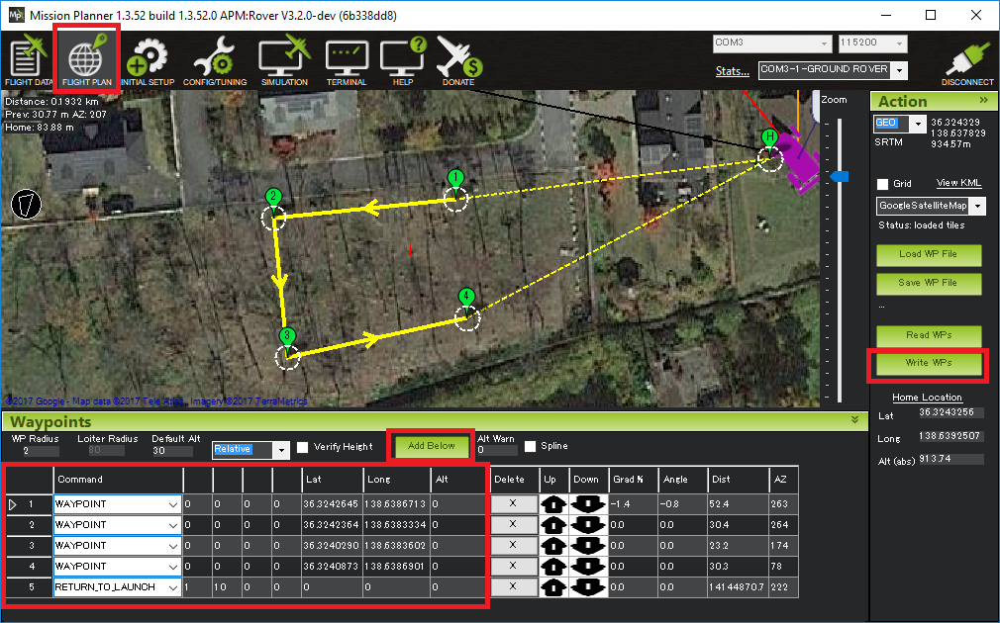
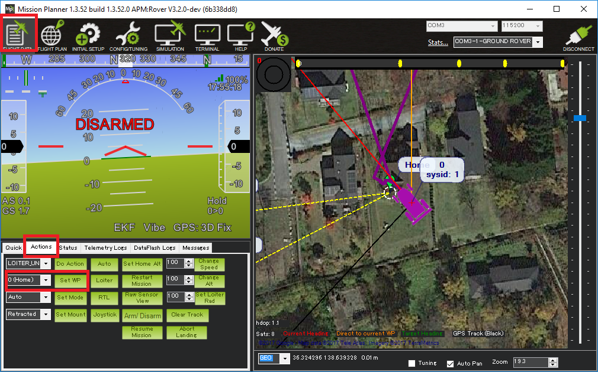

.. _auto-mode:

=========
Auto Mode
=========

In Auto mode the vehicle will follow a pre-programmed mission stored in the autopilot which is made up of navigation commands (i.e. waypoints) and “do” commands (i.e. commands that do not affect the location of the vehicle including triggering a camera shutter).

This mode requires the vehicle have :ref:`GPS <common-positioning-landing-page>` and/or :ref:`visual odometry <common-zed>` or :ref:`wheel encoders <wheel-encoder>`.

Creating a Mission
------------------

Most ground stations are capable of creating and uploading missions.  Mission Planner allows this using the Flight Planner screen:

- connect your autopilot to your PC using a USB cable or telemetry
- open the Mission Planner on your PC and press the Connect button
- go to the Flight Planer screen and click on the map in a few places to add waypoints
- in the command list section, click once on the last waypoint command in the list and press the "Add Below" button, a new command WAYPOINT command should appear at the bottom of the list
- click on the word WAYPOINT and change the command to "RETURN_TO_LAUNCH"
- upload the mission to the autopilot using the "Write WPs" button.

Starting the Mission
--------------------

The following instructions should be followed to start the mission:

- setup the :ref:`transmitter mode switch <common-rc-transmitter-flight-mode-configuration>` so that Auto can be selected
- take the vehicle outside, power it on and wait for a good position estimate (LED will turn green)
- arm the vehicle in :ref:`MANUAL <manual-mode>` or :ref:`HOLD <hold-mode>`
- change the mode to AUTO and the vehicle should begin executing the commands one after another
- if telemetry is connected you should see the vehicle travelling around the course
- if you notice any odd behaviour, use the transmitter's mode switch at any time to change back to :ref:`MANUAL <manual-mode>` or :ref:`HOLD <hold-mode>`
- if all goes well the vehicle will travel the course and then return to the point where it was armed (assuming the final command was Return-To-Launch)

Starting the Mission with a Kick
--------------------------------

The mission normally starts the moment the vehicle is switched into Auto mode but alternatively it can be configured to wait for an push by setting the :ref:`AUTO_KICKSTART <AUTO_KICKSTART>` parameter to an acceleration in m/s/s.  A value of 2 m/s/s will normally work.

Starting the Mission from a button
----------------------------------

The mission can be started from a switch as described on the :ref:`Start/Stop switch <startstop-switch>` page.

Speed Nudging
-------------

While the vehicle is executing a mission, the user can increase the vehicle's speed by raising the transmitter's throttle stick to between 75% and 100%.  At 75% the vehicle will remain at it's configured speed (i.e. :ref:`CRUISE <CRUISE_SPEED>` or :ref:`WP_SPEED <WP_SPEED>`), this linearly increases to the vehicle's maximum speed as the pilot's throttle stick reaches 100%.

Resuming or Restarting a Mission
--------------------------------

If a mission is interrupted (for example if the user switches the vehicle out of Auto mode before it has completed the mission) the last command executed is stored and when the vehicle is next returned to Auto mode it will resume the mission from this command.  Note: disarming the vehicle or rebooting the flight controller will reset the mission back to the first command.

If you would prefer the mission was always restarted from the beginning, set the :ref:`MIS_RESTART <MIS_RESTART>` parameter to "1".

Setting the active command
--------------------------

While the vehicle is executing a mission in Auto, the active command can be changed from the ground station.  If using Mission Planner this is done from the Flight Data >> Actions tab's "Set WP" button.

    
Tuning
------

Details on how to tune the controllers for good waypoint control can be found on the :ref:`Tuning Navigation <rover-tuning-navigation>` page.
