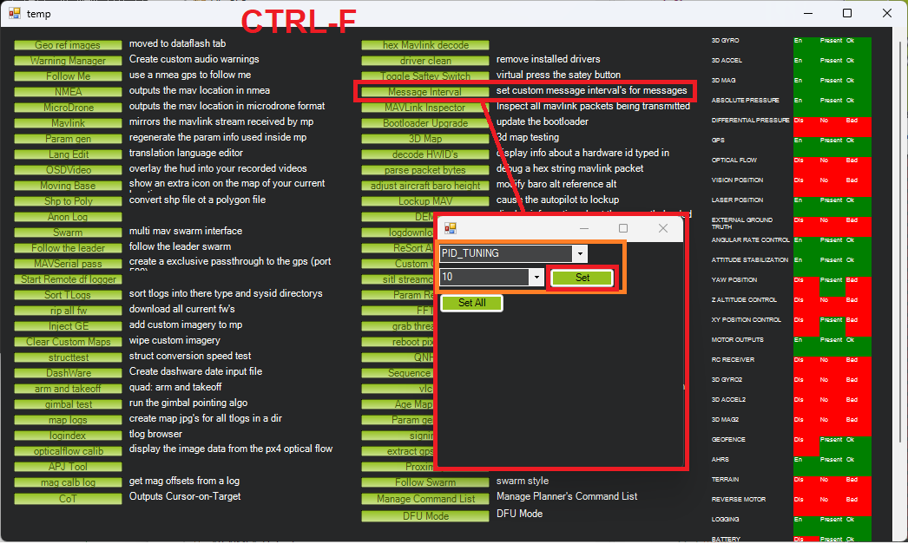

.. _balance_bot-tuning:

======================
Tuning the Balance Bot
======================

Tuning Pitch Control
====================

The Pitch controller should be tuned in Manual mode. The parameters involved in tuning this controller are:

- :ref:`BAL_PITCH_MAX<BAL_PITCH_MAX>`: Pitch angle limit.  If the user provides full throttle the vehicle will attempt to lean at this angle
- :ref:`BAL_PITCH_TRIM <BAL_PITCH_TRIM>`: Pitch trim to offset tilt of center of mass
- :ref:`ATC_BAL_PIT_FF <ATC_BAL_PIT_FF>`: Feed forward gain using the current pitch angle.  This should normally be set to 0.4
- :ref:`ATC_BAL_FF <ATC_BAL_FF>`: Feed forward gain using desired pitch angle.  This should normally be set to 0
- :ref:`ATC_BAL_P <ATC_BAL_P>`: P gain used to correct the current pitch angle error.  Higher values will result in faster error correction but if too high will lead to oscillation.
- :ref:`ATC_BAL_I <ATC_BAL_I>`: I gain used to correct long term pitch angle errors.  Setting to the same value as P often works well.  If set too high this could lead to slow oscillations.
- :ref:`ATC_BAL_D <ATC_BAL_D>`: D gain used to correct changes in pitch angle error.  Setting to higher values may result in a more stable pitch control but if too high can lead to very fast oscillations.
- :ref:`ATC_BAL_IMAX <ATC_BAL_IMAX>`: I term maximum value.  This should normally be set to 1
- :ref:`ATC_BAL_FLTT <ATC_BAL_FLTT>`: Filter applied to the desired pitch angle.  Lower values lead to a slower moving desired pitch angle target.  Higher values lead to a more responsive pitch target
- :ref:`ATC_BAL_FLTE <ATC_BAL_FLTE>`: Filter applied to the pitch error.  Lower values lead to a slower response to pitch angle errors.  Higher values lead to a faster response
- :ref:`ATC_BAL_FLTD <ATC_BAL_FLTD>`: Filter applied to the pitch error applied to the D term.  Lower values lead to a slower response to changes in pitch angle errors.  Higher values lead to a faster response

Good tuning of the pitch controller is crucial for tuning other Control Modes.

Real-time Tuning of Pitch Control
---------------------------------

It is best to connect the ground station (e.g. Mission Planner) to the vehicle using a telemetry radio and then enable real-time display of the Pitch PID controller's inputs and outputs by doing the following

- Set :ref:`GCS_PID_MASK <GCS_PID_MASK>` = 4 (Pitch)
- Connect with Mission Planner, go to the Data screen and check the "Tuning" checkbox in the bottom middle.  From the large "Display This" window check "piddesired", "pidachieved" and optionally "pidP", "pidI" and "pidD"
- Speed up the rate of the PID_TUNING messages using Mission Planner's Ctrl-F Message Interval feature

- Stand the vehicle upright and arm in Manual mode
- With the throttle stick in the middle the "piddesired" should always be zero while the "pidachieved" will move as the vehicle pitches back and forth
- Open Mission Planner's Config Full Parameter Tree and adjust :ref:`ATC_BAL_P <ATC_BAL_P>`, :ref:`ATC_BAL_I <ATC_BAL_I>` and :ref:`ATC_BAL_D <ATC_BAL_D>` gains so that "pidachieved" follows "piddesired" (e.g. stays near zero)
- The vehicle may drift off in either direction so be ready to catch it and return it to its original position.  Drifting is not necessarily a problem at this stage, the goal is for "pidachieved" to follow "piddesired" as closely as possible
- Apply throttle stick inputs which should result in "piddesired" changing.  Continue to adjust the gains so "pidachieved" tracks well

.. _balance_bot-tuning-pitch-trim:

Reducing Drift with Pitch Trim
------------------------------

If the vehicle consistently drifts in one direction while upright in Manual mode the center of mass may be slightly off of center.  :ref:`BAL_PITCH_TRIM <BAL_PITCH_TRIM>` sets the default pitch angle at zero throttle.

If the balance bot drifts forward, increase :ref:`BAL_PITCH_TRIM <BAL_PITCH_TRIM>` in steps of 0.1 until the vehicle's drift is reduced.  If the balance bot drifts backwards, decrease :ref:`BAL_PITCH_TRIM <BAL_PITCH_TRIM>`.

Pitch Limiting
--------------

Rover-4.3 (and higher) includes automatic pitch limiting to reduce the chance of the vehicle falling over due to throttle saturation.  The feature works by monitoring the throttle output and if it crosses a given threshold the maximum pitch angle is temporarily reduced.

The parameters below can be used to tune this features although normally they can be left at their default values

- :ref:`ATC_BAL_LIM_THR<ATC_BAL_LIM_THR>`: pitch limit feature's throttle threshold (expressed as a value betwee 0 and 1).  If the vehicle's throttle climbs above this limit the vehicle's maximum pitch angle will be reduced.
- :ref:`ATC_BAL_LIM_TC<ATC_BAL_LIM_TC>`: pitch limit feature's time constant.  Lower values will cause the pitch limit to be reduced quickly.  Higher values will limit the pitch more slowly.

..  youtube:: 8EATOJRzBqs
    :width: 100%

.. _balance_bot-tuning-acro:

Tuning Acro Mode
================

The following parameters should be set

- :ref:`CRUISE_THROTTLE <CRUISE_THROTTLE>` = 0 (This parameter can cause conflicts otherwise, in Balance Bots)
- :ref:`CRUISE_SPEED <CRUISE_SPEED>`: Maximum speed limit for Speed Controller. To be set by trial and error

With the above parameters set, follow the tuning guides for :ref:`Speed <rover-tuning-throttle-and-speed>` and :ref:`Steering<rover-tuning-steering-rate>`. Another important thing to note is that the feed-forward term described in these pages does not make any positive contribution in a balance bot and is best, set to zero.

Guided, Auto, RTL
=================

Follow the :ref:`Navigation tuning instructions <rover-tuning-navigation>` to tune the vehicle for autonomous modes including Guided, Auto and RTL.

Optionally it may be convenient to automatically change the mode to Acro after an Auto mission is completed by setting

- :ref:`MIS_DONE_BEHAVE <MIS_DONE_BEHAVE>` = 2 (Acro)
