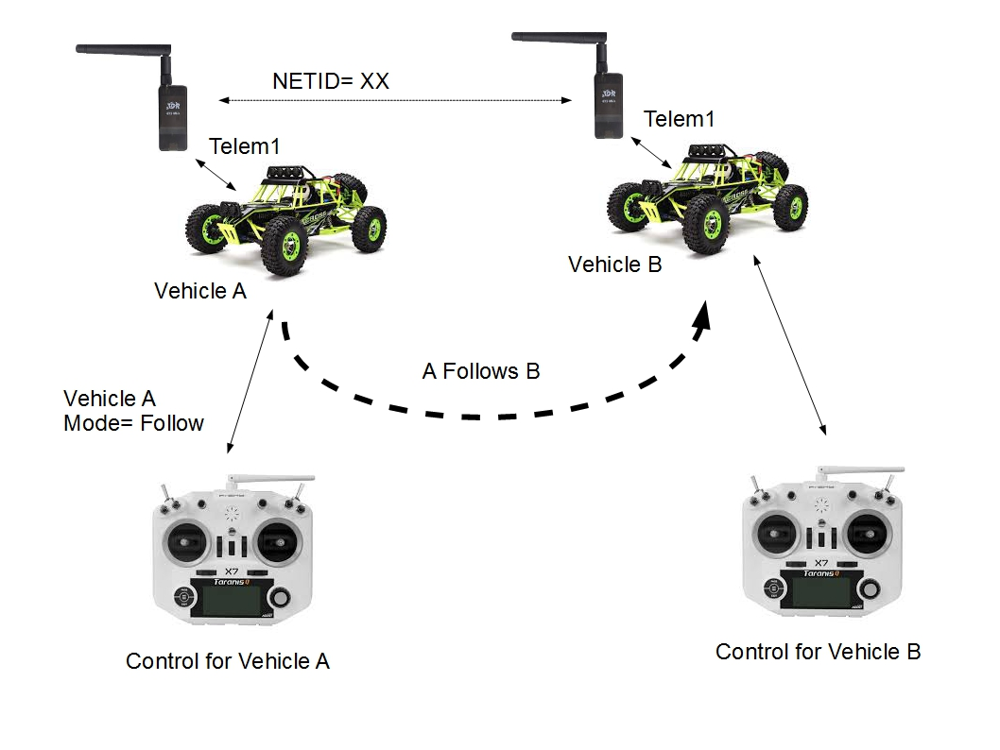
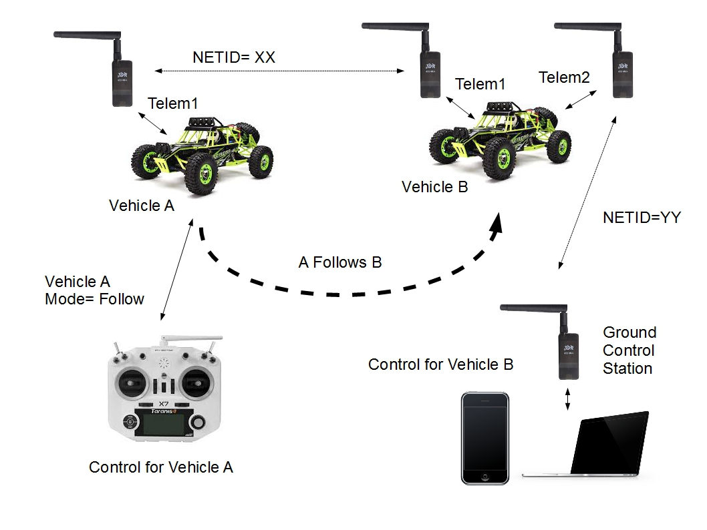
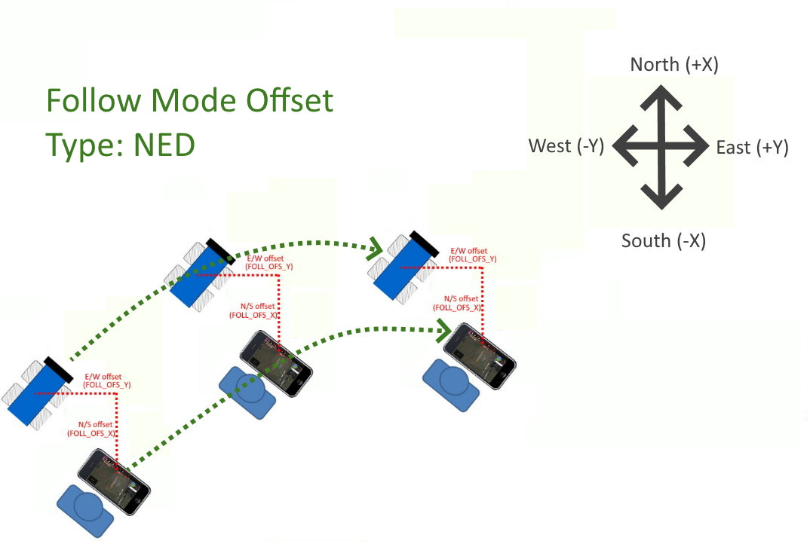
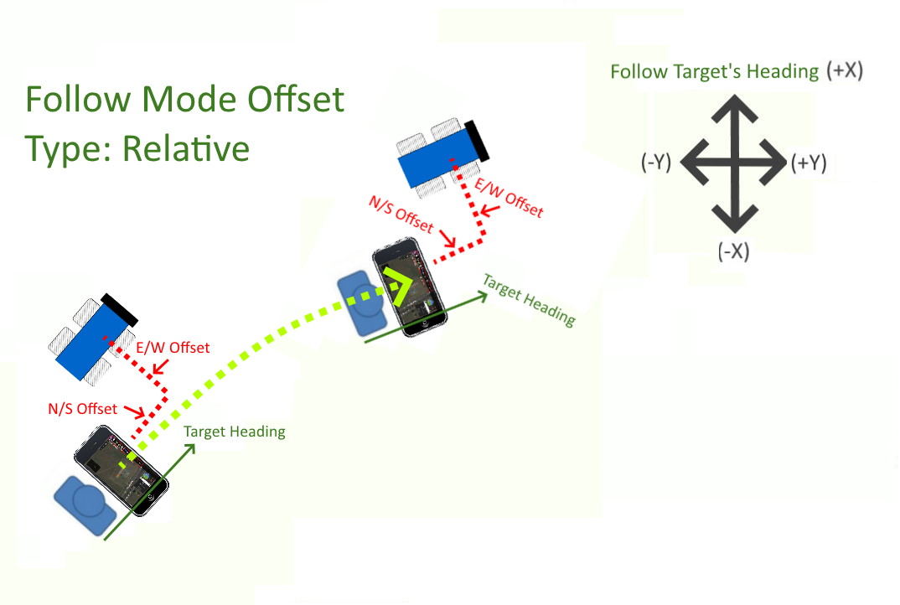

.. _follow-mode:

===========
Follow Mode
===========

..  youtube:: _g9SkK0IhRk
    :width: 100%

When switched into Follow, the vehicle will attempt to follow another vehicle (or anything publishing its position) at a specified offset.  The vehicle lead vehicle's position must be published to the vehicle in Follow mode using a telemetry system as shown below. QGroundControl's application (QGC) for Android phones and computers has this feature in beta testing also, so instead of following a vehicle, it will follow the ground control station, similar to FOLLOW ME mode in Copter.

In its simplest form, each vehicle has a telemetry radio with the same NETID, on one of their telemetry ports.

Vehicle A merely enters FOLLOW mode and it will attempt to follow Vehicle B, and vice-versa.

If Vehicle A or B requires Ground Station Control, an additional Telemetry radio on a different NETID (YY) can be installed on another telemetry port on the vehicle controller, paired with the GCS's radio on that same NETID.

In the case of QGroundControl, all that is required is to switch to FOLLOW Mode once it is connected to QGroundControl. It will then follow the computer/phone running QGC.

.. note::

   Follow is available in Rover-3.5 (and higher)

The following parameters can be used to tune Follow mode's performance:

-  :ref:`FOLL_ENABLE <FOLL_ENABLE>` : set to 1 to enable follow mode and refresh parameters.
-  :ref:`FOLL_SYSID <FOLL_SYSID>` : MAVLink system id of lead vehicle ("0" means follow the first vehicle "seen").
-  :ref:`FOLL_DIST_MAX <FOLL_DIST_MAX>` : if lead vehicle is more than this many meters away, give up on following and hold position (loiter if boat, stop if ground vehicle).
-  :ref:`FOLL_OFS_X <FOLL_OFS_X>`, :ref:`FOLL_OFS_Y <FOLL_OFS_Y>`, :ref:`FOLL_OFS_Z <FOLL_OFS_Z>` (not used in Rover) : 3D offset (in meters) from the lead vehicle. If they are zero, then the current vehicle's offset from the follow target at time of mode entry is used every time. These offsets can be altered via Mavlink and will take effect immediately. However, if they were originally zero and changed during FOLLOW MODE rather than during another mode, they will be reset to zero for the next entry into FOLLOW mode, until a reboot occurs and then the changed offsets will be restored. 
-  :ref:`FOLL_OFS_TYPE <FOLL_OFS_TYPE>` : set to 0 if offsets are North-East (NED), 1 if offsets are relative to lead vehicle's heading, see diagrams below.
-  :ref:`FOLL_POS_P <FOLL_POS_P>` : gain which controls how aggressively this vehicle moves towards lead vehicle (limited by :ref:`WPNAV_SPEED <WPNAV_SPEED>`)

