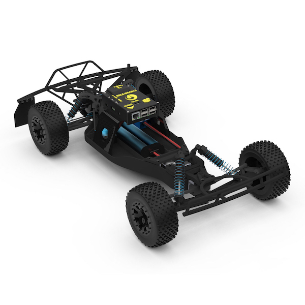

.. _gettit:

=====================
Introduction to Rover
=====================

This article describes the main components of a Rover system, including
the ground vehicle, autopilot hardware, and the software/firmware.

.. image:: ../images/APMrover7.jpg
    :target: ../_images/APMrover7.jpg

Rover Components
================

While it is is possible to build a vehicle with Rover from scratch we
highly recommend starting from an existing RC vehicle (this comes with a
frame, escs and power supply). You will need to add the autopilot, GPS,
and possibly some other hardware. Most importantly you will need to
obtain an RC Transmitter that has spare channels needed for autopilot
mode control and learning.

We like cheap 4-wheel-drive off-road vehicles with brushless motors and
no RC (the RC units that come with most ready-to-run RC cars don't have
the spare channel needed for autopilot mode control and learning). One
such good platform is `this RC off-roader from HobbyKing <http://hobbyking.com/hobbyking/store/uh_viewItem.asp?idProduct=17791>`__,
which is just $72 (don't worry, we won't use the goofy plastic body
shell):

.. image:: ../images/rover_4wd_monster_beatle.jpg
    :target: ../_images/rover_4wd_monster_beatle.jpg

Autopilot Hardware
------------------

:ref:`Pixhawk <common-pixhawk-overview>` is highly recommended for general
use.

Developers creating robot vision applications should consider using a
separate Companion Computer, or a Linux based autopilot board (e.g.
:ref:`NAVIO+ <common-navio-overview>` or
:ref:`Erle-Brain <common-erle-brain-linux-autopilot>`) which is capable of
running both Rover and the image processing code.

For more options, see the topic :ref:`Choosing a Flight Controller <common-choosing-a-flight-controller>`.

.. note::

   You will need at least four \ `female-to-female servo extension cables <http://store.jdrones.com/Servo_Extension_15cm_Female_Female_p/cblsrvff15.htm>`__
   to connect the autopilot to your RC receiver (choose length to
   suit)

4+ channel RC transmitter and receiver
--------------------------------------

You'll need a radio control transmitter to manually control your Rover
and to activate its control modes. You can use any RC
transmitter/receiver system with at least 4 channels.

.. image:: ../../../images/spektrum-dx8.jpg
    :target: ../_images/spektrum-dx8.jpg

Don't get one designed for cars (with a steering wheel and throttle
trigger); we won't be driving the Rover manually much at all.  Ideally,
it will have at least two toggles switches, and one of those switches
will have three positions. If you're on a budget, the `Turnigy 9x <http://hobbyking.com/hobbyking/store/__8992__Turnigy_9X_9Ch_Transmitter_w_Module_8ch_Receiver_Mode_2_v2_Firmware_.html>`__ ($54)
is a popular choice. If you'd like better quality, we like the :ref:`Taranis FrSky Reciever <common-pixhawk-and-px4-compatible-rc-transmitter-and-receiver-systems_frsky_taranis_ppm-sum_compatible_transmitter>`.

Some other options are discussed in the topic :ref:`Compatible RC Transmitter and Receiver Systems (Pixhawk/PX4) <common-pixhawk-and-px4-compatible-rc-transmitter-and-receiver-systems>`.

GPS module
----------

Your Rover will *require* a GPS module. The recommended module is :ref:`3DR UBlox GPS + Compass Module <common-installing-3dr-ublox-gps-compass-module>` which also
includes a compass. You can check out :ref:`other GPS solutions here <common-positioning-landing-page>`.

.. image:: ../../../images/GPS_TopAndSide.jpg
    :target: ../_images/GPS_TopAndSide.jpg

LiPo batteries and charger
--------------------------

You'll also need batteries and a charger. Almost any 2S (7.2v) LiPo
under 2600 mAh will do, but the recommend one for the above buggy is
`this one <http://hobbyking.com/hobbyking/store/__16589__Turnigy_1700mAh_2S_20C_Lipo_Pack_Suits_1_16th_Monster_Beatle_SCT_Buggy_USA_Warehouse_.html>`__.
A simple LiPo charger like `this one <http://hobbyking.com/hobbyking/store/__24289__Turnigy_2S_3S_Balance_Charger_Direct_110_240v_Input_USA_Warehouse_.html>`__
will work fine.

Optional hardware
=================

Telemetry Radio
---------------

A :ref:`telemetry radio <common-telemetry-landingpage>` allows your Rover
to communicate with your ground station remotely using the MAVLink
protocol. This allows you to interact with your missions in real time
and receive streaming data from your vehicle's cameras and other
components. This adds considerable convenience to your missions!

.. image:: ../../../images/Telemetry_store.jpg
    :target: ../_images/Telemetry_store.jpg

Sonar/IR Sensors
----------------

:ref:`Sonar/IR sensors <sonar-sensors>`
are recommended for obstacle avoidance.

Ready to Use Rovers
===================

At time of writing, the only Ready-to-Run (RTR) Rover is
`Erle-Rover <https://erlerobotics.com/blog/product/erle-rover/>`__.

   Erle-Rover: Ready to Use Rover from Erle-Robotics

This RTR Rover contains all the needed components for getting started:
the frame, `Erle-Brain <http://erlerobotics.com/blog/erle-brain-2/>`__
Linux autopilot, 4 Channels 2.4Ghz RC, Power Module (to power up the
autopilot), NIMH battery and charger.

.. note::

   This Rover uses a powerful Linux autopilot that can run more
   computationally intensive operations than a traditional autopilot (like
   Pixhawk). 

Ground Control Station
======================

The (free and open source) :ref:`Mission Planner <planner:home>` is required if you're going
to be loading new versions of Rover onto the autopilot controller, and
for first-time tuning and calibration. It runs on a PC and can also be
used for planning missions.

.. image:: ../../../images/groundstation-with-MP.jpg
    :target: ../_images/groundstation-with-MP.jpg

Once your Rover is configured, you may find it more convenient to choose
a different ground station - running on the tablet, phone or computer of
your choice. The main options are discussed in the topic :ref:`Choosing a Ground Station <common-choosing-a-ground-station>`.

.. note::

   This wiki exclusively uses Mission Planner as the reference
   GCS.

.. toctree::
    :maxdepth: 1

    Project News <project-news>
    Video Demos <rover-video-demonstrations>
    Rover Control Modes <rover-control-modes>
    Choosing a Ground Station <common-choosing-a-ground-station>
    Choosing an Autopilot Board <common-choosing-a-flight-controller>