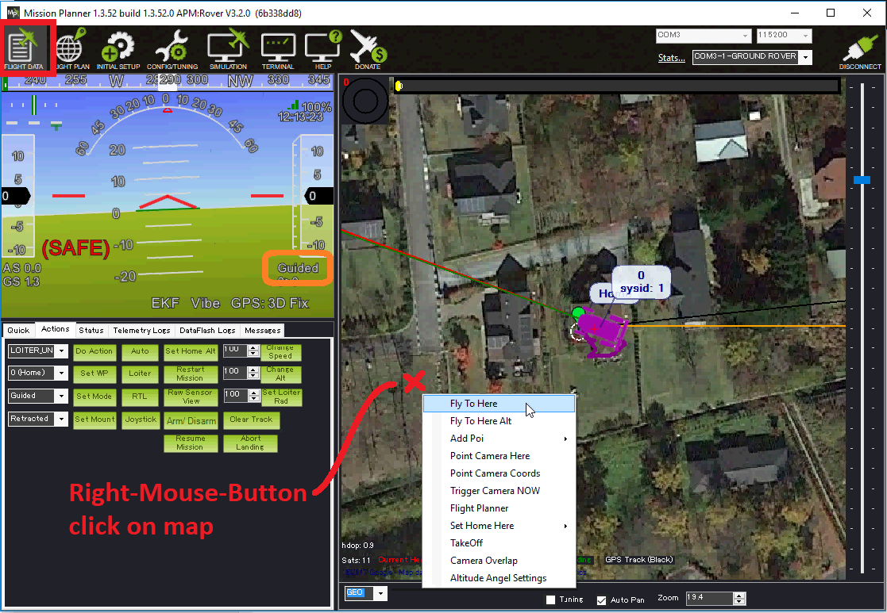

.. _guided-mode:

===========
Guided mode
===========

Guided mode is designed to allow ground stations or :ref:`companion computers <common-companion-computers>` to control the vehicle.

Sending Commands from the Ground Station
----------------------------------------

Most ground stations support commanding the vehicle to drive to a location specified by clicking on the map.  If using the Mission Planner:

- connect to the vehicle with a :ref:`telemetry radio <common-telemetry-landingpage>`
- from the Flight Data screen, right-mouse-button click on the map and select "Fly To Here".
- the vehicle will switch to Guided mode and attempted to drive to the location specified.
- once at the destination it will hold position if a surface vehicle, or loiter/circle around the destination if it is a boat.

The ground station will normally set the vehicle to Guided mode before the target destination is sent meaning it is not necessary to set up Guided mode on the :ref:`transmitter mode switch <common-rc-transmitter-flight-mode-configuration>`.

Speed
-----

While the vehicle is travelling, the user can increase the vehicle's speed by raising the transmitter's throttle stick to between 75% and 100%.  At 75% the vehicle will remain at it's configured speed (i.e. :ref:`WP_SPEED <WP_SPEED>` or :ref:`CRUISE <CRUISE_SPEED>` if :ref:`WP_SPEED <WP_SPEED>` is zero, versions of Rover after 3.5.1 use only :ref:`WP_SPEED <WP_SPEED>`), this linearly increases to the vehicle's maximum speed as the pilot's throttle stick reaches 100%.

Other controls
--------------

These additional MAVLink messages are supported in Guided mode.  These are listed mostly for developers of ground stations or :ref:`companion computers <common-companion-computers>` applications:

-  `SET_ATTITUDE_TARGET <https://mavlink.io/en/messages/common.html#SET_ATTITUDE_TARGET>`__
-  `SET_POSITION_TARGET_LOCAL_NED <https://mavlink.io/en/messages/common.html#SET_POSITION_TARGET_LOCAL_NED>`__
-  `SET_POSITION_TARGET_GLOBAL_INT <https://mavlink.io/en/messages/common.html#SET_POSITION_TARGET_GLOBAL_INT>`__
-  ``MAV_CMD_NAV_SET_YAW_SPEED`` commands within a `COMMAND_LONG <https://mavlink.io/en/messages/common.html#COMMAND_LONG>`__

