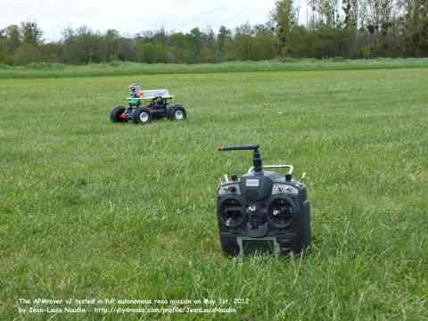

.. _introduction:

==========================
Getting Started with Rover
==========================

To start with Rover, you will first need a rover with a :ref:`ArduPilot compatible autopilot <common-autopilots>`. 
You can either select from a list of :ref:`ready-to-drive vehicles<common-rtf>` or  assemble your own (See below).

Choosing a Ready-To-Drive Vehicle
=================================

Opting for a :ref:`ready-to-drive vehicle <common-rtf>` means you'll receive a pre-configured and finely tuned rover that is prepared for its maiden drive. 
To operate it, you will need to :ref:`install a ground station <common-install-gcs>` and proceed to the :ref:`First Drive <rover-first-drive>` instructions. 
Prior to operating, it is important to follow the manufacturer's guidelines, especially related to safety.

.. Warning::

    Regardless of using a pre-assembled or a Do-It-Yourself (DIY) vehicle, remember that autonomous vehicles can pose hazards! It's critical to adhere to recommended safety practices and pay attention to all safety warnings.

Building Your Own Rover
=======================

If you are interested in building your own rover, the following references will guide you through the process:

#. Start by familiarizing yourself with :ref:`Selecting a Frame <selecting-a-frame>` and :ref:`Choosing Hardware <choosing-hardware>` sections. 
#. Then, proceed to the :ref:`Select an Autopilot Board <common-autopilots>` section to select an autopilot.
#. After choosing a frame, autopilot, and required hardware, :ref:`Pick a Ground Control Station <common-choosing-a-ground-station>`.
#. Navigate to :ref:`First Time Setup <apmrover-setup>` to begin the initial setup. 
#. Finally, consult :ref:`First Drive and Tuning <rover-first-drive>` for driving and tuning advice.
